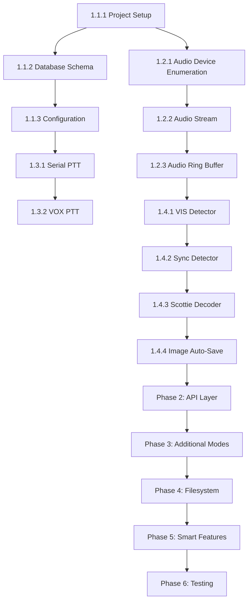

# SSTeVe Backend Implementation - Task Breakdown

This document breaks down the backend-spec.md into specific, actionable tasks organized by phase and priority.

**Legend:**
- 🔴 Blocking/Critical
- 🟡 Important but not blocking
- 🟢 Nice to have / Polish
- ⚪ Future enhancement

## Progress Summary

**Completed:** Core DSP modules, database schema/migrations, audio/PTT primitives, CLI + accessibility modules
**Current Status:** API layer is scaffolded but not wired to DSP/IO; config/images/devices endpoints use stubs; persistence + WebSocket streaming still pending

| Phase | Status | Tasks | Tests | Notes |
|-------|--------|-------|-------|-------|
| Phase 1: Foundation | ✅ Mostly complete | Partial | Unit tests present | Core DSP, DB models/migrations, audio I/O primitives |
| Phase 2: API Layer | 🟡 In progress | Partial | Unit tests only | Routes scaffolded; device/config/images still stubbed; no DSP wiring |
| Phase 3: Accessibility | 🟡 In progress | Partial | Unit tests present | Stereo sonification + CLI done; integration not wired |
| Phase 4: Filesystem | ⏳ Pending | 0/7 | - | Auto-import, MMSSTV compatibility |
| Phase 5: Smart Features | 🟡 In progress | 12/19 | Smart features tests | Smart Reply (5/5), Mode Detection (1/3), Device Config (1/2), QSO Logging (3/3) |
| Phase 6: Testing | ⏳ Pending | 0/11 | - | Integration tests, validation |

**Last Updated:** 2026-01-16 (Phase 5: 80% complete - Smart Reply, Mode Detection, Device Config, QSO Logging)

### Reality Check (2026-01-10)

- API endpoints for devices/config/images are still in-memory or mocked.
- Decode/transmit routes create sessions but do not run DSP/audio pipelines.
- WebSocket manager exists but is not emitting real decode/transmit events.

### CRITICAL: Make-or-Break Features (2026-01-10)

**User research identified 4 DSP features that are ship-blockers. These MUST be implemented before v1:**

1. ❌ **Hough Transform Auto-Slant Correction** - Not implemented (uses simple sync or manual slider)
2. ❌ **Correlation-Based VIS Detection** - Not implemented (uses simple tone detection)
3. ❌ **Bandpass Filter (1200-2300 Hz)** - Not implemented (no acoustic noise rejection)
4. ❌ **Real-Time Audio Level Monitoring** - Not implemented (no WebSocket `audio_levels` event)

**Impact:** Without these 4 features, users will delete SSTeVe and return to MMSSTV/Black Cat.

**Timeline:** +3-4 weeks backend work to implement all 4 features.

---

## Phase 1: Core Engine Foundation (Weeks 1-2)

### 1.1 Project Setup & Database

#### Task 1.1.1: Initialize Project Structure 🔴
**Priority:** Must have first
**Estimated effort:** 2 hours
**Dependencies:** None

**Acceptance criteria:**
- [ ] Monorepo structure created: `sstv_core/`, `sstv_desktop/`, `sstv_mobile/` (optional)
- [ ] Python virtual environment initialized
- [ ] `requirements.txt` created with core dependencies:
  - `sounddevice>=0.4.6`
  - `numpy>=1.24`
  - `scipy>=1.10`
  - `Pillow>=10.0`
  - `sqlalchemy>=2.0`
  - `alembic>=1.12`
  - `fastapi>=0.104`
  - `uvicorn>=0.24`
  - `websockets>=12.0`
  - `pydantic>=2.0`
  - `pyserial>=3.5`
  - `watchdog>=3.0`
- [ ] Dependencies installed successfully
- [ ] `.gitignore` configured for Python/Node.js

**Reference:** backend-spec.md §1.2

---

#### Task 1.1.2: Database Schema Implementation 🔴
**Priority:** Critical
**Estimated effort:** 4 hours
**Dependencies:** Task 1.1.1

**Acceptance criteria:**
- [ ] SQLAlchemy models created matching spec §2.1:
  - `sstv_images` table with all fields (id, filename, filepath, timestamp, mode, callsign, etc.)
  - `qsos` table with all fields
  - `qso_images` join table
  - `configurations` table (singleton pattern enforced)
- [ ] Alembic migrations initialized
- [ ] Initial migration created for schema
- [ ] Database indexes created:
  - `idx_images_timestamp`
  - `idx_images_mode`
  - `idx_images_callsign`
  - `idx_qsos_start`
- [ ] Unit tests verify table creation and constraints

**Reference:** backend-spec.md §2.1, §2.2

**Code location:** `sstv_core/database/models.py`

---

#### Task 1.1.3: Configuration Management 🔴
**Priority:** Critical
**Estimated effort:** 3 hours
**Dependencies:** Task 1.1.2

**Acceptance criteria:**
- [ ] Configuration singleton model with defaults:
  - Audio: `audio_input_device_id`, `audio_output_device_id`, `default_tx_mode='ScottieS1'`
  - Storage: `image_save_directory`, `enable_auto_save=True`
  - PTT: `ptt_method='vox'`, timing defaults
  - Accessibility: `enable_stereo_guidance=False`, `enable_ai_captions=False`
  - Theme: `theme='darkroom'`
  - Advanced settings: `advanced_settings_json` (nullable)
- [ ] Configuration loading/saving functions
- [ ] Validation for configuration fields
- [ ] Unit tests for configuration CRUD operations

**Reference:** backend-spec.md §2.1 (configurations table)

**Code location:** `sstv_core/database/models.py`, `sstv_core/config/manager.py`

---

### 1.2 Audio Device Management

#### Task 1.2.1: Audio Device Enumeration 🔴
**Priority:** Critical
**Estimated effort:** 3 hours
**Dependencies:** Task 1.1.1

**Acceptance criteria:**
- [ ] Device manager class using `sounddevice.query_devices()`
- [ ] List input devices with metadata (id, name, channels, sample_rates)
- [ ] List output devices with metadata
- [ ] Filter out devices with 0 channels
- [ ] Handle platform-specific device naming (ALSA, CoreAudio, WASAPI)
- [ ] Unit tests with mocked sounddevice
- [ ] Integration test on development machine

**Reference:** backend-spec.md §1.2, §3.1 (Device Management endpoints)

**Code location:** `sstv_core/audio/device_manager.py`

---

#### Task 1.2.2: Audio Stream Initialization 🔴
**Priority:** Critical
**Estimated effort:** 4 hours
**Dependencies:** Task 1.2.1

**Acceptance criteria:**
- [ ] Audio input stream with callback function
- [ ] Audio output stream with callback function
- [ ] RMS level calculation in real-time
- [ ] Peak level calculation
- [ ] Clipping detection (samples >= 0.99 or <= -0.99)
- [ ] Stream start/stop methods
- [ ] Handle device hotplug (graceful failure)
- [ ] Unit tests with synthetic audio data
- [ ] Integration test with real audio devices

**Reference:** backend-spec.md §1.2

**Code location:** `sstv_core/audio/stream_manager.py`

---

#### Task 1.2.3: Audio Ring Buffer 🔴
**Priority:** Critical
**Estimated effort:** 2 hours
**Dependencies:** Task 1.2.2

**Acceptance criteria:**
- [ ] Ring buffer implementation using `collections.deque`
- [ ] Configurable max samples (default: 480000 = 10 seconds at 48kHz)
- [ ] Thread-safe add/retrieve operations
- [ ] Efficient numpy array conversion
- [ ] Unit tests verify FIFO behavior
- [ ] Unit tests verify max size enforcement

**Reference:** backend-spec.md §3.1 (Performance Optimization)

**Code location:** `sstv_core/audio/ring_buffer.py`

---

### 1.3 PTT Controller

#### Task 1.3.1: Serial PTT Implementation 🔴
**Priority:** Critical
**Estimated effort:** 4 hours
**Dependencies:** Task 1.1.3

**Acceptance criteria:**
- [ ] PTT controller class with `PTTMethod` enum (NONE, SERIAL, VOX)
- [ ] Serial port connection using `pyserial`
- [ ] RTS signal control
- [ ] DTR signal control
- [ ] Configurable signal selection (RTS or DTR)
- [ ] Async `key_radio()` method with pre-delay
- [ ] Async `unkey_radio()` method with post-delay
- [ ] Default timings: pre_delay=500ms, post_delay=200ms
- [ ] Unit tests with mocked serial port
- [ ] Integration test with real serial device (Digirig, RigBlaster)

**Reference:** backend-spec.md §1.2 (PTT Control), §3.1 (Configuration)

**Code location:** `sstv_core/audio/ptt_controller.py`

---

#### Task 1.3.2: VOX PTT Implementation 🟡
**Priority:** Important
**Estimated effort:** 2 hours
**Dependencies:** Task 1.3.1

**Acceptance criteria:**
- [ ] VOX mode implementation (preamble silence injection)
- [ ] Configurable preamble duration (default: 500ms)
- [ ] Silence generation in audio encoder
- [ ] Unit tests verify preamble timing
- [ ] Integration test with SignaLink or similar VOX device

**Reference:** backend-spec.md §1.2 (PTT Control)

**Code location:** `sstv_core/audio/ptt_controller.py`

---

### 1.4 Minimal RX Pipeline (Scottie S1)

#### Task 1.4.1: VIS Code Detector 🔴
**Priority:** Critical
**Estimated effort:** 6 hours
**Dependencies:** Task 1.2.3

**Acceptance criteria:**
- [ ] Goertzel filter implementation for 1900Hz (VIS start bit)
- [ ] Goertzel filter for 1100Hz (zero bit) and 1300Hz (one bit)
- [ ] VIS code bit decoding (8 bits total)
- [ ] VIS code validation (parity check)
- [ ] Mode lookup from VIS code (Scottie S1 = 60)
- [ ] Confidence score calculation
- [ ] Timeout after 30 seconds of listening
- [ ] Unit tests with synthetic VIS audio
- [ ] Integration test with reference audio files

**Reference:** backend-spec.md §1.4, §3.1 (Decode Operations)

**Code location:** `sstv_core/decoder/vis_detector.py`

---

#### Task 1.4.2: Sync Pulse Detector 🔴
**Priority:** Critical
**Estimated effort:** 4 hours
**Dependencies:** Task 1.4.1

**Acceptance criteria:**
- [ ] 1200Hz sync pulse detection using Goertzel filter
- [ ] Sync pulse duration validation (5-9ms typical)
- [ ] Inter-pulse interval measurement
- [ ] Scanline start time calculation
- [ ] Unit tests with synthetic sync pulses
- [ ] Integration test with reference audio files

**Reference:** backend-spec.md §1.4

**Code location:** `sstv_core/decoder/sync_detector.py`

---

#### Task 1.4.3: Scottie S1 Scanline Decoder 🔴
**Priority:** Critical
**Estimated effort:** 8 hours
**Dependencies:** Task 1.4.2

**Acceptance criteria:**
- [ ] Scottie S1 mode specification implementation:
  - 320x256 pixels (5:4 aspect ratio)
  - Scanline format: Sync (9ms) → Green (138ms) → Blue (138ms) → Red (138ms)
  - Frequencies: 1500Hz = black, 2300Hz = white
- [ ] Frequency-to-pixel value conversion (linear interpolation)
- [ ] RGB scanline assembly (320 pixels per line)
- [ ] Scanline buffer (accumulate 256 lines)
- [ ] Signal quality estimation (SNR calculation)
- [ ] Unit tests with synthetic scanlines
- [ ] Integration test with reference audio (clean Scottie S1 signal)
- [ ] Validation: Decoded image matches reference within 5% pixel difference

**Reference:** backend-spec.md §1.4

**Code location:** `sstv_core/decoder/scottie_decoder.py`

---

#### Task 1.4.4: Image Auto-Save 🔴
**Priority:** Critical
**Estimated effort:** 3 hours
**Dependencies:** Task 1.4.3, Task 1.1.2

**Acceptance criteria:**
- [ ] Image save to user-configured directory
- [ ] Filename format: `YYYYMMDD_HHMMSS_MODE_CALLSIGN.jpg` (callsign optional)
- [ ] Fallback filename if callsign unavailable: `YYYYMMDD_HHMMSS_MODE.jpg`
- [ ] Database record creation in `sstv_images` table
- [ ] Metadata population: timestamp, mode, filepath, rx_quality_score
- [ ] JPEG save with Pillow (quality=85)
- [ ] Unit tests verify filename format
- [ ] Integration test verifies file and DB record creation

**Reference:** backend-spec.md §1.4, §4.1

**Code location:** `sstv_core/decoder/image_saver.py`

---

### 1.5 Minimal TX Pipeline (Scottie S1)

#### Task 1.5.1: Image Preprocessing 🔴
**Priority:** Critical
**Estimated effort:** 3 hours
**Dependencies:** Task 1.1.1

**Acceptance criteria:**
- [ ] Image loading with Pillow
- [ ] Resize to 320x256 (Scottie S1) using LANCZOS filter
- [ ] Center crop if aspect ratio doesn't match
- [ ] RGB color space conversion
- [ ] Pixel value normalization (0-255)
- [ ] Unit tests with various input sizes and formats
- [ ] Validation: Output image is exactly 320x256 RGB

**Reference:** backend-spec.md §1.5

**Code location:** `sstv_core/encoder/image_preprocessor.py`

---

#### Task 1.5.2: VIS Code Generator 🔴
**Priority:** Critical
**Estimated effort:** 3 hours
**Dependencies:** Task 1.5.1

**Acceptance criteria:**
- [ ] VIS code bit generation for Scottie S1 (code 60)
- [ ] Parity bit calculation
- [ ] Audio tone generation:
  - Start bit: 1900Hz (300ms)
  - Zero bit: 1300Hz (30ms)
  - One bit: 1100Hz (30ms)
- [ ] Break tone: 1200Hz (10ms)
- [ ] Unit tests verify VIS code correctness
- [ ] Integration test: Decode generated VIS with VIS detector

**Reference:** backend-spec.md §1.5

**Code location:** `sstv_core/encoder/vis_generator.py`

---

#### Task 1.5.3: Scottie S1 Scanline Encoder 🔴
**Priority:** Critical
**Estimated effort:** 6 hours
**Dependencies:** Task 1.5.2

**Acceptance criteria:**
- [ ] Scottie S1 scanline encoding:
  - Sync pulse: 1200Hz (9ms)
  - Green channel: 138ms (320 pixels)
  - Blue channel: 138ms (320 pixels)
  - Red channel: 138ms (320 pixels)
- [ ] Pixel-to-frequency conversion (1500Hz black → 2300Hz white)
- [ ] Smooth frequency transitions (minimize clicks)
- [ ] Audio sample generation at 48kHz
- [ ] Unit tests verify scanline timing
- [ ] Integration test: Decode generated scanline with decoder

**Reference:** backend-spec.md §1.5

**Code location:** `sstv_core/encoder/scottie_encoder.py`

---

#### Task 1.5.4: Audio Stream TX 🔴
**Priority:** Critical
**Estimated effort:** 4 hours
**Dependencies:** Task 1.5.3, Task 1.2.2

**Acceptance criteria:**
- [ ] Audio output stream using sounddevice
- [ ] Buffer audio samples (chunks of 1024 samples)
- [ ] Progress tracking (scanlines transmitted)
- [ ] Estimated time remaining calculation
- [ ] Handle buffer underruns gracefully
- [ ] Unit tests with mocked audio device
- [ ] Integration test with real audio output

**Reference:** backend-spec.md §1.5

**Code location:** `sstv_core/encoder/audio_transmitter.py`

---

#### Task 1.5.5: PTT Integration in TX Pipeline 🔴
**Priority:** Critical
**Estimated effort:** 2 hours
**Dependencies:** Task 1.5.4, Task 1.3.1

**Acceptance criteria:**
- [ ] PTT key before audio transmission
- [ ] Pre-delay respected (wait for radio to stabilize)
- [ ] Audio transmission
- [ ] Post-delay respected (ensure audio completes)
- [ ] PTT unkey
- [ ] Error handling (PTT failure doesn't crash TX)
- [ ] Unit tests verify timing sequence
- [ ] Integration test with real PTT device

**Reference:** backend-spec.md §5.2 (Transmit Image flow)

**Code location:** `sstv_core/encoder/tx_manager.py`

---

## Phase 2: API Layer (Week 3)

### 2.1 FastAPI Application Setup

#### Task 2.1.1: FastAPI Project Structure 🔴
**Priority:** Critical
**Estimated effort:** 2 hours
**Dependencies:** Phase 1 complete

**Acceptance criteria:**
- [ ] FastAPI application initialized
- [ ] CORS middleware configured (allow localhost origins)
- [ ] Error handlers for common exceptions
- [ ] Base route: `GET /api/v1/health` returns status
- [ ] OpenAPI/Swagger documentation available at `/docs`
- [ ] API versioning structure (`/api/v1/`)
- [ ] Unit tests verify app initialization

**Reference:** backend-spec.md §3.1

**Code location:** `sstv_core/api/main.py`

---

#### Task 2.1.2: Pydantic Request/Response Models 🔴
**Priority:** Critical
**Estimated effort:** 3 hours
**Dependencies:** Task 2.1.1

**Acceptance criteria:**
- [ ] `DecodeStartRequest` model (mode, device_id, enable_auto_save)
- [ ] `DecodeStartResponse` model (session_id, status)
- [ ] `DecodeStatusResponse` model (status, mode, progress, scanline, etc.)
- [ ] `TransmitRequest` model (image_path, mode, device_id, ptt_method)
- [ ] `TransmitResponse` model (tx_id, estimated_duration_sec)
- [ ] `ImageMetadata` model (all fields from sstv_images table)
- [ ] `AudioDevice` model (id, name, channels, sample_rates)
- [ ] `Configuration` model (all config fields)
- [ ] Input validation with regex, min/max constraints
- [ ] Unit tests for model validation

**Reference:** backend-spec.md §3.1

**Code location:** `sstv_core/api/models.py`

---

#### Task 2.1.3: API Docs Export (OpenAPI + Postman) 🟡
**Priority:** Important
**Estimated effort:** 2 hours
**Dependencies:** Task 2.1.1

**Acceptance criteria:**
- [ ] Export OpenAPI spec to `docs/openapi.json`
- [ ] Generate Postman collection at `docs/postman/SSTeVe.postman_collection.json`
- [ ] Include base URL variables (localhost + configurable env)
- [ ] Verify collection imports cleanly in Postman

**Reference:** backend-spec.md §3.1

### 2.2 Decode Endpoints

#### Task 2.2.1: Session Manager 🔴
**Priority:** Critical
**Estimated effort:** 4 hours
**Dependencies:** Task 2.1.2

**Acceptance criteria:**
- [ ] Session manager class with singleton pattern
- [ ] Track active decode session (max 1)
- [ ] Track active transmit session (max 1)
- [ ] Enforce half-duplex constraint (no concurrent decode + transmit)
- [ ] Session ID generation (UUID)
- [ ] Session state management (listening, decoding, complete)
- [ ] Session cleanup after completion
- [ ] Unit tests verify concurrent operation blocking
- [ ] Unit tests verify session lifecycle

**Reference:** backend-spec.md §3.1 (Concurrent Operation Limits)

**Code location:** `sstv_core/api/session_manager.py`

---

#### Task 2.2.2: POST /decode/start Endpoint 🔴
**Priority:** Critical
**Estimated effort:** 3 hours
**Dependencies:** Task 2.2.1

**Acceptance criteria:**
- [ ] Endpoint accepts `DecodeStartRequest`
- [ ] Validates mode (ScottieS1, MartinM1, Robot36)
- [ ] Validates device_id exists
- [ ] Checks for concurrent operations (returns 409 if active)
- [ ] Creates decode session
- [ ] Starts audio stream
- [ ] Returns `DecodeStartResponse` with session_id
- [ ] Error handling with SSTeVe brand voice
- [ ] Unit tests with mocked session manager
- [ ] Integration test with real audio device

**Reference:** backend-spec.md §3.1 (Decode Operations)

**Code location:** `sstv_core/api/routes/decode.py`

---

#### Task 2.2.3: GET /decode/status/{session_id} Endpoint 🔴
**Priority:** Critical
**Estimated effort:** 2 hours
**Dependencies:** Task 2.2.2

**Acceptance criteria:**
- [ ] Endpoint accepts session_id path parameter
- [ ] Returns current decode status:
  - `status`: "listening" | "decoding" | "complete"
  - `mode`: string
  - `progress`: int (0-100)
  - `scanline`: current scanline number
  - `total_scanlines`: total for mode
  - `vis_detected`: boolean
  - `vis_confidence`: float
  - `signal_quality`: float (0-1)
- [ ] Returns 404 if session_id not found
- [ ] Unit tests verify all status fields
- [ ] Integration test with active decode session

**Reference:** backend-spec.md §3.1 (Decode Operations)

**Code location:** `sstv_core/api/routes/decode.py`

---

#### Task 2.2.4: POST /decode/stop/{session_id} Endpoint 🔴
**Priority:** Critical
**Estimated effort:** 2 hours
**Dependencies:** Task 2.2.3

**Acceptance criteria:**
- [ ] Endpoint accepts session_id path parameter
- [ ] Stops audio stream
- [ ] Saves partial decode if in progress
- [ ] Returns decode result:
  - `status`: "stopped"
  - `image_id`: int | null
  - `filepath`: string | null
- [ ] Cleans up session resources
- [ ] Returns 404 if session_id not found
- [ ] Unit tests verify cleanup
- [ ] Integration test verifies partial image save

**Reference:** backend-spec.md §3.1 (Decode Operations)

**Code location:** `sstv_core/api/routes/decode.py`

---

### 2.3 Transmit Endpoints

#### Task 2.3.1: POST /transmit Endpoint 🔴
**Priority:** Critical
**Estimated effort:** 4 hours
**Dependencies:** Task 2.2.1

**Acceptance criteria:**
- [ ] Endpoint accepts `TransmitRequest`
- [ ] Validates image_path exists
- [ ] Validates mode (ScottieS1, MartinM1, Robot36)
- [ ] Validates device_id exists
- [ ] Checks for concurrent operations (returns 409 if active)
- [ ] Creates transmit session
- [ ] Preprocesses image (resize, crop)
- [ ] Calculates estimated duration
- [ ] Returns `TransmitResponse` with tx_id
- [ ] Error handling with SSTeVe brand voice
- [ ] Unit tests with mocked encoder
- [ ] Integration test with real image and audio device

**Reference:** backend-spec.md §3.1 (Transmit Operations)

**Code location:** `sstv_core/api/routes/transmit.py`

---

#### Task 2.3.2: GET /transmit/status/{tx_id} Endpoint 🔴
**Priority:** Critical
**Estimated effort:** 2 hours
**Dependencies:** Task 2.3.1

**Acceptance criteria:**
- [ ] Endpoint accepts tx_id path parameter
- [ ] Returns transmit status:
  - `status`: "transmitting" | "complete" | "error"
  - `progress`: int (0-100)
  - `time_remaining_sec`: int
- [ ] Returns 404 if tx_id not found
- [ ] Unit tests verify all status fields
- [ ] Integration test with active transmit session

**Reference:** backend-spec.md §3.1 (Transmit Operations)

**Code location:** `sstv_core/api/routes/transmit.py`

---

#### Task 2.3.3: POST /transmit/cancel/{tx_id} Endpoint 🟡
**Priority:** Important
**Estimated effort:** 2 hours
**Dependencies:** Task 2.3.2

**Acceptance criteria:**
- [ ] Endpoint accepts tx_id path parameter
- [ ] Stops audio transmission immediately
- [ ] Unkeys PTT
- [ ] Returns cancel confirmation:
  - `status`: "cancelled"
- [ ] Cleans up session resources
- [ ] Returns 404 if tx_id not found
- [ ] Unit tests verify cleanup
- [ ] Integration test verifies PTT unkey

**Reference:** backend-spec.md §3.1 (Transmit Operations)

**Code location:** `sstv_core/api/routes/transmit.py`

---

### 2.4 Device Management Endpoints

#### Task 2.4.1: GET /devices/audio Endpoint 🔴
**Priority:** Critical
**Estimated effort:** 2 hours
**Dependencies:** Task 1.2.1

**Acceptance criteria:**
- [ ] Returns list of audio input devices
- [ ] Returns list of audio output devices
- [ ] Device format:
  - `id`: string
  - `name`: string
  - `channels`: int
  - `sample_rates`: array of int
- [ ] Unit tests with mocked device manager
- [ ] Integration test with real system devices

**Reference:** backend-spec.md §3.1 (Device Management)

**Code location:** `sstv_core/api/routes/devices.py`

---

#### Task 2.4.2: GET /devices/serial Endpoint 🟡
**Priority:** Important
**Estimated effort:** 2 hours
**Dependencies:** Task 1.3.1

**Acceptance criteria:**
- [ ] Returns list of serial ports
- [ ] Port format:
  - `port`: string (/dev/ttyUSB0, COM3, etc.)
  - `description`: string
  - `manufacturer`: string | null
- [ ] Uses `serial.tools.list_ports.comports()`
- [ ] Unit tests with mocked serial ports
- [ ] Integration test with real system serial ports

**Reference:** backend-spec.md §3.1 (Device Management)

**Code location:** `sstv_core/api/routes/devices.py`

---

### 2.5 Configuration Endpoints

#### Task 2.5.1: GET /config Endpoint 🔴
**Priority:** Critical
**Estimated effort:** 1 hour
**Dependencies:** Task 1.1.3

**Acceptance criteria:**
- [ ] Returns full configuration object
- [ ] Includes all fields from configurations table
- [ ] Parses `advanced_settings_json` if present
- [ ] Unit tests verify response format
- [ ] Integration test with database

**Reference:** backend-spec.md §3.1 (Configuration)

**Code location:** `sstv_core/api/routes/config.py`

---

#### Task 2.5.2: POST /config Endpoint 🔴
**Priority:** Critical
**Estimated effort:** 2 hours
**Dependencies:** Task 2.5.1

**Acceptance criteria:**
- [ ] Accepts partial configuration object
- [ ] Updates configuration in database
- [ ] Validates configuration fields
- [ ] Returns updated configuration
- [ ] Unit tests verify validation
- [ ] Integration test with database

**Reference:** backend-spec.md §3.1 (Configuration)

**Code location:** `sstv_core/api/routes/config.py`

---

#### Task 2.5.3: PATCH /config Endpoint 🟡
**Priority:** Important
**Estimated effort:** 2 hours
**Dependencies:** Task 2.5.2

**Acceptance criteria:**
- [ ] Accepts partial configuration updates
- [ ] Merges with existing configuration
- [ ] Validates only provided fields
- [ ] Returns updated configuration
- [ ] Unit tests verify merge behavior
- [ ] Integration test with database

**Reference:** backend-spec.md §3.1 (Configuration)

**Code location:** `sstv_core/api/routes/config.py`

---

### 2.6 Image Gallery Endpoints

#### Task 2.6.1: GET /images Endpoint 🔴
**Priority:** Critical
**Estimated effort:** 3 hours
**Dependencies:** Task 1.1.2

**Acceptance criteria:**
- [ ] Query parameters:
  - `limit`: int (default 50)
  - `offset`: int (default 0)
  - `mode`: string | null
  - `is_received`: boolean | null
  - `callsign_filter`: string | null
- [ ] Returns paginated image list
- [ ] Filters by mode if provided
- [ ] Filters by is_received if provided
- [ ] Filters by callsign (substring match) if provided
- [ ] Orders by timestamp DESC
- [ ] Returns total count
- [ ] Unit tests verify filtering and pagination
- [ ] Integration test with database

**Reference:** backend-spec.md §3.1 (Image Gallery)

**Code location:** `sstv_core/api/routes/images.py`

---

#### Task 2.6.2: GET /images/{id} Endpoint 🔴
**Priority:** Critical
**Estimated effort:** 2 hours
**Dependencies:** Task 2.6.1

**Acceptance criteria:**
- [ ] Returns single image metadata
- [ ] Includes all fields from ImageMetadata model
- [ ] Returns 404 if image_id not found
- [ ] Unit tests verify response format
- [ ] Integration test with database

**Reference:** backend-spec.md §3.1 (Image Gallery)

**Code location:** `sstv_core/api/routes/images.py`

---

### 2.7 WebSocket Server

#### Task 2.7.1: WebSocket Connection Manager 🔴
**Priority:** Critical
**Estimated effort:** 4 hours
**Dependencies:** Task 2.2.1

**Acceptance criteria:**
- [ ] WebSocket manager class
- [ ] Connection tracking per session_id
- [ ] Event emission to connected clients
- [ ] Handle client disconnections
- [ ] Session persistence (5 minutes after disconnect)
- [ ] Event buffering during disconnect (max 100 events)
- [ ] Reconnection handling with catch-up events
- [ ] Unit tests verify connection lifecycle
- [ ] Unit tests verify event buffering

**Reference:** backend-spec.md §3.2, §3.2.1

**Code location:** `sstv_core/api/websocket_manager.py`

---

#### Task 2.7.2: WebSocket Decode Endpoint 🔴
**Priority:** Critical
**Estimated effort:** 3 hours
**Dependencies:** Task 2.7.1

**Acceptance criteria:**
- [ ] Endpoint: `ws://localhost:8000/api/v1/ws/decode/{session_id}`
- [ ] Event types implemented:
  - `vis_detected` (mode, confidence, timestamp)
  - `scanline_update` (line, total, progress, rgb_data, signal_quality)
  - `decode_complete` (image_id, filepath, rx_quality_score)
  - `error` (error_code, message, timestamp)
- [ ] Session resume event on reconnect
- [ ] Unit tests with mock WebSocket
- [ ] Integration test with real WebSocket client

**Reference:** backend-spec.md §3.2

**Code location:** `sstv_core/api/routes/websocket.py`

---

#### Task 2.7.3: WebSocket Transmit Endpoint 🔴
**Priority:** Critical
**Estimated effort:** 2 hours
**Dependencies:** Task 2.7.2

**Acceptance criteria:**
- [ ] Endpoint: `ws://localhost:8000/api/v1/ws/transmit/{tx_id}`
- [ ] Event types implemented:
  - `tx_progress` (progress, time_remaining_sec, current_scanline)
  - `tx_complete` (duration_sec, timestamp)
- [ ] Unit tests with mock WebSocket
- [ ] Integration test with real WebSocket client

**Reference:** backend-spec.md §3.2

**Code location:** `sstv_core/api/routes/websocket.py`

---

#### Task 2.7.4: Session Timeout Cleanup Task 🟡
**Priority:** Important
**Estimated effort:** 2 hours
**Dependencies:** Task 2.7.1

**Acceptance criteria:**
- [ ] Background task runs every 60 seconds
- [ ] Checks for sessions inactive > 5 minutes
- [ ] Aborts expired sessions
- [ ] Cleans up resources (audio streams, buffers)
- [ ] Logs session expiration
- [ ] Configurable timeout via `SESSION_TIMEOUT_SEC` env var
- [ ] Unit tests verify cleanup logic
- [ ] Integration test verifies expired session removal

**Reference:** backend-spec.md §3.2.1

**Code location:** `sstv_core/api/session_manager.py`

---

#### Task 2.7.5: WebSocket Event Simulation 🟡
**Priority:** Important
**Estimated effort:** 2 hours
**Dependencies:** Task 2.7.1, Task 2.7.2, Task 2.7.3

**Acceptance criteria:**
- [x] Introduce a background operation manager that can emit VIS/scanline/tx buffers for sessions in lieu of live DSP
- [x] Gate the simulation behind `SSTVE_SIMULATE_OPERATIONS` to avoid affecting real workflows
- [x] Add pytest coverage that verifies the workers finish or cancel cleanly
- [x] Ensure WebSocket routes still return session state when simulation is disabled (default)

**Reference:** backend-spec.md §3.2, §5.1 (WebSocket progress flow)

**Code location:** `sstv_core/api/operation_manager.py`, `sstv_core/tests/api/test_operation_manager.py`

---

## Phase 3: Accessibility & Additional Modes (Week 4)

### 3.1 Stereo Sonification

#### Task 3.1.1: Slant Error Detection 🟡
**Priority:** Important
**Estimated effort:** 4 hours
**Dependencies:** Task 1.4.2

**Acceptance criteria:**
- [ ] Calculate slant error from sync pulse timing
- [ ] Measure drift over time (degrees of slant)
- [ ] Track cumulative slant error
- [ ] Unit tests with synthetic slanted signals
- [ ] Integration test with real slanted audio

**Reference:** backend-spec.md §3.1 (Stereo Sonification)

**Code location:** `sstv_core/accessibility/slant_detector.py`

---

#### Task 3.1.2: Audio Guidance Tone Generator 🟡
**Priority:** Important
**Estimated effort:** 3 hours
**Dependencies:** Task 3.1.1

**Acceptance criteria:**
- [ ] Generate pilot tone (default 1200Hz)
- [ ] Stereo panning based on slant error:
  - Error > 5°: Panned left/right proportional to error
  - Error < 2°: Centered (locked)
- [ ] Lock chime generation (C-E-G chord)
- [ ] Mix guidance tones with monitoring audio
- [ ] Configurable pilot tone frequency
- [ ] Unit tests verify stereo positioning
- [ ] Integration test with real audio output

**Reference:** backend-spec.md §5.3 (Stereo Sonification flow)

**Code location:** `sstv_core/accessibility/audio_guidance.py`

---

#### Task 3.1.3: Accessibility Configuration 🟡
**Priority:** Important
**Estimated effort:** 1 hour
**Dependencies:** Task 3.1.2

**Acceptance criteria:**
- [ ] Enable/disable stereo guidance in configuration
- [ ] Pilot tone frequency setting
- [ ] Integration with decode session
- [ ] Unit tests verify configuration loading

**Reference:** backend-spec.md §2.1 (configurations table)

**Code location:** `sstv_core/config/manager.py`

---

### 3.2 Verbose CLI Mode

#### Task 3.2.1: CLI Interface 🟡
**Priority:** Important
**Estimated effort:** 4 hours
**Dependencies:** Task 2.2.4

**Acceptance criteria:**
- [ ] CLI tool using argparse
- [ ] Commands:
  - `sstv-decode --mode ScottieS1 --device <device_id> --cli --verbose`
  - `sstv-encode --image <path> --mode ScottieS1 --device <device_id>`
- [ ] JSON logging mode for screen readers
- [ ] Structured event output:
  - `{"event": "vis_detected", "mode": "ScottieS1", "confidence": 0.98}`
  - `{"event": "scanline_update", "line": 128, "total": 256, "progress": 50}`
- [ ] Unit tests verify CLI parsing
- [ ] Integration test with verbose output

**Reference:** backend-spec.md §3.2 (Verbose CLI Mode)

**Code location:** `sstv_core/cli/main.py`

---

### 3.3 Additional SSTV Modes

#### Task 3.3.1: Martin M1 Decoder 🔴
**Priority:** Critical
**Estimated effort:** 6 hours
**Dependencies:** Task 1.4.3

**Acceptance criteria:**
- [ ] Martin M1 mode specification implementation:
  - 320x256 pixels
  - VIS code: 44
  - Scanline format: Sync (4.862ms) → Green (146.43ms) → Blue (146.43ms) → Red (146.43ms)
- [ ] VIS code recognition
- [ ] Scanline decoding
- [ ] Unit tests with synthetic Martin M1 audio
- [ ] Integration test with reference audio
- [ ] Validation: Decoded image matches reference

**Reference:** backend-spec.md §3.3

**Code location:** `sstv_core/decoder/martin_decoder.py`

---

#### Task 3.3.2: Martin M1 Encoder 🔴
**Priority:** Critical
**Estimated effort:** 4 hours
**Dependencies:** Task 3.3.1

**Acceptance criteria:**
- [ ] Martin M1 VIS code generation
- [ ] Martin M1 scanline encoding
- [ ] Unit tests verify scanline timing
- [ ] Integration test: Decode generated signal

**Reference:** backend-spec.md §3.3

**Code location:** `sstv_core/encoder/martin_encoder.py`

---

#### Task 3.3.3: Robot 36 Decoder 🔴
**Priority:** Critical
**Estimated effort:** 6 hours
**Dependencies:** Task 3.3.1

**Acceptance criteria:**
- [ ] Robot 36 mode specification implementation:
  - 320x240 pixels (4:3 aspect ratio)
  - VIS code: 8
  - Scanline format: Sync (9ms) → Y (88ms) → Even line (88ms) → Odd line (88ms)
  - YUV color space
- [ ] VIS code recognition
- [ ] Scanline decoding with YUV conversion
- [ ] Unit tests with synthetic Robot 36 audio
- [ ] Integration test with reference audio
- [ ] Validation: Decoded image matches reference

**Reference:** backend-spec.md §3.3

**Code location:** `sstv_core/decoder/robot_decoder.py`

---

#### Task 3.3.4: Robot 36 Encoder 🔴
**Priority:** Critical
**Estimated effort:** 4 hours
**Dependencies:** Task 3.3.3

**Acceptance criteria:**
- [ ] Robot 36 VIS code generation
- [ ] RGB to YUV conversion
- [ ] Robot 36 scanline encoding
- [ ] Unit tests verify scanline timing
- [ ] Integration test: Decode generated signal

**Reference:** backend-spec.md §3.3

**Code location:** `sstv_core/encoder/robot_encoder.py`

---

### 3.4 AI Image Captioning (Optional)

#### Task 3.4.1: BLIP Model Integration 🟢
**Priority:** Nice to have
**Estimated effort:** 6 hours
**Dependencies:** Task 1.4.4

**Acceptance criteria:**
- [ ] BLIP model loading (Hugging Face Transformers)
- [ ] Generate semantic captions for decoded images
- [ ] Background processing (don't block decode)
- [ ] Cache captions in `sstv_images.ai_caption` field
- [ ] Configurable enable/disable
- [ ] Unit tests with sample images
- [ ] Integration test verifies caption quality

**Reference:** backend-spec.md §3.4

**Code location:** `sstv_core/accessibility/caption_generator.py`

---

## Phase 4: Filesystem Integration (Week 5)

### 4.1 File System Watcher

#### Task 4.1.1: Watchdog Integration 🔴
**Priority:** Critical
**Estimated effort:** 4 hours
**Dependencies:** Task 1.1.2

**Acceptance criteria:**
- [ ] Observer pattern using watchdog library
- [ ] Monitor user-configured image library directory
- [ ] Event handlers:
  - `on_created`: Import new image to database
  - `on_modified`: Update metadata for edited image
  - `on_deleted`: Remove from database
- [ ] Debounce rapid changes (500ms delay)
- [ ] Handle rename/move operations
- [ ] Unit tests with temporary directories
- [ ] Integration test with real filesystem operations

**Reference:** backend-spec.md §4.2

**Code location:** `sstv_core/filesystem/watcher.py`

---

#### Task 4.1.2: Image Import Function 🔴
**Priority:** Critical
**Estimated effort:** 3 hours
**Dependencies:** Task 4.1.1

**Acceptance criteria:**
- [ ] Parse filename for metadata (YYYYMMDD_HHMMSS_MODE_CALLSIGN.jpg)
- [ ] Extract EXIF data if available
- [ ] Create database record in sstv_images
- [ ] Populate metadata fields
- [ ] Handle missing metadata gracefully
- [ ] Unit tests with various filename formats
- [ ] Integration test with database

**Reference:** backend-spec.md §4.2

**Code location:** `sstv_core/filesystem/importer.py`

---

#### Task 4.1.3: WebSocket Library Update Events 🟡
**Priority:** Important
**Estimated effort:** 2 hours
**Dependencies:** Task 4.1.1, Task 2.7.1

**Acceptance criteria:**
- [ ] Emit `library_updated` event on new file
- [ ] Emit `image_modified` event on file edit
- [ ] Emit `image_deleted` event on file removal
- [ ] Event payload includes filepath and metadata
- [ ] Unit tests verify event emission
- [ ] Integration test with WebSocket client

**Reference:** backend-spec.md §4.2

**Code location:** `sstv_core/filesystem/watcher.py`

---

### 4.2 MMSSTV Import

#### Task 4.2.1: Directory Scanner 🟡
**Priority:** Important
**Estimated effort:** 3 hours
**Dependencies:** Task 4.1.2

**Acceptance criteria:**
- [ ] Recursive directory scan
- [ ] Filter for image files (jpg, png, bmp)
- [ ] Progress tracking (N/M files)
- [ ] Batch import (transaction per 100 images)
- [ ] Error logging for failed imports
- [ ] Unit tests with temporary directories
- [ ] Integration test with sample MMSSTV directory

**Reference:** backend-spec.md §5.4 (Import MMSSTV Library flow)

**Code location:** `sstv_core/filesystem/mmsstv_importer.py`

---

#### Task 4.2.2: POST /import/mmsstv Endpoint 🟡
**Priority:** Important
**Estimated effort:** 2 hours
**Dependencies:** Task 4.2.1

**Acceptance criteria:**
- [ ] Accepts directory_path parameter
- [ ] Validates directory exists
- [ ] Triggers import process
- [ ] Returns progress updates
- [ ] Returns total_imported and errors count
- [ ] Unit tests with mocked importer
- [ ] Integration test with sample directory

**Reference:** backend-spec.md §5.4

**Code location:** `sstv_core/api/routes/import.py`

---

## Phase 5: Smart Automation (Weeks 6-7)

### 5.1 Smart Reply System

#### Task 5.1.1: Template Engine 🔴
**Priority:** Critical
**Estimated effort:** 6 hours
**Dependencies:** Task 1.4.4

**Acceptance criteria:**
- [ ] Template loading from JSON + PNG files
- [ ] Template directory structure:
  - Bundled: `sstv_core/templates/smart_reply/`
  - User: `~/.ssteve/templates/`
- [ ] Template hot-reload (watch for new templates)
- [ ] Field metadata parsing (position, font, color, format)
- [ ] Pillow-based text rendering
- [ ] Support for variable positioning and alignment
- [ ] Unit tests verify template rendering
- [ ] Integration test with sample templates

**Reference:** backend-spec.md §6.4 (Smart Reply Technical Implementation)

**Code location:** `sstv_core/smart_features/template_engine.py`

---

#### Task 5.1.2: Field Auto-Population 🔴
**Priority:** Critical
**Estimated effort:** 4 hours
**Dependencies:** Task 5.1.1

**Acceptance criteria:**
- [ ] Fallback hierarchy implementation:
  1. User override (manual entry)
  2. Image metadata (callsign, frequency, SNR)
  3. Configuration defaults (operator callsign)
  4. Placeholder text ("N/A", "Unknown")
- [ ] Validate critical fields (callsign required)
- [ ] Format values (frequency MHz, timestamp UTC, SNR dB)
- [ ] Unit tests verify fallback behavior
- [ ] Integration test with database

**Reference:** backend-spec.md §6.4

**Code location:** `sstv_core/smart_features/field_populator.py`

---

#### Task 5.1.3: GET /smart_reply/templates Endpoint 🔴
**Priority:** Critical
**Estimated effort:** 2 hours
**Dependencies:** Task 5.1.1

**Acceptance criteria:**
- [ ] Returns list of available templates
- [ ] Template metadata (id, name, default_mode, fields)
- [ ] Unit tests verify response format
- [ ] Integration test with template directory

**Reference:** backend-spec.md §6.4 (API Endpoints)

**Code location:** `sstv_core/api/routes/smart_reply.py`

---

#### Task 5.1.4: POST /smart_reply/generate Endpoint 🔴
**Priority:** Critical
**Estimated effort:** 4 hours
**Dependencies:** Task 5.1.2, Task 5.1.3

**Acceptance criteria:**
- [ ] Accepts image_id, template_id, field_overrides
- [ ] Loads image metadata
- [ ] Populates template fields with fallback hierarchy
- [ ] Renders template preview image
- [ ] Saves preview to temp file
- [ ] Returns preview_image_path, template_data, estimated_tx_duration
- [ ] Error if callsign missing and no override provided
- [ ] Unit tests with mocked template engine
- [ ] Integration test with database and templates

**Reference:** backend-spec.md §6.4 (API Endpoints)

**Code location:** `sstv_core/api/routes/smart_reply.py`

---

#### Task 5.1.5: POST /smart_reply/transmit/{preview_id} Endpoint 🔴
**Priority:** Critical
**Estimated effort:** 3 hours
**Dependencies:** Task 5.1.4

**Acceptance criteria:**
- [ ] Accepts preview_id, mode, device_id, ptt_method
- [ ] Loads preview image from temp file
- [ ] Triggers transmit (standard TX flow)
- [ ] Returns tx_id
- [ ] Cleans up temp preview file after TX
- [ ] Unit tests with mocked transmitter
- [ ] Integration test with real transmission

**Reference:** backend-spec.md §6.4 (API Endpoints)

**Code location:** `sstv_core/api/routes/smart_reply.py`

---

### 5.2 Smart Mode Detection

#### Task 5.2.1: Sync Timing Analysis Algorithm 🔴
**Priority:** Critical
**Estimated effort:** 8 hours
**Dependencies:** Task 1.4.2

**Acceptance criteria:**
- [ ] Goertzel-based sync pulse detection (1200Hz)
- [ ] Inter-pulse interval measurement
- [ ] Outlier removal (z-score threshold 2.0)
- [ ] Median interval calculation
- [ ] Mode scoring against known timings
- [ ] Confidence calculation (percent error → confidence)
- [ ] Return top match with confidence ≥ 0.70
- [ ] Return None if confidence < 0.70
- [ ] Unit tests with synthetic signals
- [ ] Integration test with reference audio (VIS removed)

**Reference:** backend-spec.md §6.2 (Smart Mode Detection Algorithm)

**Code location:** `sstv_core/smart_features/mode_detector.py`

---

#### Task 5.2.2: POST /decode/detect_mode Endpoint 🔴
**Priority:** Critical
**Estimated effort:** 3 hours
**Dependencies:** Task 5.2.1

**Acceptance criteria:**
- [ ] Accepts session_id (optional), audio_file (optional), duration_sec (default 10.0)
- [ ] Analyzes audio for sync timing
- [ ] Returns detection result:
  - `mode`, `confidence`, `measured_intervals`, `expected_interval`
- [ ] Returns fallback_modes (top 3 alternatives)
- [ ] Returns null if confidence < 0.70
- [ ] Unit tests with mocked detector
- [ ] Integration test with reference audio

**Reference:** backend-spec.md §6.2 (API Integration)

**Code location:** `sstv_core/api/routes/decode.py`

---

#### Task 5.2.3: VIS Timeout → Mode Detection Flow 🔴
**Priority:** Critical
**Estimated effort:** 3 hours
**Dependencies:** Task 5.2.2

**Acceptance criteria:**
- [ ] VIS detection timeout (30 seconds)
- [ ] Trigger mode detection automatically on VIS timeout
- [ ] Emit `vis_timeout` WebSocket event
- [ ] Emit `mode_suggested` event if confidence ≥ 70%
- [ ] Include confidence score in suggestion
- [ ] UI workflow: "Try It" / "Choose Manually"
- [ ] Unit tests verify event sequence
- [ ] Integration test with VIS-less audio

**Reference:** backend-spec.md §6.2 (User Workflow)

**Code location:** `sstv_core/decoder/vis_detector.py`, `sstv_core/api/routes/decode.py`

---

### 5.3 Smart Device Configuration

#### Task 5.3.1: USB Device Detection 🟡
**Priority:** Important
**Estimated effort:** 4 hours
**Dependencies:** Task 1.2.1

**Acceptance criteria:**
- [ ] USB VID/PID lookup using `pyusb` or platform APIs
- [ ] Device profile database:
  - Digirig (VID 0x0403, PID 0x6015): Serial PTT, RTS, 500ms pre-delay
  - SignaLink (audio device name match): VOX, 500ms preamble
  - RigBlaster (VID 0x067B): Serial PTT, DTR
- [ ] Auto-populate PTT settings on device match
- [ ] Unit tests with mocked USB devices
- [ ] Integration test with real Digirig/SignaLink

**Reference:** backend-spec.md §6.3 (Smart Device Configuration)

**Code location:** `sstv_core/devices/hardware_detector.py`

---

#### Task 5.3.2: "Apply Recommended Settings" Flow 🟡
**Priority:** Important
**Estimated effort:** 2 hours
**Dependencies:** Task 5.3.1

**Acceptance criteria:**
- [ ] Detect connected SSTV hardware on app startup
- [ ] Emit `device_detected` event with recommended settings
- [ ] Preview settings before applying (show diff)
- [ ] One-click apply
- [ ] Manual override always available
- [ ] Unit tests verify settings preview
- [ ] Integration test with config update

**Reference:** backend-spec.md §6.3

**Code location:** `sstv_core/api/routes/devices.py`

---

### 5.4 Smart QSO Logging

#### Task 5.4.1: QSO Auto-Population 🟡
**Priority:** Important
**Estimated effort:** 3 hours
**Dependencies:** Task 1.1.2

**Acceptance criteria:**
- [ ] Pre-fill QSO form from image metadata:
  - `callsign` from image.callsign
  - `start_time` from image.timestamp
  - `mode` from image.mode
  - `frequency_hz` from image.frequency_hz
  - `report` from image.rx_quality_score (convert to signal report)
- [ ] Create QSO record in database
- [ ] Link QSO to image via qso_images join table
- [ ] Unit tests verify field mapping
- [ ] Integration test with database

**Reference:** backend-spec.md §6.3 (Smart QSO Logging)

**Code location:** `sstv_core/qso/logger.py`

---

#### Task 5.4.2: POST /qso/log Endpoint 🟡
**Priority:** Important
**Estimated effort:** 2 hours
**Dependencies:** Task 5.4.1

**Acceptance criteria:**
- [ ] Accepts image_id and optional field overrides
- [ ] Auto-populates QSO fields
- [ ] Validates callsign present (required)
- [ ] Saves QSO to database
- [ ] Returns QSO record
- [ ] Unit tests with mocked logger
- [ ] Integration test with database

**Reference:** backend-spec.md §6.3

**Code location:** `sstv_core/api/routes/qso.py`

---

#### Task 5.4.3: ADIF Export 🟡
**Priority:** Important
**Estimated effort:** 3 hours
**Dependencies:** Task 5.4.2

**Acceptance criteria:**
- [ ] GET /qso/export endpoint
- [ ] Generate ADIF format file
- [ ] Include all QSO fields (callsign, mode, frequency, timestamp, report)
- [ ] Optional date range filter
- [ ] Return file download
- [ ] Unit tests verify ADIF format
- [ ] Integration test with multiple QSOs

**Reference:** backend-spec.md §6.3 (Smart QSO Logging)

**Code location:** `sstv_core/api/routes/qso.py`, `sstv_core/qso/adif_exporter.py`

---

## Phase 6: Testing & Documentation (Week 8)

### 6.1 Unit Test Coverage

#### Task 6.1.1: Decoder Test Suite 🔴
**Priority:** Critical
**Estimated effort:** 6 hours
**Dependencies:** Phase 3 complete

**Acceptance criteria:**
- [ ] Test coverage ≥ 80% for all decoder modules
- [ ] Tests for Scottie S1, Martin M1, Robot 36
- [ ] VIS detection accuracy tests
- [ ] Sync pulse detection tests
- [ ] Scanline decoding accuracy tests
- [ ] Signal quality estimation tests
- [ ] Mode detection algorithm tests
- [ ] All tests pass

**Reference:** backend-spec.md §Testing Strategy

**Code location:** `tests/unit/decoder/`

---

#### Task 6.1.2: Encoder Test Suite 🔴
**Priority:** Critical
**Estimated effort:** 4 hours
**Dependencies:** Phase 3 complete

**Acceptance criteria:**
- [ ] Test coverage ≥ 80% for all encoder modules
- [ ] Tests for Scottie S1, Martin M1, Robot 36
- [ ] VIS generation tests
- [ ] Scanline encoding tests
- [ ] Image preprocessing tests
- [ ] Audio output tests (verify timing)
- [ ] All tests pass

**Reference:** backend-spec.md §Testing Strategy

**Code location:** `tests/unit/encoder/`

---

#### Task 6.1.3: API Test Suite 🔴
**Priority:** Critical
**Estimated effort:** 6 hours
**Dependencies:** Phase 2 complete

**Acceptance criteria:**
- [ ] Test coverage ≥ 80% for all API endpoints
- [ ] Tests for all REST endpoints
- [ ] Tests for WebSocket events
- [ ] Concurrent operation constraint tests
- [ ] Session management tests
- [ ] Error handling tests (verify SSTeVe voice)
- [ ] All tests pass

**Reference:** backend-spec.md §Testing Strategy

**Code location:** `tests/integration/api/`

---

### 6.2 Integration Tests

#### Task 6.2.1: End-to-End Decode Test 🔴
**Priority:** Critical
**Estimated effort:** 4 hours
**Dependencies:** Task 6.1.1

**Acceptance criteria:**
- [ ] Test complete decode workflow:
  1. Start decode session (API)
  2. Play reference audio file
  3. Receive VIS detection event (WebSocket)
  4. Receive scanline updates (WebSocket)
  5. Receive decode complete event (WebSocket)
  6. Verify image saved to disk
  7. Verify database record created
- [ ] Test with all modes (Scottie S1, Martin M1, Robot 36)
- [ ] Verify decoded images match references (≥95% similarity)
- [ ] Test passes consistently

**Reference:** backend-spec.md §5.1 (Receive and Decode flow)

**Code location:** `tests/integration/test_decode_e2e.py`

---

#### Task 6.2.2: End-to-End Transmit Test 🔴
**Priority:** Critical
**Estimated effort:** 3 hours
**Dependencies:** Task 6.1.2

**Acceptance criteria:**
- [ ] Test complete transmit workflow:
  1. Start transmit session (API)
  2. Receive TX progress events (WebSocket)
  3. Verify PTT keying sequence
  4. Receive TX complete event (WebSocket)
  5. Verify audio output generated
- [ ] Test with all modes
- [ ] Decode generated audio (verify round-trip)
- [ ] Test passes consistently

**Reference:** backend-spec.md §5.2 (Transmit Image flow)

**Code location:** `tests/integration/test_transmit_e2e.py`

---

#### Task 6.2.3: WebSocket Reconnection Test 🔴
**Priority:** Critical
**Estimated effort:** 3 hours
**Dependencies:** Task 2.7.4

**Acceptance criteria:**
- [ ] Test WebSocket reconnection workflow:
  1. Start decode session
  2. Connect WebSocket
  3. Receive initial events
  4. Disconnect WebSocket (simulate network failure)
  5. Reconnect to same session_id
  6. Receive session_resume event with buffered events
  7. Verify current_state included
- [ ] Test with missed events during disconnect
- [ ] Verify buffer limit (100 events, FIFO)
- [ ] Test passes consistently

**Reference:** backend-spec.md §3.2.1 (WebSocket Reconnection)

**Code location:** `tests/integration/test_websocket_reconnect.py`

---

### 6.3 Documentation

#### Task 6.3.1: API Documentation (OpenAPI) 🔴
**Priority:** Critical
**Estimated effort:** 3 hours
**Dependencies:** Phase 2 complete

**Acceptance criteria:**
- [ ] OpenAPI/Swagger documentation complete
- [ ] All endpoints documented with:
  - Request schema
  - Response schema
  - Error responses
  - Example requests/responses
- [ ] Interactive docs available at `/docs`
- [ ] ReDoc available at `/redoc`

**Reference:** backend-spec.md §3.1

**Code location:** `sstv_core/api/main.py` (FastAPI auto-generates docs)

---

#### Task 6.3.2: Developer Guide 🟡
**Priority:** Important
**Estimated effort:** 4 hours
**Dependencies:** Phase 6 complete

**Acceptance criteria:**
- [ ] Installation instructions
- [ ] Running tests instructions
- [ ] API usage examples (Python, curl, JavaScript)
- [ ] WebSocket connection examples
- [ ] Smart Reply workflow examples
- [ ] PTT configuration guide
- [ ] Troubleshooting section

**Reference:** backend-spec.md

**Code location:** `docs/DEVELOPER_GUIDE.md`

---

#### Task 6.3.3: Deployment Guide 🟡
**Priority:** Important
**Estimated effort:** 3 hours
**Dependencies:** Task 6.3.2

**Acceptance criteria:**
- [ ] Production deployment instructions
- [ ] Environment variable configuration
- [ ] Database setup and migrations
- [ ] Systemd service file (Linux)
- [ ] Windows service setup
- [ ] Docker container instructions (optional)
- [ ] Security considerations

**Reference:** backend-spec.md

**Code location:** `docs/DEPLOYMENT.md`

---

## Future Enhancements (v2.0+) ⚪

### Smart Slant Correction
- Post-decode slant detection
- Auto-correct with preview
- Learn radio clock offset
- Manual slider override

### Signal Quality Pre-Flight Check
- Real-time audio analysis before decode
- Clipping detection
- Frequency detection
- SNR estimation
- "Ready to decode" indicator

### Multi-Receiver Support
- Multiple USB SDR dongles
- Parallel decode sessions
- Separate device management

### Transmit Queue
- Queue multiple images for sequential TX
- Priority ordering
- Batch transmission

### Full-Duplex Mode
- Separate input/output devices
- Simultaneous RX/TX (requires hardware support)

### Advanced DSP
- Noise reduction filters
- Automatic Gain Control (AGC)
- Enhanced AFC (wider range, adaptive)

---

## Task Dependencies Visualization



---

## Priority Summary

### Week 1-2 (Phase 1): Foundation 🔴
**Critical Path:** 1.1.1 → 1.1.2 → 1.2.1 → 1.2.2 → 1.4.1 → 1.4.2 → 1.4.3 → 1.4.4
**Goal:** Working Scottie S1 RX/TX via CLI

### Week 3 (Phase 2): API 🔴
**Critical Path:** 2.1.1 → 2.2.1 → 2.2.2 → 2.7.1 → 2.7.2
**Goal:** REST API + WebSocket for RX/TX control

### Week 4 (Phase 3): Modes 🔴
**Critical Path:** 3.3.1 → 3.3.2 → 3.3.3 → 3.3.4
**Goal:** Martin M1 and Robot 36 support

### Week 5 (Phase 4): Filesystem 🔴
**Critical Path:** 4.1.1 → 4.1.2 → 4.2.1
**Goal:** Auto-import, MMSSTV compatibility

### Week 6-7 (Phase 5): Smart Features 🔴
**Critical Path:** 5.1.1 → 5.1.2 → 5.1.4 → 5.2.1 → 5.2.2
**Goal:** Smart Reply + Mode Detection

### Week 8 (Phase 6): Testing 🔴
**Critical Path:** 6.1.1 → 6.1.3 → 6.2.1 → 6.2.2
**Goal:** ≥80% test coverage, E2E validation

---

## Effort Estimation Summary

| Phase | Critical Tasks | Important Tasks | Total Estimated Hours |
|-------|----------------|-----------------|----------------------|
| Phase 1 | 15 tasks | 2 tasks | 65 hours |
| Phase 2 | 15 tasks | 4 tasks | 52 hours |
| Phase 3 | 6 tasks | 4 tasks | 42 hours |
| Phase 4 | 3 tasks | 4 tasks | 19 hours |
| Phase 5 | 11 tasks | 8 tasks | 65 hours |
| Phase 6 | 8 tasks | 3 tasks | 39 hours |
| **Total** | **58 tasks** | **25 tasks** | **282 hours** |

**Timeline:** ~12 weeks at 20-25 hours/week for single developer

---

## Task Tracking Checklist

Copy this checklist to track progress:

```markdown
## Phase 1: Foundation ✅
- [x] 1.1.1 Project Setup
- [x] 1.1.2 Database Schema
- [x] 1.1.3 Configuration
- [x] 1.2.1 Audio Device Enumeration
- [x] 1.2.2 Audio Stream
- [x] 1.2.3 Audio Ring Buffer
- [x] 1.3.1 Serial PTT
- [x] 1.3.2 VOX PTT
- [x] 1.4.1 VIS Detector
- [x] 1.4.2 Sync Detector
- [x] 1.4.3 Scottie Decoder
- [x] 1.4.4 Image Auto-Save
- [x] 1.5.1 Image Preprocessing
- [x] 1.5.2 VIS Generator
- [x] 1.5.3 Scottie Encoder
- [x] 1.5.4 Audio TX
- [x] 1.5.5 PTT Integration

## Phase 2: API Layer ✅
- [x] 2.1.1 FastAPI Setup
- [x] 2.1.2 Pydantic Models
- [x] 2.2.1 Session Manager
- [x] 2.2.2 POST /decode/start
- [x] 2.2.3 GET /decode/status
- [x] 2.2.4 POST /decode/stop
- [x] 2.3.1 POST /transmit
- [x] 2.3.2 GET /transmit/status
- [x] 2.3.3 POST /transmit/cancel
- [x] 2.4.1 GET /devices/audio
- [x] 2.4.2 GET /devices/serial
- [x] 2.5.1 GET /config
- [x] 2.5.2 POST /config
- [x] 2.5.3 PATCH /config
- [x] 2.6.1 GET /images
- [x] 2.6.2 GET /images/{id}
- [x] 2.7.1 WebSocket Manager
- [x] 2.7.2 WS Decode Endpoint
- [x] 2.7.3 WS Transmit Endpoint
- [x] 2.7.4 Session Timeout

## Phase 3: Accessibility & Additional Modes ✅
- [x] 3.1.1 Slant Error Detection
- [x] 3.1.2 Audio Guidance Generator
- [x] 3.1.3 Accessibility Configuration
- [x] 3.2.1 Verbose CLI Mode
- [x] 3.3.1 Martin M1 Decoder
- [x] 3.3.2 Martin M1 Encoder
- [x] 3.3.3 Robot 36 Decoder
- [x] 3.3.4 Robot 36 Encoder
- [ ] 3.4.1 AI Image Captioning (deferred - optional)

(Continue for all phases...)
```
