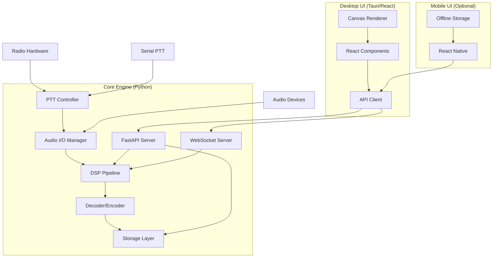
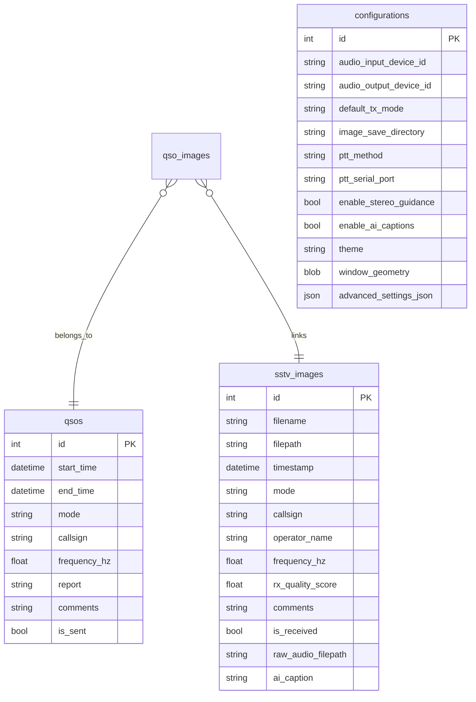
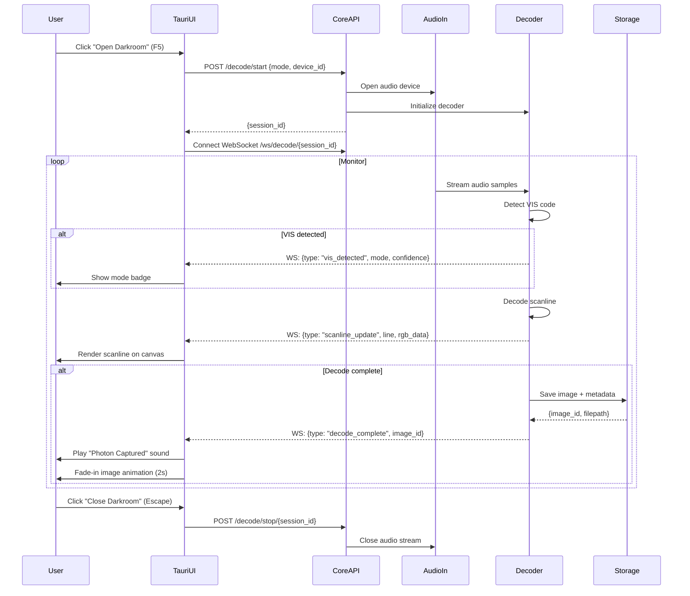
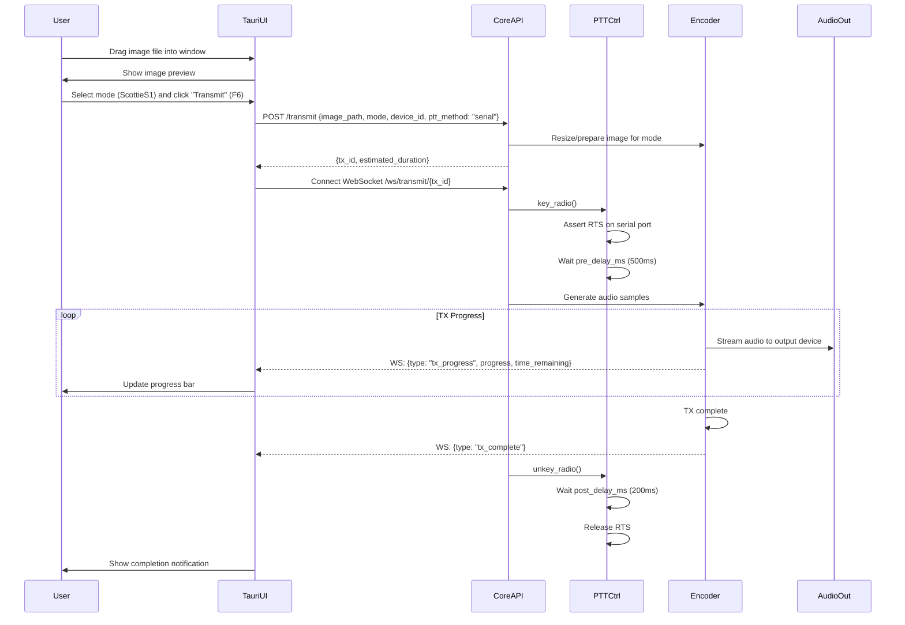
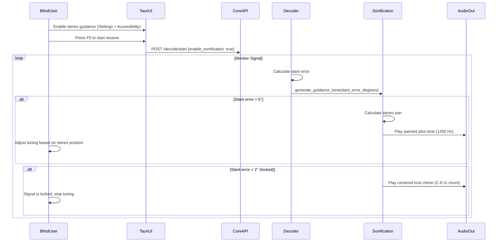
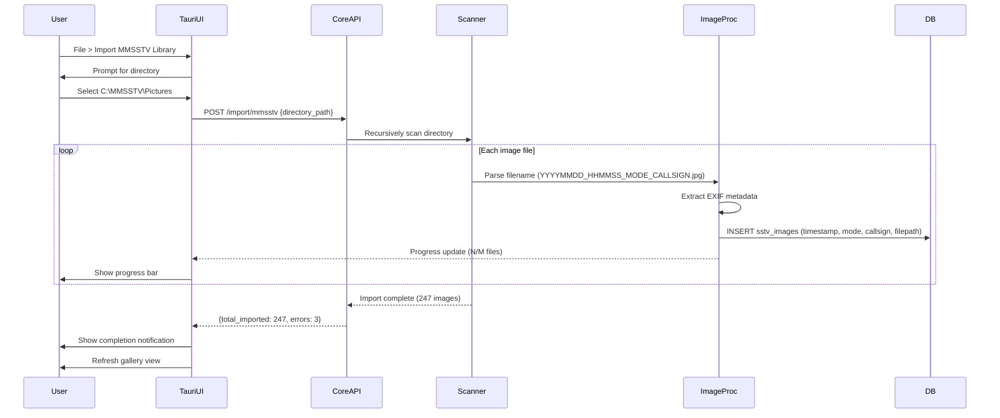

Summary:: Modern, modular SSTV platform with headless Python core and web-based desktop UI (Tauri), centered on reliable RX/TX, accessibility (stereo sonification), and smart automation that removes friction. SSTeVe is your friendly nerdy assistant for SSTV - helpful, capable, and approachable through messaging, not gimmicks.
Next:: Build Option C hybrid (Auto + Manual modes), conduct user testing with 20 participants, ship validated approach
Context:: Revised architecture serving Makers, Activators, Preppers, and Old Guard ham operators with API-first design and progressive disclosure based on extensive UX research.

## SSTeVe SSTV Platform - Build-Ready Blueprint

### Project Abstract
Build a modular SSTV platform with a headless Python core engine exposing a REST API and WebSocket interface, paired with a lightweight React/Tauri desktop UI. Serve multiple user archetypes (Makers, Activators, Preppers, Old Guard) through smart automation that removes friction: Smart Reply for instant acknowledgments, Smart Mode Detection when VIS fails, Signal Quality Pre-Flight to prevent wasted decodes, and friendly messaging that makes SSTV approachable without dumbing it down.

**Timeline:** 12 weeks for desktop MVP + accessibility + brand integration. Optional mobile prototype adds 6 weeks.

---

## 1. Tech Stack & Architecture

### 1.1 Modular Architecture Overview

**Core Philosophy:** Separate DSP/business logic from UI layer to enable:
- Multiple interface options (desktop, mobile, CLI, community plugins)
- Easier testing and maintenance
- Community extensibility via API

**System Architecture:**



### 1.2 Core Engine Stack

**Language:** Python 3.10+ (100% Python for DSP/business logic)

**Key Dependencies:**
```python
# Core DSP & Audio
sounddevice>=0.4.6          # Audio I/O (primary)
numpy>=1.24                 # Signal processing
scipy>=1.10                 # Filters, FFT
Pillow>=10.0               # Image processing

# Database & Storage
sqlalchemy>=2.0             # ORM
alembic>=1.12              # Migrations

# API Layer
fastapi>=0.104             # REST API framework
uvicorn>=0.24              # ASGI server
websockets>=12.0           # Live updates
pydantic>=2.0              # Data validation

# PTT Control
pyserial>=3.5              # Serial port control

# Filesystem Integration
watchdog>=3.0              # File system monitoring

# Accessibility (optional, post-MVP)
transformers>=4.35         # AI image captioning (BLIP) for alt-text
pytesseract>=0.3.10       # OCR (not for automatic callsign extraction - too unreliable on noisy SSTV images)
```

**Packaging:**
- Core engine: Python package installable via pip
- Desktop app: Tauri bundler (Windows installer, macOS .app, Linux AppImage)
- Mobile app: React Native bundler (APK, IPA)

### 1.3 Desktop UI Stack

**Framework:** React 18 + Tauri 2.0

**Why Tauri over PyQt:**
- 600KB binary vs 80MB (Electron) or 40MB (PyQt bundled)
- No Python runtime needed for UI (smaller distribution)
- Web tech enables easier community contributions
- Can evolve to web-hosted version without rewrite
- Native system integration (notifications, tray icons)

**UI Dependencies:**
```json
{
  "framework": "React 18",
  "state": "Zustand (lightweight)",
  "UI": "shadcn/ui (Tailwind components)",
  "build": "Vite",
  "desktop": "Tauri 2.0"
}
```

**Actionable Advice:**
- Run core engine as subprocess from Tauri app
- Use HTTP/WebSocket for UI ↔ Core communication
- Store core engine path in Tauri app bundle
- Handle core startup/shutdown lifecycle from Tauri

### 1.4 Mobile UI Stack (Optional - Phase 3)

**Framework:** React Native 0.72+

**Platform Support:**
- iOS 14+ (Lightning adapter, USB-C iPad)
- Android 10+ (USB-C OTG, USB host mode)

**Offline-First Design:**
- Local SQLite database syncs with core API
- Pre-bundled mode templates
- Queue TX/RX logs for upload when online

---

## 2. Data Schema (Core Engine Database)

### 2.1 Core Tables (SQLite via SQLAlchemy)

```sql
-- Images (received/transmitted)
CREATE TABLE sstv_images (
  id INTEGER PRIMARY KEY AUTOINCREMENT,
  filename TEXT NOT NULL,
  filepath TEXT NOT NULL,
  timestamp DATETIME NOT NULL DEFAULT CURRENT_TIMESTAMP,
  mode TEXT NOT NULL,
  callsign TEXT,
  operator_name TEXT,
  frequency_hz REAL,
  rx_quality_score REAL,
  comments TEXT,
  is_received BOOLEAN NOT NULL DEFAULT 1,
  raw_audio_filepath TEXT,
  ai_caption TEXT,                    -- NEW: AI-generated alt-text
  UNIQUE(filepath)
);

-- QSO log
CREATE TABLE qsos (
  id INTEGER PRIMARY KEY AUTOINCREMENT,
  start_time DATETIME NOT NULL DEFAULT CURRENT_TIMESTAMP,
  end_time DATETIME,
  mode TEXT NOT NULL,
  callsign TEXT NOT NULL,
  frequency_hz REAL,
  report TEXT,
  comments TEXT,
  is_sent BOOLEAN NOT NULL DEFAULT 0
);

-- QSO-Image join table
CREATE TABLE qso_images (
  qso_id INTEGER NOT NULL REFERENCES qsos(id) ON DELETE CASCADE,
  image_id INTEGER NOT NULL REFERENCES sstv_images(id) ON DELETE CASCADE,
  PRIMARY KEY (qso_id, image_id)
);

-- Configuration (singleton)
CREATE TABLE configurations (
  id INTEGER PRIMARY KEY CHECK (id = 1),

  -- Audio
  audio_input_device_id TEXT,
  audio_output_device_id TEXT,
  default_tx_mode TEXT NOT NULL DEFAULT 'ScottieS1',

  -- Storage
  image_save_directory TEXT NOT NULL,
  mmsstv_import_directory TEXT,
  enable_auto_save BOOLEAN NOT NULL DEFAULT 1,

  -- PTT Control (NEW)
  ptt_method TEXT NOT NULL DEFAULT 'vox',  -- 'none', 'serial', 'vox'
  ptt_serial_port TEXT,
  ptt_serial_baud INTEGER DEFAULT 9600,
  ptt_serial_signal TEXT DEFAULT 'RTS',   -- 'RTS' or 'DTR'
  ptt_pre_delay_ms INTEGER DEFAULT 500,
  ptt_post_delay_ms INTEGER DEFAULT 200,
  vox_preamble_ms INTEGER DEFAULT 500,

  -- Accessibility (NEW)
  enable_stereo_guidance BOOLEAN DEFAULT 0,
  pilot_tone_hz INTEGER DEFAULT 1200,
  enable_ai_captions BOOLEAN DEFAULT 0,  -- optional, off by default
  enable_verbose_cli BOOLEAN DEFAULT 0,

  -- Brand (minimal)
  theme TEXT NOT NULL DEFAULT 'darkroom',

  -- UI State
  window_geometry BLOB,
  window_state BLOB,
  last_input_device TEXT,
  last_output_device TEXT,

  advanced_settings_json TEXT
);

-- Indexes for performance
CREATE INDEX idx_images_timestamp ON sstv_images(timestamp DESC);
CREATE INDEX idx_images_mode ON sstv_images(mode);
CREATE INDEX idx_images_callsign ON sstv_images(callsign);
CREATE INDEX idx_qsos_start ON qsos(start_time DESC);
```

### 2.2 Entity Relationship Diagram



---

## 3. Core Engine API Specification

### 3.1 REST API Endpoints (FastAPI)

**Base URL:** `http://localhost:8000/api/v1`

#### Decode Operations

```yaml
POST /decode/start
  Request:
    mode: "ScottieS1" | "MartinM1" | "Robot36"
    device_id: string
    enable_auto_save: boolean
  Response:
    session_id: uuid
    status: "listening"

GET /decode/status/{session_id}
  Response:
    status: "listening" | "decoding" | "complete"
    mode: string
    progress: int (0-100)
    scanline: int
    total_scanlines: int
    vis_detected: boolean
    vis_confidence: float
    signal_quality: float (0-1)

POST /decode/stop/{session_id}
  Response:
    status: "stopped"
    image_id: int | null
    filepath: string | null
```

#### Transmit Operations

```yaml
POST /transmit
  Request:
    image_path: string
    mode: string
    device_id: string
    ptt_method: "none" | "serial" | "vox"
  Response:
    tx_id: uuid
    estimated_duration_sec: int

GET /transmit/status/{tx_id}
  Response:
    status: "transmitting" | "complete" | "error"
    progress: int (0-100)
    time_remaining_sec: int

POST /transmit/cancel/{tx_id}
  Response:
    status: "cancelled"
```

#### Image Gallery

```yaml
GET /images
  Query:
    limit: int (default 50)
    offset: int (default 0)
    mode: string | null
    is_received: boolean | null
    callsign_filter: string | null
  Response:
    images: array of ImageMetadata
    total: int

GET /images/{id}
  Response:
    id: int
    filename: string
    filepath: string
    timestamp: ISO8601
    mode: string
    callsign: string | null
    rx_quality_score: float | null
    ai_caption: string | null
    metadata: object
```

#### Device Management

```yaml
GET /devices/audio
  Response:
    inputs: array of AudioDevice
    outputs: array of AudioDevice

  AudioDevice:
    id: string
    name: string
    channels: int
    sample_rates: array of int

GET /devices/serial
  Response:
    ports: array of SerialPort

  SerialPort:
    port: string (/dev/ttyUSB0, COM3, etc.)
    description: string
    manufacturer: string | null
```

#### Configuration

```yaml
GET /config
  Response: Configuration object (full schema)

POST /config
  Request: Partial Configuration object
  Response: Updated Configuration

PATCH /config
  Request: Partial updates
  Response: Updated Configuration
```

### 3.2 WebSocket Live Updates

**Endpoint:** `ws://localhost:8000/api/v1/ws/decode/{session_id}`

**Event Types:**

```javascript
// VIS code detected
{
  "type": "vis_detected",
  "mode": "ScottieS1",
  "confidence": 0.98,
  "timestamp": "2025-12-02T14:30:23Z"
}

// Scanline decoded
{
  "type": "scanline_update",
  "line": 128,
  "total": 256,
  "progress": 50,
  "rgb_data": "base64-encoded-scanline",
  "signal_quality": 0.87
}

// Decode complete
{
  "type": "decode_complete",
  "image_id": 123,
  "filepath": "/path/to/image.jpg",
  "rx_quality_score": 0.92
}

// Error occurred
{
  "type": "error",
  "error_code": "DEVICE_FAILURE",
  "message": "Audio input device disconnected",
  "timestamp": "2025-12-02T14:32:01Z"
}
```

**Transmit WebSocket:** `ws://localhost:8000/api/v1/ws/transmit/{tx_id}`

```javascript
// TX progress
{
  "type": "tx_progress",
  "progress": 67,
  "time_remaining_sec": 36,
  "current_scanline": 172
}

// TX complete
{
  "type": "tx_complete",
  "duration_sec": 110,
  "timestamp": "2025-12-02T14:35:22Z"
}
```

---

## 4. Image Library & Filesystem Integration

### 4.1 Filesystem-Native Architecture

**Core Principle:** The image library is a regular directory on the user's filesystem, not an abstracted database-only store. This enables seamless integration with external image editing tools.

**Directory Structure:**
```
/Users/jeremy/SSTV/Images/           # User-configurable location
├── received/
│   ├── 20251203_142345_ScottieS1_W1AW.jpg
│   ├── 20251203_143012_MartinM1_K2XYZ.jpg
│   └── ...
├── transmitted/
│   ├── my_template_01.png
│   ├── pota_activation_k1234.jpg
│   └── ...
└── .ssteve/                         # Hidden metadata directory
    └── library.db                   # SQLite database (metadata only)
```

**Key Design Decisions:**
- Images stored as regular files (not embedded in database)
- Database stores metadata only (callsign, mode, timestamp, rx_quality)
- User can browse/backup directory with any file manager
- External apps can save directly to library (no import step)

### 4.2 File System Watcher

**Purpose:** Automatically detect changes to the image library directory and sync with database.

**Implementation (Python Core):**
```python
from watchdog.observers import Observer
from watchdog.events import FileSystemEventHandler

class ImageLibraryWatcher(FileSystemEventHandler):
    def on_created(self, event):
        """New file added to library directory"""
        if self.is_image_file(event.src_path):
            self.import_image(event.src_path)
            self.emit_websocket_event("library_updated")

    def on_modified(self, event):
        """File edited externally (e.g., in Preview/GIMP)"""
        if self.is_image_file(event.src_path):
            self.update_metadata(event.src_path)
            self.emit_websocket_event("image_modified")

    def on_deleted(self, event):
        """File removed from filesystem"""
        self.remove_from_database(event.src_path)
        self.emit_websocket_event("image_deleted")
```

**Behavior:**
- Watches user-configured library directory recursively
- Debounces rapid changes (editors often write multiple times)
- Handles rename/move operations
- Emits WebSocket events to UI for live gallery updates

### 4.3 OS Integration Features

**"Edit in Default App" (Context Menu):**
```typescript
// Tauri frontend
import { Command } from '@tauri-apps/plugin-shell';

async function editInDefaultApp(imagePath: string) {
  // Opens image in OS default editor (Preview, Photos, GIMP)
  await Command.create('open', [imagePath]).execute();

  // File watcher handles detecting save and updating gallery
}
```

**"Show in Finder/Explorer" (Context Menu):**
```typescript
async function revealInFileManager(imagePath: string) {
  const dir = path.dirname(imagePath);
  await Command.create('open', [dir]).execute();
}
```

**"Edit and Reply" Workflow (Smart Reply Integration):**
```typescript
async function editAndReply(receivedImage: Image) {
  // Export to temp file
  const tempPath = await exportToTemp(receivedImage);

  // Open in default editor
  await editInDefaultApp(tempPath);

  // Watch for changes
  const watcher = watchFile(tempPath, async (modified) => {
    // Auto-load into TransmitView when user saves
    await loadImageForTransmit(modified);
    showNotification("Image updated - ready to transmit");
  });
}
```

### 4.4 Drag-and-Drop Support

**UI Drop Zones:**
- Main window (anywhere) → Import to library
- Gallery view → Import to library
- Transmit view → Load image for TX (doesn't save to library)

**Supported Formats:**
- Single image file (JPG, PNG, BMP)
- Multiple image files (batch import)
- Directory (recursive import of all images)

**Implementation:**
```typescript
// React drop handler
function handleDrop(event: DragEvent) {
  event.preventDefault();
  const files = Array.from(event.dataTransfer.files);

  files.forEach(async (file) => {
    if (isImageFile(file)) {
      await importToLibrary(file);
    } else if (isDirectory(file)) {
      await importDirectoryRecursive(file);
    }
  });
}
```

### 4.5 Save-to-Library Workflow

**External Tool Integration:**
Users can save directly from any application into the SSTeVe image library:

```
User's Canva Workflow:
1. Create graphic in Canva
2. Export → Download → Save to disk
3. Navigate to: /Users/jeremy/SSTV/Images/transmitted/
4. Save as: my-template.png
5. Switch back to SSTeVe
   → Image appears immediately in gallery (file watcher)
   → No import button needed
```

**Configuration (Settings Panel):**
```yaml
Image Library Location:
  [/Users/jeremy/SSTV/Images/]  [Change Directory...]

  [Open in Finder/Explorer]

  ☑ Watch for new files (auto-import)
  ☑ Auto-detect image modifications
  ☑ Sync metadata to EXIF tags
```

### 4.6 Graphics and Overlay Workflows

**Design Philosophy:**
SSTeVe does not include a general-purpose graphics editor. Modern operating systems and web-based tools handle image creation better than any SSTV application can. SSTeVe focuses on seamless integration with these tools rather than replicating their functionality.

**Comparison with MMSSTV Quick Graphics:**

| **Use Case** | **MMSSTV Approach** | **SSTeVe Approach** |
|--------------|---------------------|---------------------|
| **Create initial graphics** | Quick Graphics editor (text, shapes, color bars) | Use OS tools (Preview, Photos, GIMP) or web tools (Canva, Photopea). Save directly to image library. |
| **Add callsign to image** | Manual text overlay in Quick Graphics | Smart Reply system (auto-populated from telemetry). See Section 6.5. |
| **Real-time acknowledgment** | Type callsign manually, position text | Right-click → "Smart Reply" → One-click transmit with proof-of-reception composite. |
| **Reusable templates** | Save Quick Graphics .qst files | Create templates in external tool, save to library. Or use Smart Reply templates. |

**Why This Approach:**

1. **Modern tools are better:** Image editing capabilities in Preview, Photos, GIMP, and web-based editors surpass what MMSSTV Quick Graphics offered.

2. **Seamless integration:** File system watcher and "Edit in Default App" provide round-trip editing without leaving SSTeVe mentally.

3. **Innovation where it matters:** Smart Reply with auto-populated telemetry (frequency, SNR, timestamp) is genuinely better than MMSSTV's manual text entry for acknowledgment workflows.

4. **Intentional focus:** SSTeVe excels at reliable SSTV communication, not at being a Swiss Army knife.

**For MMSSTV Users:**

If your workflow depends on in-app graphics editing beyond Smart Reply for real-time acknowledgments, SSTeVe may not be the right fit. This is an intentional design decision, not an oversight. The project prioritizes modern workflow integration over feature parity with legacy applications.

**Workflows Supported:**

1. **Prepare graphics externally:**
   - Create image in Canva/GIMP/Preview
   - Save directly to SSTeVe image library directory
   - Image appears automatically in gallery
   - Select and transmit

2. **Edit received image for reply:**
   - Right-click received image → "Edit in Default App"
   - Add your callsign/notes in Preview/Photos/GIMP
   - Save file
   - SSTeVe detects change, updates preview
   - Transmit

3. **Quick acknowledgment (Smart Reply):**
   - Right-click received image → "Smart Reply"
   - Preview shows auto-populated proof-of-reception composite
   - Click "Transmit" (5 seconds from decode complete to reply)

---

## 6. Smart Automation Principles

### 6.1 Design Philosophy

SSTeVe reduces friction through **intelligent assistance**, not brittle automation. SSTV signals are inherently noisy and variable - smart features must degrade gracefully when signal quality is poor.

**Core Insight:** Taking the work out of SSTV is what makes it fun. SSTeVe is your friendly nerdy assistant - helpful suggestions, not bossy automation. Focus on removing tedious tasks (typing callsigns, configuring devices, restarting failed decodes) rather than adding complexity through gamification.

### 6.2 Signal Reality Constraints

**Assumptions we CAN make:**
- ✅ Audio-level analysis (input levels, clipping, frequency detection)
- ✅ Signal timing analysis (sync pulse intervals, scanline duration)
- ✅ Hardware detection (USB device IDs, serial port characteristics)
- ✅ User-provided metadata (callsign entered once, reused everywhere)

**Assumptions we CANNOT make:**
- ❌ Image content is readable (OCR unreliable on noisy decodes)
- ❌ VIS codes always present (20% failure rate)
- ❌ Auto-detection always succeeds (must provide manual overrides)
- ❌ Signal quality is consistent (QSB, QRM, fading common)

### 6.3 Graceful Degradation Strategy

Every smart feature must have a fallback:

| Feature | Works On Good Signals | Degrades To (Noisy Signals) |
|---------|----------------------|---------------------------|
| Smart Mode Detection | Auto-suggests from sync timing | Manual mode selection |
| Smart Reply | Pre-fills callsign from metadata | User edits callsign in preview |
| Smart QSO Logging | One-click with all fields populated | User enters callsign, rest auto-fills |
| Signal Quality Pre-Flight | Accurate SNR estimate | Basic clipping/level detection only |
| Smart Slant Correction | Auto-corrects with high confidence | Offers manual adjustment with preview |

**Core Principle:** Smart features should **reduce work when possible**, not **fail when signal quality is poor**.

### 6.4 Innovation Areas (Reality-Grounded)

**1. Smart Reply (Flagship Feature)**
- User enters callsign on decode complete → Saved to metadata
- Right-click → "Smart Reply" → Auto-populated proof-of-reception composite
- Includes: Both callsigns, frequency, timestamp, SNR, mode
- One-click transmit (5 seconds from decode complete to reply)

**2. Smart Mode Detection**
- When VIS fails, analyze sync pulse timing at signal level
- Suggest most likely mode with confidence score
- One-click accept or manual override
- Prevents 2+ minute restart penalty

**3. Smart Device Configuration**
- Auto-detect common SSTV hardware (Digirig, SignaLink, RigBlaster)
- Pre-populate PTT settings based on device type
- One-click "Apply Recommended Settings"
- Reduces 10-15 minute setup frustration

**4. Signal Quality Pre-Flight Check**
- Real-time audio analysis before decode starts
- Warns about clipping, weak signal, off-frequency
- Prevents wasted 90-second decodes on bad signals
- Actionable feedback with quick-access fixes

**5. Smart QSO Logging**
- Decode completes → "Log QSO?" notification
- All fields pre-populated from telemetry
- One-click save (no typing except callsign)
- ADIF export automatic

**6. Smart Slant Correction**
- Post-decode one-click correction offer
- Preview before/after
- Learns radio clock offset for next time
- Manual override always available

### 6.5 Brand Voice Guidelines (SSTeVe - Friendly & Nerdy)

**Brand Personality:**
SSTeVe is your helpful radio buddy who's really into SSTV. Excited to show you cool stuff, not gatekeep-y. Technical competence without pretension. Makes SSTV approachable without dumbing it down.

**Voice Characteristics:**
- **Helpful, not bossy:** "Want me to try ScottieS1?" not "Switching to ScottieS1"
- **Encouraging, not condescending:** "Signal's looking good!" not "Great job!"
- **Specific, not vague:** "Signal's too hot - let's dial it back" not "Please adjust settings"
- **Conversational, not robotic:** "Couldn't read the VIS code" not "VIS detection failed"

**Messaging Examples:**

| Context | Technical (Avoid) | SSTeVe Voice (Use) |
|---------|-------------------|-------------------|
| Decode complete | "Decode operation successful" | "Got it! Nice signal from W1AW" |
| VIS failed | "VIS code detection failed. Manual mode selection required." | "Couldn't read the VIS code, but this looks like ScottieS1 to me. Want to try it?" |
| Smart Reply | "Generate proof-of-reception composite transmission" | "Reply to W1AW?" |
| Signal clipping | "Input level exceeds threshold. Reduce gain." | "Whoa, signal's too hot! Let's dial it back a bit" |
| Device detected | "Hardware device detected: Digirig Mobile USB Serial. Apply recommended configuration profile?" | "Oh hey, I see you've got a Digirig! I know how to set that up - want me to do it?" |
| Signal weak | "Signal to noise ratio below optimal threshold" | "Signal's pretty weak - want to try decoding anyway?" |
| First run | "Application initialized. Configure audio device to begin operation." | "Hey! I'm SSTeVe. Want to decode something?" |
| Mode suggestion | "Signal analysis indicates ScottieS1 mode (confidence: 85%)" | "This looks like ScottieS1 to me. Should we go with that?" |

**UI Copy Guidelines:**

**Buttons:**
- ✅ "Listen" not "Start Receive" or "Open Darkroom"
- ✅ "Reply" not "Generate Smart Reply"
- ✅ "Try It" not "Accept Suggestion"
- ✅ "Fix It" not "Apply Correction"

**Status Messages:**
- ✅ "Listening..." not "Receive Mode Active"
- ✅ "Decoding..." not "Processing Signal"
- ✅ "Done!" not "Operation Complete"

**Errors:**
- ✅ "Can't find that device - did you unplug it?" not "Device enumeration failed"
- ✅ "Hmm, that didn't work. Try again?" not "Operation failed. Retry?"

**Notifications:**
- ✅ "New decode from W1AW" not "Image received"
- ✅ "Ready to transmit" not "TX queue prepared"

**What to Avoid:**
- ❌ Over-enthusiasm: "Awesome!", "Amazing!", "Perfect!"
- ❌ Baby talk: "Oopsie!", "Uh oh!", "Yay!"
- ❌ Corporate speak: "Please be advised", "Kindly", "At this time"
- ❌ Jargon without context: "VIS", "SNR", "AFC" (explain on first use)
- ❌ Unnecessary personality: Don't add "!" to everything
- ❌ Mascot references: No "Steve says..." or character dialogue

**Consistency Rules:**
1. First-person singular when SSTeVe is doing something: "I couldn't detect the mode"
2. Second-person for user actions: "Want to try listening?"
3. Neutral/factual for telemetry: "SNR: 18dB" (no flavor text needed)
4. Use contractions: "can't", "didn't", "won't" (sounds human)

**Accessibility Note:**
Screen reader announcements should be factual and direct, not conversational. Friendly voice in visible UI, clear voice for assistive tech.

---

## 7. Functional Requirements (MoSCoW)

### 7.1 Must Have (MVP - Weeks 1-8)

**Core Engine (Utility First):**
- [ ] Headless Python service with FastAPI REST API
- [ ] RX/TX for Scottie S1, Martin M1, Robot 36
- [ ] Audio device enumeration and selection
- [ ] PTT control (serial + VOX) with pre/post delay
- [ ] SQLite database with image/QSO storage
- [ ] WebSocket live updates for RX/TX progress
- [ ] VIS detection with mismatch warnings
- [ ] Automatic image save with MMSSTV-compatible filenames
- [ ] MMSSTV import: scan directory, parse metadata, ingest
- [ ] Scriptable CLI for headless operation and smoke tests

**Desktop UI (Tauri/React):**
- [ ] Live decode view with canvas rendering
- [ ] Transmit view with image upload/preview
- [ ] Gallery view (list + filters)
- [ ] Settings panel (audio, PTT, accessibility)
- [ ] Keyboard shortcuts (F5=RX, F6=TX, Escape=cancel)
- [ ] Audio level meter (RMS + peak + clipping indicator)
- [ ] Signal Quality Pre-Flight Check (real-time audio analysis before decode)
  - [ ] Clipping detection with actionable warning
  - [ ] Frequency detection (signal present at expected tone)
  - [ ] Rough SNR estimate during listening phase
  - [ ] "Ready to decode" status indicator
- [ ] Drag-and-drop support (images + directories)
- [ ] Offline-first logging/store with burst sync/export
- [ ] SSTeVe branding/terminology (friendly and nerdy through messaging, not visuals)
- [ ] Desktop-native baseline: menu/tray entry, OS file pickers, window state persistence, clear offline/error states

**Filesystem Integration:**
- [ ] User-configurable image library directory
- [ ] Filesystem-native storage (images as regular files, not DB-embedded)
- [ ] File system watcher (auto-import on create/modify)
- [ ] "Edit in Default App" context menu
- [ ] "Show in Finder/Explorer" context menu
- [ ] Live gallery updates on filesystem changes

**Accessibility:**
- [ ] Stereo sonification for blind signal tuning
- [ ] Verbose CLI mode with JSON logging
- [ ] Screen reader labels (ARIA live regions)
- [ ] Keyboard-only navigation

### 7.2 Should Have (Weeks 9-12)

**Desktop UI Polish:**
- [ ] Waterfall/spectrum display with zoom
- [ ] Slant correction tools
- [ ] QSO log view with ADIF export
- [ ] Recent files menu
- [ ] Session recovery
- [ ] Platform-specific integration:
  - macOS: Native menu bar, dock badges, unified toolbar
  - Windows: Taskbar progress, jump lists, installer
  - Linux: .desktop file, D-Bus notifications

**Quality & Convenience:**
- [ ] AI image captioning (optional, offline-friendly toggles)
- [ ] Burst sync/export flows for field logs

### 7.3 Could Have (v2+)

**Mobile App (React Native):**
- [ ] Offline-first architecture (local SQLite + sync)
- [ ] GPS integration (auto-fill grid square)
- [ ] Battery-optimized mode
- [ ] Field workflows (Quick Log, Emergency TX)
- [ ] USB audio interface support (Digirig, SignaLink)

**Community & Engagement (Optional):**
- [ ] Achievement or proficiency markers (minimal, opt-in)
- [ ] Plugin architecture for custom modes
- [ ] Community image sharing
- [ ] SDR control integration
- [ ] Advanced DSP (noise reduction, AGC)

### 7.4 Won't Have (MVP)

- [ ] Cloud backends or account systems
- [ ] Video SSTV modes
- [ ] WASM DSP modules
- [ ] Blockchain integration (seriously, no)
- [ ] General-purpose graphics editor
- [ ] MMSSTV Quick Graphics feature parity
- [ ] In-app text/shape drawing tools (use OS image tools instead)
- [ ] Gamification (achievements, badges, leaderboards, stats dashboards)
  - **Rationale:** Taking work out of SSTV makes it fun, not adding game mechanics. Focus on friction removal through smart automation instead.

### 7.5 UX Alignment (Personas + First Wins)

- **Maker (Spectrum Hacker):** Scriptable/headless decode and transmit smoke tests with sample audio; REST/CLI parity; stable API for automation.
- **Activator (Gamified Adventurer):** Offline-first capture/log queue with burst sync/export; fast image TX/RX flows; minimal setup in the field.
- **Prepper (Resilient Pragmatist):** Low-friction onboarding; reliable PTT and device handling; “good enough” defaults to receive and log without configuration burden.
- **Old Guard:** Compatible filenames/import; predictable desktop controls; optional branding kept light.

**First Win Tests (per persona):**
- Maker: Run sample audio decode via CLI/API headless; confirm image saved + status events.
- Activator: Capture RX/TX in offline mode; queue logs; perform burst sync/export when back online.
- Prepper: Fresh install → choose device → receive and save an image without extra config; PTT keys reliably.
- Old Guard: Import MMSSTV library; verify filenames and gallery usability with standard desktop controls.

---

## 5. Key User Flows

### 5.1 Receive and Decode (Core + Desktop UI)



### 5.2 Transmit Image with PTT Control



### 5.3 Stereo Sonification for Blind Operators



### 5.4 Import MMSSTV Library



---

## 6. Implementation Checklist

### **Phase 1: Core Engine Foundation (Weeks 1-2)**

- [ ] **1.1 Project Setup**
  - [ ] Create monorepo structure: `sstv_core/`, `sstv_desktop/`, `sstv_mobile/` (optional)
  - [ ] Set up Python venv and install dependencies (sounddevice, FastAPI, SQLAlchemy, pyserial, etc.)
  - [ ] Initialize SQLite database with Alembic migrations
  - [ ] Create SQLAlchemy models matching schema in §2.1

- [ ] **1.2 Audio Device Manager**
  - [ ] Implement `sstv_core/audio/device_manager.py` using sounddevice
  - [ ] Enumerate input/output devices
  - [ ] Handle device hotplug detection
  - [ ] Implement audio callback with RMS/peak level calculation

- [ ] **1.3 PTT Controller**
  - [ ] Implement `sstv_core/audio/ptt_controller.py`
  - [ ] Support serial PTT (RTS/DTR signals)
  - [ ] Support VOX mode (preamble silence injection)
  - [ ] Add pre/post TX delays
  - [ ] Test with Digirig (serial) and SignaLink (VOX)

- [ ] **1.4 Minimal RX Pipeline**
  - [ ] Implement VIS detector for Scottie S1
  - [ ] Implement Scottie S1 decoder (320x256, 5:4 aspect)
  - [ ] Real-time scanline rendering
  - [ ] Auto-save to configured directory
  - [ ] Calculate RX quality score (signal SNR)

- [ ] **1.5 Minimal TX Pipeline**
  - [ ] Implement Scottie S1 encoder
  - [ ] Image resize/crop to 320x256 (Pillow LANCZOS)
  - [ ] Generate VIS code + sync pulses
  - [ ] Stream audio to output device
  - [ ] Integrate PTT control (key before audio, unkey after)

### **Phase 2: API Layer (Week 3)**

- [ ] **2.1 FastAPI Application**
  - [ ] Set up FastAPI app with CORS middleware
  - [ ] Implement `/api/v1/decode/*` endpoints (start/stop/status)
  - [ ] Implement `/api/v1/transmit/*` endpoints
  - [ ] Implement `/api/v1/images/*` endpoints (list, get)
  - [ ] Implement `/api/v1/devices/*` endpoints (audio, serial)
  - [ ] Implement `/api/v1/config` endpoint (GET/POST/PATCH)
  - [ ] Add request validation with Pydantic models

- [ ] **2.2 WebSocket Server**
  - [ ] Implement `/api/v1/ws/decode/{session_id}` WebSocket endpoint
  - [ ] Emit `vis_detected`, `scanline_update`, `decode_complete` events
  - [ ] Implement `/api/v1/ws/transmit/{tx_id}` WebSocket endpoint
  - [ ] Emit `tx_progress`, `tx_complete` events
  - [ ] Handle client disconnections gracefully

- [ ] **2.3 API Testing**
  - [ ] Write pytest integration tests for all endpoints
  - [ ] Test WebSocket event streams
  - [ ] Test concurrent RX/TX operations
  - [ ] Document API with OpenAPI/Swagger

### **Phase 3: Accessibility & Additional Modes (Week 4)**

- [ ] **3.1 Stereo Sonification**
  - [ ] Implement `sstv_core/accessibility/audio_guidance.py`
  - [ ] Generate stereo-panned pilot tones based on slant error
  - [ ] Generate lock chime (C-E-G chord) when centered
  - [ ] Mix guidance tones with monitoring audio

- [ ] **3.2 Verbose CLI Mode**
  - [ ] Implement `sstv_core/api/cli.py` with JSON logging
  - [ ] Add `--cli` and `--verbose` flags
  - [ ] Emit structured events for screen readers
  - [ ] Test with NVDA/VoiceOver/Orca

- [ ] **3.3 Additional Modes**
  - [ ] Implement Martin M1 decoder/encoder (320x256)
  - [ ] Implement Robot 36 decoder/encoder (320x240, 4:3 aspect)
  - [ ] Update mode selection API to support all 3 modes

- [ ] **3.4 AI Image Captioning (Optional)**
  - [ ] Integrate BLIP model for semantic captions
  - [ ] Integrate Tesseract OCR for callsign extraction
  - [ ] Generate captions in background thread (don't block RX)
  - [ ] Cache captions in `sstv_images.ai_caption` field

### **Phase 4: Desktop UI - Core Views (Week 5)**

- [ ] **4.1 Tauri Project Setup**
  - [ ] Initialize Tauri 2.0 project
  - [ ] Configure Rust backend to launch core engine subprocess
  - [ ] Set up React 18 frontend with Vite
  - [ ] Install shadcn/ui components and Tailwind CSS
  - [ ] Set up Zustand state management

- [ ] **4.2 API Client**
  - [ ] Create TypeScript API client with fetch/WebSocket
  - [ ] Implement auto-reconnect for WebSocket
  - [ ] Handle core engine startup/shutdown
  - [ ] Add error boundary for API failures

- [ ] **4.3 Live Decode View**
  - [ ] Implement canvas-based scanline renderer
  - [ ] Subscribe to WebSocket scanline updates
  - [ ] Show real-time progress bar
  - [ ] Display VIS detection badge
  - [ ] Show audio level meter (RMS/peak/clipping)

- [ ] **4.4 Transmit View**
  - [ ] Implement image file upload (drag-and-drop + file picker)
  - [ ] Show image preview with mode-specific crop overlay
  - [ ] Mode selection dropdown (Scottie S1, Martin M1, Robot 36)
  - [ ] TX progress dialog with time remaining
  - [ ] Cancel button (send API request)

- [ ] **4.5 Gallery View**
  - [ ] Implement infinite scroll with lazy loading
  - [ ] Show image cards (thumbnail + metadata)
  - [ ] Add filtering (mode, callsign, date range)
  - [ ] Add sorting (newest, oldest, quality)
  - [ ] Click to open full-size view

- [ ] **4.6 Settings View**
  - [ ] Audio device selection (dropdowns for input/output)
  - [ ] PTT configuration (method, serial port, delays)
  - [ ] Accessibility options (sonification, AI captions, high contrast)
  - [ ] Image save directory picker
  - [ ] Theme selection (Darkroom, Light, High Contrast)

### **Phase 5: Desktop UI - Polish & Brand (Week 6)**

- [ ] **5.1 SSTeVe Brand Integration**
  - [ ] Create `brand_constants.ts` with SSTeVe colors
  - [ ] Apply instrument panel theme (deep blue-charcoal + lime/amber accents)
  - [ ] Implement SSTeVe voice guidelines ("Listen", "Reply", etc.)
  - [ ] Implement smooth canvas transitions (600-800ms easing)
  - [ ] Add "Decode Complete" confirmation tone

- [ ] **5.2 First-Run Experience**
  - [ ] Create onboarding modal for first launch
  - [ ] Add demo mode (play pre-recorded SSTV audio)
  - [ ] Show tutorial tooltips for first RX/TX

- [ ] **5.3 Keyboard Shortcuts**
  - [ ] F5: Start receive
  - [ ] F6: Start transmit
  - [ ] Escape: Cancel RX/TX
  - [ ] Ctrl+O: Open image for TX
  - [ ] Ctrl+S: Save current RX image
  - [ ] Ctrl+,: Open settings
  - [ ] Ctrl+L: Quick log QSO
  - [ ] F12: Emergency transmit

- [ ] **5.4 System Integration**
  - [ ] Implement native notifications (decode complete, TX complete)
  - [ ] macOS: Native menu bar, unified toolbar
  - [ ] Windows: Taskbar progress, system tray icon
  - [ ] Linux: .desktop file, D-Bus notifications

- [ ] **5.5 Packaging**
  - [ ] Windows: Inno Setup installer (.exe)
  - [ ] macOS: .app bundle with code signing
  - [ ] Linux: AppImage + .deb package

### **Phase 6: Smart Workflows & Automation (Weeks 7-8)**

- [ ] **6.1 Smart Reply System (Flagship Feature)**
  - [ ] Template engine for proof-of-reception composites (Python core)
  - [ ] 2-3 template designs (QSL Card, Monitor Frame, Minimal Badge)
  - [ ] Auto-population from reception telemetry (callsign, frequency, SNR, timestamp, mode)
  - [ ] Manual callsign entry on decode complete → saved to image metadata
  - [ ] Callsign reuse from metadata for Smart Reply
  - [ ] "Smart Reply" UI workflow (right-click → preview → transmit)
  - [ ] Template selector and field editor in preview modal
  - [ ] Keyboard shortcut: R (while image selected)
  - [ ] Editable fields in preview (callsign defaults to metadata, user can override)

- [ ] **6.2 Smart Mode Detection**
  - [ ] Signal-level sync pulse timing analysis (Python core)
  - [ ] Mode suggestion algorithm based on scanline duration patterns
  - [ ] Confidence scoring for mode suggestions
  - [ ] UI workflow: "VIS failed → Suggested: ScottieS1 (85%) [Accept] [Try Other]"
  - [ ] One-click mode switch without restarting decode
  - [ ] Fallback to manual mode selection if confidence < 50%

- [ ] **6.3 Smart Device Configuration**
  - [ ] USB device ID detection (VID/PID lookup)
  - [ ] Hardware profile database (Digirig, SignaLink, RigBlaster presets)
  - [ ] Auto-populate PTT settings based on detected hardware
  - [ ] "Apply Recommended Settings" one-click workflow
  - [ ] Settings preview before applying (show what will change)
  - [ ] Manual override always available

- [ ] **6.4 Smart QSO Logging**
  - [ ] Decode-complete notification with "Log QSO?" prompt
  - [ ] Pre-filled QSO form (callsign from metadata, time/freq/mode/SNR auto)
  - [ ] One-click save to database
  - [ ] ADIF export integration
  - [ ] Keyboard shortcut: Ctrl+L (from decode-complete notification)
  - [ ] Optional: Skip logging if no callsign in metadata

- [ ] **6.5 Smart Slant Correction**
  - [ ] Post-decode slant detection algorithm
  - [ ] One-click "Auto-Correct Slant" offer with before/after preview
  - [ ] Correction confidence scoring
  - [ ] Learn radio clock offset (save per frequency for future decodes)
  - [ ] Manual slider override always available
  - [ ] Apply correction without requiring decode restart

- [ ] **6.6 Frequency Discovery Helper**
  - [ ] Common SSTV frequency reference list (HF, VHF, satellite)
  - [ ] "Copy to Clipboard" for manual tuning
  - [ ] Usage notes (time of day, band conditions)
  - [ ] Optional: CAT control integration for auto-tuning (future)

- [ ] **6.7 Filesystem Integration**
  - [ ] File system watcher implementation (watchdog library)
  - [ ] "Edit in Default App" context menu (Tauri shell integration)
  - [ ] "Show in Finder/Explorer" context menu
  - [ ] Drag-and-drop support (single file, multiple files, directory)
  - [ ] Auto-import on file create/modify
  - [ ] Image library directory configuration in Settings
  - [ ] WebSocket events for live gallery updates

- [ ] **6.8 Emergency Transmit Dialog (Prepper Workflow)**
  - [ ] Build high-contrast emergency UI
  - [ ] Generate emergency composite (GPS + callsign + timestamp)
  - [ ] Long-press confirmation (3s hold to prevent accidents)
  - [ ] Use Robot 36 (fastest mode)
  - [ ] Keyboard shortcut: F12

### **Phase 7: Accessibility Enhancements (Weeks 9-10)**

- [ ] **7.1 Screen Reader Support**
  - [ ] Add ARIA labels to all interactive elements
  - [ ] Implement ARIA live regions for decode progress
  - [ ] Test with NVDA (Windows), VoiceOver (macOS), Orca (Linux)
  - [ ] Fix keyboard navigation issues

- [ ] **7.2 AI Image Captioning UI (Optional, Post-MVP)**
  - [ ] Show AI captions in gallery view (alt-text) for accessibility
  - [ ] Add "Generate Caption" button for existing images
  - [ ] Note: OCR for callsigns unreliable on noisy SSTV images - users enter callsigns manually instead

- [ ] **7.3 High-Contrast Mode**
  - [ ] Create high-contrast theme variant
  - [ ] Ensure 4.5:1 contrast ratio for text (WCAG AA)
  - [ ] Test with color blindness simulators

- [ ] **7.4 Keyboard-Only Enhancements**
  - [ ] Type-ahead search for device dropdowns
  - [ ] Gallery navigation with arrow keys
  - [ ] Delete/preview with Delete/Space keys

### **Phase 8: Platform-Specific Integration (Week 11)**

- [ ] **8.1 macOS Integration**
  - [ ] Native menu bar (File, Edit, View, Help)
  - [ ] Dock badge for unread images
  - [ ] Unified toolbar + title bar (Big Sur+)
  - [ ] File associations (.jpg, .png open in SSTeVe)
  - [ ] Notification Center integration

- [ ] **8.2 Windows Integration**
  - [ ] Taskbar progress during TX
  - [ ] Jump lists (Recent Images, Quick Log)
  - [ ] System tray icon with context menu
  - [ ] File associations (registry keys)
  - [ ] Windows 10/11 toast notifications

- [ ] **8.3 Linux Integration**
  - [ ] Install .desktop file to ~/.local/share/applications
  - [ ] Add to application menu (HamRadio category)
  - [ ] D-Bus notifications
  - [ ] Handle PulseAudio/PipeWire device changes

### **Phase 9: Testing & Release (Week 12)**

- [ ] **9.1 Hardware Testing**
  - [ ] Test PTT with Digirig (serial RTS/DTR)
  - [ ] Test PTT with SignaLink (VOX preamble)
  - [ ] Test with various audio interfaces (Scarlett, Behringer, etc.)
  - [ ] Test device hotplug handling

- [ ] **9.2 Accessibility Testing**
  - [ ] Contract with NFB for blind user testing
  - [ ] Validate stereo sonification effectiveness
  - [ ] Test screen reader compatibility (NVDA, VoiceOver, Orca)
  - [ ] Verify keyboard-only operation

- [ ] **9.3 Cross-Platform Testing**
  - [ ] Windows 10, Windows 11 (installer, serial ports)
  - [ ] macOS 12, 13, 14 (.app bundle, microphone permissions)
  - [ ] Ubuntu 22.04, Fedora 39, Arch Linux (AppImage, .deb)

- [ ] **9.4 Performance Testing**
  - [ ] Profile CPU usage during RX/TX
  - [ ] Test memory leaks (leave running for 24h)
  - [ ] Optimize database queries (add indexes if needed)
  - [ ] Test with 10,000+ images in gallery

- [ ] **9.5 Documentation**
  - [ ] Write README with screenshots
  - [ ] Create API documentation (OpenAPI/Swagger)
  - [ ] Write user guide (Markdown + hosted on GitHub Pages)
  - [ ] Record demo video (RX, TX, PTT, accessibility features)

- [ ] **9.6 Beta Release**
  - [ ] Create GitHub release (v1.0.0-beta.1)
  - [ ] Post to r/amateurradio, r/hamradio
  - [ ] Post to QRZ forums
  - [ ] Collect feedback and bug reports

### **Phase 10: Mobile Prototype (Optional - Weeks 13-18)**

- [ ] **10.1 React Native Setup**
  - [ ] Initialize React Native project (TypeScript)
  - [ ] Set up offline-first architecture (local SQLite + sync)
  - [ ] Implement API client with retry/queue logic

- [ ] **10.2 Core Views**
  - [ ] Simplified RX/TX UI (large buttons, minimal chrome)
  - [ ] Gallery with swipe gestures
  - [ ] Settings (audio, PTT, offline sync)

- [ ] **10.3 Field Optimizations**
  - [ ] GPS integration (auto-fill grid square)
  - [ ] Battery saver mode (reduce polling, lower sample rate)
  - [ ] Glove mode (larger touch targets)

- [ ] **10.4 Testing**
  - [ ] Test with Digirig on iOS (Lightning adapter)
  - [ ] Test with Digirig on Android (USB-C OTG)
  - [ ] Field test at POTA activation
  - [ ] Battery drain profiling

---

## 7. SSTeVe Brand Specifications

### 7.1 Visual Language

**Color Palette (Instrument-Focused):**
```typescript
const BRAND_COLORS = {
  // Primary: Cello (Slate Blue-Gray) - "Radio tuning"
  CELLO: {
    500: "#3B4E5F", // Base (approx)
    900: "#1A232C"  // Deep
  },
  // Secondary: Terracotta (Earthy Red-Brown) - "Analog heritage"
  TERRACOTTA: {
    500: "#CCA48B", // Base (approx)
    900: "#5C4234"  // Deep
  },
  // Backgrounds: Black Rock (Deep Earth Tones)
  BLACK_ROCK: "#1A1D21", 
  
  // Status Indicators
  SUCCESS_SAGE: "rgb(143, 177, 75)",       // Natural green
  WARNING_AMBER: "rgb(249, 197, 116)",     // Warm glow
  DANGER_FLAMINGO: "rgb(231, 83, 81)",     // Earthy red
  INFO_CALX: "rgb(184, 197, 217)"          // Muted blue
};
```

**Typography:**
- System Font Stack (No web fonts)
- Hierarchy: Medium weight headers, Monospace for data (Frequency, SNR)

**Motion Language:**
- **Easing:** Spring physics (mechanical instrument feel)
- **Timing:** Deliberate, not instant (honoring SSTV's slow nature)
- **Feedback:** "Instrument-like" settling into position

### 7.2 Terminology (Standardized)

| Concept | Terminology |
|---------|-------------|
| RX View | Capture View |
| TX View | Transmit View |
| History | Log / Gallery |
| Tuning Aid | Waterfall / Spectrum |
| Signal Lock | Sync / Locked |

### 7.3 The Decode Animation

- **Progressive:** Scan lines render in real-time
- **Completion:** "Image Saved" success indicator (Green/Sage)
- **Sound:** Subtle mechanical "complete" click or chime

### 7.4 First Run Experience

**Trigger:** First app launch (database empty)

**Modal Dialog:**
```
SSTeVe is listening.

Tune your radio to 14.230 MHz.
Press F5 to Capture.

[Try Demo Mode]
```

**Demo Mode:** Play pre-recorded SSTV audio file to demonstrate decoding without radio.

---

## 8. Accessibility Specifications

### 8.1 Stereo Sonification Algorithm

**Purpose:** Enable blind operators to tune signals by ear using stereo audio guidance.

**Implementation:**
```python
def generate_guidance_tone(slant_error_degrees: float) -> np.ndarray:
    """
    Args:
        slant_error_degrees: -45 to +45 (left tilt to right tilt)

    Returns:
        Stereo audio (2 channels) with panned pilot tone
    """
    # Calculate stereo pan (-1 = full left, +1 = full right)
    pan = np.clip(slant_error_degrees / 45, -1, 1)

    # Equal-power panning
    left_gain = np.sqrt((1 - pan) / 2)
    right_gain = np.sqrt((1 + pan) / 2)

    # Generate pilot tone (1200 Hz by default)
    pilot_tone = generate_sine_wave(1200, duration=0.1)

    # Apply stereo pan
    stereo = np.column_stack((pilot_tone * left_gain, pilot_tone * right_gain))

    # Centered = success chime (C-E-G chord)
    if abs(slant_error_degrees) < 2:
        return generate_lock_chime()

    return stereo
```

**User Experience:**
- Signal too far left → Tone in left ear only
- Signal centered → Rising three-note chord in both ears
- Signal too far right → Tone in right ear only

### 8.2 Verbose CLI Mode

**Purpose:** Provide structured logging for screen reader parsing and automation.

**Usage:**
```bash
sstv-core --cli --verbose --mode ScottieS1 --rx
```

**Output Format:**
```json
{"timestamp":"2025-12-02T14:30:45Z","type":"VIS_DETECTED","message":"Mode: ScottieS1","data":{"mode":"ScottieS1","confidence":0.98}}
{"timestamp":"2025-12-02T14:30:50Z","type":"SYNC_LOCK","message":"Scanline 64/256","data":{"scanline":64,"progress":25}}
{"timestamp":"2025-12-02T14:31:55Z","type":"DECODE_COMPLETE","message":"Saved: image_001.jpg","data":{"image_id":123,"filepath":"/path/to/image.jpg"}}
```

### 8.3 AI Image Captioning

**Purpose:** Generate semantic alt-text for screen readers.

**Status:** Optional (post-MVP) due to model size and bundle impact.

**Models:**
- BLIP (Salesforce/blip-image-captioning-base) for image captions
- Tesseract OCR for callsign extraction

**Example Output:**
```
"A radio tower against a blue sky. Detected text: W1AW ARRL HQ"
```

**Storage:** Cache captions in `sstv_images.ai_caption` field to avoid re-processing.

### 8.4 WCAG 2.1 Level AA Compliance

**Contrast Ratios:**
- Normal text: 4.5:1 minimum (white on #353535 = 19:1)
- Large text: 3:1 minimum
- UI components: 3:1 minimum

**Keyboard Navigation:**
- All functions accessible via keyboard
- Focus indicators visible (2px blue outline)
- Tab order follows logical flow

**Screen Reader Support:**
- ARIA labels on all interactive elements
- ARIA live regions for real-time updates
- Semantic HTML structure

---

## 9. PTT Control Specifications

### 9.1 Supported Methods

**1. Serial PTT (Digirig, RigBlaster)**
- Assert RTS or DTR signal on serial port
- Pre-TX delay (default 500ms) for relay settling
- Post-TX delay (default 200ms) before release

**2. VOX PTT (SignaLink, TigerTronics)**
- No hardware control
- Add 500ms silence preamble to audio
- Radio keys on audio presence

**3. None (Monitor Only)**
- Transmit audio but don't key radio
- For testing or VOX-equipped radios

### 9.2 Configuration

**Database Fields:**
```sql
ptt_method TEXT NOT NULL DEFAULT 'vox'
ptt_serial_port TEXT                    -- /dev/ttyUSB0, COM3, etc.
ptt_serial_baud INTEGER DEFAULT 9600
ptt_serial_signal TEXT DEFAULT 'RTS'    -- 'RTS' or 'DTR'
ptt_pre_delay_ms INTEGER DEFAULT 500
ptt_post_delay_ms INTEGER DEFAULT 200
vox_preamble_ms INTEGER DEFAULT 500
```

**UI Settings Panel:**
- Dropdown: PTT Method (None, Serial, VOX)
- Serial Port: Dropdown (auto-populated from `/api/v1/devices/serial`)
- Signal: Radio buttons (RTS, DTR)
- Pre-Delay: Slider (0-1000ms)
- Post-Delay: Slider (0-500ms)
- VOX Preamble: Slider (0-1000ms)

### 9.3 Testing Checklist

- [ ] Serial PTT: Radio TX LED illuminates before audio starts
- [ ] Serial PTT: Audio plays cleanly without clipping
- [ ] Serial PTT: Radio un-keys cleanly after audio
- [ ] VOX PTT: Radio keys within 500ms of audio start
- [ ] Device hotplug: Graceful error if serial port disconnected

---

## 10. Error Handling Strategy

### 10.1 Audio Device Failures

**Trigger:** Device disconnected during RX/TX, driver error

**Core Engine Response:**
1. Stop audio stream immediately
2. Emit WebSocket error event:
   ```json
   {
     "type": "error",
     "error_code": "DEVICE_FAILURE",
     "message": "Audio input device disconnected",
     "device_id": "usb_audio_1"
   }
   ```
3. Set session status to "error"

**Desktop UI Response:**
1. Show modal error dialog:
   - Title: "Audio Device Error"
   - Message: "Failed to open audio device: [device name]"
   - Buttons: [Retry] [Open Settings] [Quit]
2. Reset UI to idle state
3. Re-enumerate devices and update dropdowns

### 10.2 PTT Control Failures

**Trigger:** Serial port not found, permission denied

**Core Engine Response:**
1. Return HTTP 500 error from `/transmit` endpoint
2. Include error details in response body
3. Do not transmit audio (fail-safe)

**Desktop UI Response:**
1. Show non-modal error banner:
   - "PTT Error: Cannot open /dev/ttyUSB0. Check permissions."
2. Offer "Transmit without PTT" option
3. Log full error to console

### 10.3 Database Errors

**Trigger:** SQLite locked, disk full, corruption

**Core Engine Response (Startup):**
1. Fail fast on initialization
2. Return HTTP 503 from all endpoints
3. Log error with database path

**Desktop UI Response:**
1. Show modal error dialog:
   - Title: "Database Initialization Failed"
   - Message: "Unable to initialize database at [path]"
   - Buttons: [Reset Database] [Quit]
2. Reset Database: Backup old DB, create fresh schema, restart app

**Core Engine Response (Runtime):**
1. Log error with full traceback
2. Return HTTP 500 from affected endpoint
3. Continue serving other requests (don't crash)

### 10.4 Image Processing Errors

**Trigger:** Corrupted image file, unsupported format

**Core Engine Response:**
1. Skip problematic file during MMSSTV import
2. Increment error counter in response
3. Log error with file path

**Desktop UI Response:**
1. Show non-blocking toast notification:
   - "⚠️ Failed to import: corrupted_file.jpg"
2. Continue import process (don't abort)
3. Show summary at end: "247 imported, 3 errors"

---

## 11. Performance Requirements

### 11.1 Real-Time Constraints

**Audio Latency:**
- Target callback latency: 10ms (no audible glitches)
- Buffer size: start at 1024 samples @ 48kHz (~21ms); allow tuning per device
- Use separate thread for DSP to avoid blocking UI
- Document fallback strategy if devices require higher buffer (degraded but stable)

**WebSocket Update Rate:**
- Scanline updates: 10-20 Hz (acceptable for visual feedback)
- Audio level meter: 20 Hz (smooth animation)
- Throttle updates on slow connections

### 11.2 Database Performance

**Gallery View:**
- Load 50 images in <100ms (indexed query)
- Thumbnail generation: Lazy load on scroll
- Cache thumbnails in memory (max 200 images)

**Indexes:**
```sql
CREATE INDEX idx_images_timestamp ON sstv_images(timestamp DESC);
CREATE INDEX idx_images_mode ON sstv_images(mode);
CREATE INDEX idx_images_callsign ON sstv_images(callsign);
```

**Query Optimization:**
```python
# BAD: Load all columns
images = session.query(SSTVImage).all()

# GOOD: Load only needed columns
images = session.query(
    SSTVImage.id, SSTVImage.filepath, SSTVImage.timestamp
).limit(50).all()
```

### 11.3 Memory Usage

**Desktop App:**
- Idle: <100MB RAM
- Active RX: <200MB RAM
- Gallery (1000 images): <500MB RAM

**Core Engine:**
- Idle: <50MB RAM
- Active RX/TX: <150MB RAM

**Optimizations:**
- Release image buffers immediately after save
- Use numpy views instead of copies
- Lazy load AI captioning models (only when enabled)

**DSP/Decoder Details (guidance):**
- Tone detection: Goertzel/PLL for VIS and sync; AFC + slant correction plan documented
- Timing recovery: explicit thresholds and re-sync behavior
- PTT: pre/post timing defaults (e.g., 500ms/200ms) and hotplug/error handling

---

## 12. Security Considerations

### 12.1 API Security

**Local-Only Binding:**
```python
uvicorn.run(app, host="127.0.0.1", port=8000)  # Localhost only
```

**No Authentication (MVP):**
- API runs locally, no network exposure
- Future: Add API key auth for remote access

**Input Validation:**
- All endpoints use Pydantic models
- Validate file paths (prevent directory traversal)
- Validate serial port names (whitelist known patterns)

### 12.2 File System Access

**Restrict Write Paths:**
```python
# Only allow writes to configured save directory
if not os.path.abspath(filepath).startswith(config.image_save_directory):
    raise ValueError("Invalid filepath")
```

**MMSSTV Import:**
- Scan only user-selected directory (no recursive scanning of system dirs)
- Skip symlinks to prevent directory traversal

### 12.3 Serial Port Access

**Linux Permissions:**
```bash
# Add user to dialout group for serial port access
sudo usermod -a -G dialout $USER
```

**Windows:**
- No special permissions needed for COM ports

**macOS:**
- Requires user approval for USB device access (handled by system)

---

## 13. Testing Strategy

### 13.1 Unit Tests (Pytest)

**Core Engine:**
- [ ] Audio device enumeration
- [ ] VIS code detection (known test signals)
- [ ] Mode encoding/decoding (known images)
- [ ] PTT timing (mock serial port)
- [ ] Database CRUD operations
- [ ] API endpoint responses (mocked decoder)

**Target Coverage:** 80% for core modules

### 13.2 Integration Tests

**API Flow Tests:**
- [ ] Full RX flow (start → VIS → scanlines → complete)
- [ ] Full TX flow (upload → encode → transmit → complete)
- [ ] WebSocket reconnection
- [ ] Concurrent RX/TX sessions
- [ ] Device hotplug during operation

### 13.3 End-to-End Tests (Playwright)

**Desktop UI:**
- [ ] Start app → Open Darkroom → Receive → Save
- [ ] Load image → Select mode → Transmit
- [ ] Import MMSSTV directory
- [ ] Change settings → Verify persistence
- [ ] Keyboard shortcuts work

### 13.4 Accessibility Testing

**Screen Readers:**
- [ ] NVDA (Windows): All controls readable, decode progress announced
- [ ] VoiceOver (macOS): Native menu bar accessible, image captions read
- [ ] Orca (Linux): GTK accessibility tree populated

**Keyboard Navigation:**
- [ ] Tab order follows logical flow
- [ ] All functions accessible without mouse
- [ ] Focus indicators visible

**Contrast:**
- [ ] Run axe DevTools audit (0 violations)
- [ ] Test with color blindness simulator

### 13.5 Hardware Testing

**PTT Control:**
- [ ] Digirig: Serial RTS keys radio, audio follows
- [ ] SignaLink: VOX preamble triggers radio
- [ ] Test with various radios (Yaesu, Icom, Kenwood)

**Audio Interfaces:**
- [ ] Built-in sound card (Windows/macOS/Linux)
- [ ] USB interfaces (Scarlett, Behringer, Digirig)
- [ ] Sample rate mismatches handled gracefully

---

## 14. Documentation Deliverables

### 14.1 User Documentation

**README.md:**
- Project overview (what is SSTV?)
- Screenshot gallery
- Installation instructions (Windows/macOS/Linux)
- Quick start guide (RX/TX in 5 minutes)
- Link to full user guide

**User Guide (GitHub Pages):**
- Detailed setup (audio devices, PTT configuration)
- Step-by-step tutorials (first decode, first transmit)
- Troubleshooting (common errors, solutions)
- Accessibility features (stereo sonification, CLI mode)
- MMSSTV migration guide

### 14.2 Developer Documentation

**API Reference:**
- OpenAPI/Swagger spec (auto-generated from FastAPI)
- WebSocket event reference
- Database schema documentation

**Architecture Guide:**
- System overview diagram
- Core engine design (audio pipeline, decoder architecture)
- UI architecture (Tauri/React components)
- Plugin development guide (future)

**Contributing Guide:**
- Development setup (Python venv, npm install)
- Code style guide (PEP 8, Prettier)
- Testing requirements (pytest, Playwright)
- Pull request process

### 14.3 Demo Video

**Script (5 minutes):**
1. Introduction (30s): "SSTeVe is a modern SSTV platform for ham radio operators"
2. Receive Demo (90s): Tune radio → Listen → Watch image develop → Decode complete
3. Transmit Demo (60s): Load image → Select mode → Configure PTT → Transmit
4. Accessibility Demo (60s): Enable stereo guidance → Tune by ear → Lock chime
5. Gallery & Features (60s): Show collection, achievements, QSO log
6. Call to Action (30s): "Download now, join the community"

**Platforms:**
- YouTube (embed in README)
- Twitter/X (GIF demo)
- Reddit r/amateurradio

---

## 15. Release Strategy

### 15.1 Beta Release (v1.0.0-beta.1)

**Timeline:** Week 12

**Deliverables:**
- Windows installer (.exe)
- macOS .app bundle (code-signed)
- Linux AppImage + .deb

**Distribution:**
- GitHub Releases (primary)
- QRZ.com download page
- ARRL software directory listing

**Beta Testing:**
- 20-30 volunteers from r/amateurradio
- 5 blind operators (NFB partnership)
- 10 POTA/SOTA activators
- Feedback via GitHub Issues + Discord

### 15.2 v1.0 Stable Release

**Timeline:** Week 16 (after 4 weeks of beta feedback)

**Success Criteria:**
- 0 critical bugs (audio failures, PTT issues)
- <5 high-priority bugs (UI glitches, minor errors)
- Positive feedback from 80% of beta testers
- Accessibility validated by blind users

**Marketing:**
- Press release to ham radio magazines (QST, CQ)
- Demo video (YouTube, Twitter)
- Reddit announcement (r/amateurradio, r/hamradio)
- QRZ forums post

### 15.3 Post-Release Roadmap

**v1.1 (3 months):**
- Waterfall display
- Slant correction tools
- ADIF export
- More modes (PD90, PD120)

**v1.2 (6 months):**
- Plugin architecture
- Community image sharing
- SDR control integration

**v2.0 (12 months):**
- Mobile app (iOS, Android)
- Web-hosted version
- Real-time collaboration features

---

## 16. Success Metrics

### 16.1 Technical Metrics

**API Coverage:**
- [ ] All SSTV operations accessible via REST API
- [ ] Real-time updates via WebSocket

**Accessibility:**
- [ ] WCAG 2.1 Level AA compliance
- [ ] Validated by blind users (NFB partnership)
- [ ] Stereo sonification enables blind signal tuning

**Platform Support:**
- [ ] Windows 10/11 (installer, taskbar integration)
- [ ] macOS 12+ (native menu bar, dock badges)
- [ ] Linux (Ubuntu, Fedora, Arch)

**PTT Compatibility:**
- [ ] Digirig (serial RTS/DTR)
- [ ] SignaLink (VOX preamble)
- [ ] RigBlaster, TigerTronics (serial)

### 16.2 User Metrics (Post-Beta)

**Maker Archetype:**
- 50+ GitHub stars
- 5+ community plugins/scripts
- 10+ pull requests from community

**Activator Archetype:**
- 10+ POTA/SOTA field reports
- Mobile app downloaded by 100+ activators

**Prepper Archetype:**
- 20+ users report "easier than MMSSTV"
- Emergency mode used in disaster drills

**Old Guard:**
- 30+ users migrate from MMSSTV
- Positive reviews on QRZ forums

### 16.3 Strategic Metrics

**Differentiation:**
- Feature parity with MMSSTV: ✓
- API for extensibility: ✓
- Mobile support: ✓ (optional)
- Accessibility: ✓ (unique selling point)

**Community:**
- 100+ Discord/Reddit members
- 20+ active contributors
- 500+ downloads in first 3 months

**Growth:**
- 20% MoM user growth in first 6 months
- Featured in ham radio podcast
- ARRL endorsement/mention

---

## 17. Risk Mitigation

### 17.1 Technical Risks

| Risk | Likelihood | Impact | Mitigation |
|------|------------|--------|------------|
| FastAPI performance insufficient for real-time | Low | High | Profile early; optimize or fall back to native C extension |
| Tauri WebView incompatible with canvas rendering | Low | Medium | Test proof-of-concept in Week 1; fall back to Electron if needed |
| Serial port permissions on mobile (Android) | Medium | High | Document USB host mode requirements; provide rooted workaround |
| Battery drain on mobile | High | Medium | Aggressive power management, background throttling, battery tests |
| AI captioning models too large | Medium | Low | Lazy load, optional feature, use lightweight BLIP variant |

### 17.2 Strategic Risks

| Risk | Likelihood | Impact | Mitigation |
|------|------------|--------|------------|
| Community prefers desktop over mobile | Medium | Low | Desktop is MVP, mobile is optional (no sunk cost) |
| API not sufficient for "Maker" archetype | Low | High | Involve makers in beta, iterate on API design based on feedback |
| Accessibility features underutilized | Medium | Low | Value is in inclusion, not usage volume; good PR for ham community |
| MMSSTV users don't migrate | Medium | Medium | Provide MMSSTV import tool, compatibility mode, migration guide |
| Regulatory issues (encryption, export) | Low | Medium | SSTV is unencrypted, no export controls; consult legal if API extended |

---

## 18. Next Steps

### 18.1 Immediate Actions (Week 0)

1. **Approve this specification** → Confirm architecture, timeline, scope
2. **Set up development environment:**
   - Create GitHub repository (MIT license)
   - Initialize monorepo structure
   - Set up CI/CD (GitHub Actions: pytest, Playwright, builds)
3. **Recruit team:**
   - 1-2 Python developers (core engine)
   - 1 frontend developer (React/Tauri)
   - 1 accessibility tester (blind operator)
4. **Create detailed task breakdown:**
   - Week 1 tickets (audio manager, PTT controller, DB models)
   - Set up project board (GitHub Projects or Linear)

### 18.2 Week 1 Kickoff

**Goals:**
- Core engine skeleton running
- Audio device enumeration working
- PTT controller tested with Digirig
- Database initialized with migrations

**Deliverable:** Demo video showing audio devices listed, PTT keying radio, database created.

---

## Appendix A: MMSSTV Import Metadata Extraction

### A.1 Filename Pattern

**Expected Format:**
```
YYYYMMDD_HHMMSS_MODE_CALLSIGN.jpg
Example: 20231215_143022_ScottieS1_W1AW.jpg
```

**Regex:**
```python
import re
pattern = r'(\d{8})_(\d{6})_([A-Za-z0-9]+)_([A-Z0-9]+)\.jpg'
match = re.match(pattern, filename)
if match:
    date, time, mode, callsign = match.groups()
```

**Fallback:** If no callsign in filename, leave `NULL` in database.

### A.2 EXIF Field Mapping

```python
from PIL import Image
from PIL.ExifTags import TAGS

img = Image.open(filepath)
exif = img._getexif()

if exif:
    for tag_id, value in exif.items():
        tag = TAGS.get(tag_id, tag_id)

        if tag == 'DateTime' or tag == 'DateTimeOriginal':
            timestamp = datetime.strptime(value, '%Y:%m:%d %H:%M:%S')

        if tag == 'UserComment' or tag == 'ImageDescription':
            # Check for callsign/mode in comment
            callsign = extract_callsign(value)
```

**Fallback:** If both filename and EXIF parsing fail, use file modification timestamp.

---

## Appendix B: Mode Specifications

### B.1 Scottie S1

| Parameter | Value |
|-----------|-------|
| Resolution | 320×256 |
| Aspect Ratio | 5:4 |
| Duration | ~110 seconds |
| VIS Code | 0x3C (60 decimal) |
| Scanlines | 256 |

### B.2 Martin M1

| Parameter | Value |
|-----------|-------|
| Resolution | 320×256 |
| Aspect Ratio | 5:4 |
| Duration | ~114 seconds |
| VIS Code | 0x2C (44 decimal) |
| Scanlines | 256 |

### B.3 Robot 36

| Parameter | Value |
|-----------|-------|
| Resolution | 320×240 |
| Aspect Ratio | 4:3 |
| Duration | ~36 seconds |
| VIS Code | 0x08 (8 decimal) |
| Scanlines | 240 |

---

## Appendix C: Keyboard Shortcut Reference

| Action | Shortcut | Context |
|--------|----------|---------|
| Start Receive | F5 | Global |
| Start Transmit | F6 | Global (image loaded) |
| Cancel RX/TX | Escape | During operation |
| Open Image for TX | Ctrl+O (Cmd+O macOS) | Global |
| Save Current RX Image | Ctrl+S (Cmd+S macOS) | During RX |
| Preferences | Ctrl+, (Cmd+, macOS) | Global |
| Quit Application | Ctrl+Q (Cmd+Q macOS) | Global |
| Show Gallery | Ctrl+1 (Cmd+1 macOS) | Global |
| Show QSO Log | Ctrl+2 (Cmd+2 macOS) | Global |
| Quick Log QSO | Ctrl+L (Cmd+L macOS) | Global |
| Emergency Transmit | F12 | Global |
| Mode: Scottie S1 | Ctrl+Shift+1 | Global |
| Mode: Martin M1 | Ctrl+Shift+2 | Global |
| Mode: Robot 36 | Ctrl+Shift+3 | Global |
| Help Documentation | F1 | Global |

---

## Appendix D: Brand Asset Checklist

### D.1 Visual Assets

- [ ] App icon (1024×1024 PNG)
  - macOS: .icns file
  - Windows: .ico file (16, 32, 48, 256 px)
  - Linux: .png (256×256)
- [ ] Logo variants (SVG):
  - Full logo (text + icon)
  - Icon only
  - Horizontal lockup
- [ ] UI icons (Material Design style):
  - Open Darkroom (F5)
  - Transmit (F6)
  - Settings (gear)
  - Gallery (grid)
  - QSO Log (list)

### D.2 Audio Assets

- [ ] Photon Captured (decode complete)
  - Format: WAV, 44.1kHz, stereo
  - Duration: 1-2 seconds
  - Style: Warm analog chime
- [ ] Lock Chime (stereo sonification)
  - C-E-G chord (523, 659, 784 Hz)
  - Rising pitch, 300ms decay
- [ ] Error sound
  - Single low tone (220 Hz)
  - 200ms duration

### D.3 Typography

**Fonts to Bundle:**
- Atkinson Hyperlegible (Regular, Bold)
  - License: SIL Open Font License
  - Source: https://fonts.google.com/specimen/Atkinson+Hyperlegible
- JetBrains Mono (Regular, Bold)
  - License: SIL Open Font License
  - Source: https://www.jetbrains.com/lp/mono/

---

**END OF SPECIFICATION**

**Total Timeline:** 12 weeks (desktop MVP + accessibility + brand) + 6 weeks (optional mobile)

**Ready to Begin:** Phase 1, Week 1 - Core Engine Foundation

**Questions/Clarifications:** Open GitHub Discussions for architecture feedback before implementation start.

Summary:: Modern, modular SSTV platform with headless Python core and React/Tauri desktop UI, centered on reliable RX/TX, accessibility (stereo sonification), and SSTeVe's friendly & nerdy brand voice. Smart automation removes friction without brittle complexity.

## 7. SSTeVe UI Concept

### 7.1 Visual Language & Tone

**Intent:** SSTeVe should feel like a helpful radio buddy who's really into SSTV: friendly, nerdy, and genuinely excited to help without being condescending.

**Palette:**
- Backgrounds: Deep blue-charcoal panels (e.g., #0D1016, #151924)
- Accents:
  - Lock / good state: neutral lime (#7CFF8A)
  - Progress: amber (#F2B451)
  - Errors: magenta-red (#FF4D8C)
  - Metrics / selection: teal-cyan (#5BD6E8)

**Typography:**
- Primary: Technical grotesk for headers and labels (e.g., Manrope-style)
- Body: Atkinson Hyperlegible for legibility
- Mono: JetBrains Mono for numeric telemetry and logs

Overall tone: instrument panel on a well-used workbench, not a lab bench and not a themed "darkroom" experience.

### 7.2 SSTeVe Terminology (UI Vocabulary)

| Domain Concept | SSTeVe Term |
|----------------|------------|
| Start Receive | Listen (F5) |
| Stop Receive | Stop Listening |
| Receiving | Listening / Decoding |
| Decode Progress | Progress (n%) |
| Image Saved | Decode Complete |
| Signal Strength | Signal Level / SNR |
| Mode Selection | SSTV Mode |
| Gallery | Log / Gallery |
| Received Images | Received Images |

Use this vocabulary consistently across buttons, labels, documentation, and audio cues. Keep language simple and friendly - SSTeVe talks like a helpful radio buddy, not a formal instrument.

### 7.3 Decode Experience

Replace the "darkroom" metaphor with a clear decode workflow:
- Primary action: `Listen` (F5) on the main view.
- Status rail across the top of the canvas:
  - `Listening → VIS Detected → Sync Lock → Decoding → Decode Complete`
- Canvas behavior:
  - Show scanline sweep as lines are decoded.
  - On lock, subtly slow the sweep and show lock confidence (0–100%).
  - On completion, the image eases into its final position over ~600–800ms (no theatrical fade).
- Audio (optional): short, analog-flavored confirmation tone on decode complete.

### 7.4 First-Run Experience

**Trigger:** First app launch (empty database, no prior captures).

**Welcome Panel:**
- Title: "Hey! I'm SSTeVe"
- Body copy:
  - "I can help you receive and transmit SSTV images."
  - "Want to decode something? You can start with your radio, or try a sample signal first."
- Actions:
  - `Try a Sample Decode` → Play bundled SSTV audio through the core engine and walk through a full decode.
  - `Set Up Devices` → Open Devices & PTT panel.

**Sample Decode Flow:**
- Runs through the same decode pipeline as a real signal.
- Shows the status rail transitions and the final "Decode Complete" state.
- Automatically writes a first log entry (source: Sample) so users see how received images accumulate over time.

The first-run experience should feel like a helpful friend showing you how things work, not a formal tutorial or one-off "demo mode" gimmick.

---

## SSTeVe SSTV Platform - Build-Ready Blueprint

Build a modular SSTV platform with a headless Python core engine exposing a REST API and WebSocket interface, paired with a lightweight React/Tauri desktop UI. Serve multiple user archetypes (Makers, Activators, Preppers, Old Guard) through strategic feature choices: PTT control for field ops, stereo sonification for blind operators, and SSTeVe's friendly & nerdy brand voice. Smart automation removes friction without brittle complexity. Gamification and AI extras are explicitly deferred beyond the MVP.

---

## 19. Frontend Implementation Blueprint (SSTeVe)

This section translates the SSTeVe UI concept into implementation-facing structures for a Tauri/React app.

### 19.1 Route & View Structure

Treat each primary view as a route (even in a desktop app):

- `/capture` → CaptureView
- `/transmit` → TransmitView
- `/log` → LogView
- `/devices` → DevicesView
- Field Mode → overlay or `/field` that reuses capture/transmit logic with a simplified layout.

Initial route: `/capture`.

### 19.2 Component Inventory (React)

**Global Shell**
- `AppShell`
  - Props: none (top-level)
  - Children: `TopBar`, `SideNav`, `RouteOutlet`.
- `TopBar`
  - Props: `appState: "idle" | "listening" | "capturing" | "pictureLocked" | "txActive" | "error"`, `snr: number | null`.
- `SideNav`
  - Props: `currentRoute: string`, `onNavigate(route: string)`.

**Capture**
- `CapturePage`
  - Props: none (reads from store)
  - Children: `CaptureControls`, `CaptureCanvas`, `CaptureTelemetry`.
- `CaptureControls`
  - Props:
    - `modes: ModePreset[]`
    - `selectedModeId: string`
    - `inputDevices: AudioDevice[]`
    - `selectedInputId: string | null`
    - `stereoGuidanceEnabled: boolean`
    - `slantErrorDeg: number | null`
    - `locked: boolean`
    - `onModeChange(id: string)`
    - `onInputChange(id: string)`
    - `onToggleGuidance()`
    - `onStartCapture()`
    - `onStopCapture()`
    - `isCapturing: boolean`
- `CaptureCanvas`
  - Props:
    - `status: "idle" | "listening" | "vis" | "locked" | "decoding" | "complete" | "error"`
    - `progress: number` (0–100)
    - `lockConfidence: number | null`
    - `imageUrl: string | null`
    - `scanlineCount: { current: number; total: number } | null`
- `StatusRail`
  - Props: `status`, `lockConfidence` (as above)
- `CaptureTelemetry`
  - Props:
    - `snr: number | null`
    - `rms: number | null`
    - `peak: number | null`
    - `bufferHealth: "good" | "ok" | "bad"`
    - `events: CaptureEvent[]`

**Transmit**
- `TransmitPage`
  - Children: `TransmitImagePanel`, `TransmitOutputPanel`.
- `TransmitImagePanel`
  - Props:
    - `image: LoadedImage | null`
    - `modes: ModePreset[]`
    - `selectedModeId: string`
    - `onImageSelect(file: File)`
    - `onModeChange(id: string)`
    - `adjustments: { brightness: number; contrast: number }`
    - `onAdjustmentsChange(partial: Partial<Adjustments>)`
- `TransmitOutputPanel`
  - Props:
    - `outputDevices: AudioDevice[]`
    - `selectedOutputId: string | null`
    - `pttConfig: PttConfig`
    - `onOutputChange(id: string)`
    - `onPttConfigChange(partial: Partial<PttConfig>)`
    - `onTestPtt()`
    - `onPlayTestTone()`
    - `onTransmit()`
    - `onCancelTransmit()`
    - `txState: { status: "idle" | "transmitting" | "complete" | "error"; progress: number; remainingSec: number | null }`

**Log**
- `LogPage`
  - Children: `LogFilters`, `LogList`, `LogDetail`.
- `LogFilters`
  - Props: `filters: LogFiltersState`, `onChange(partial: Partial<LogFiltersState>)`.
- `LogList`
  - Props:
    - `entries: ImageLogEntry[] | QsoLogEntry[]`
    - `viewMode: "grid" | "list"`
    - `selectedId: string | null`
    - `onSelect(id: string)`
    - `onLoadMore()`
- `LogDetail`
  - Props:
    - `entry: ImageLogEntry | QsoLogEntry | null`
    - `onRedeocodeFromAudio(id: string)`
    - `onAssociateQso(id: string)`
    - `onOpenInFolder(id: string)`
    - `onUpdateNotes(id: string, notes: string)`

**Devices**
- `DevicesPage`
  - Children: `AudioDevicesPanel`, `PttPanel`, `DefaultsPanel`.
- `AudioDevicesPanel`
  - Props:
    - `inputs: AudioDevice[]`
    - `outputs: AudioDevice[]`
    - `selectedInputId: string | null`
    - `selectedOutputId: string | null`
    - `onSelectInput(id: string)`
    - `onSelectOutput(id: string)`
    - `onPlayTestTone()`
    - `onMonitorInput()`
- `PttPanel`
  - Props:
    - `pttConfig: PttConfig`
    - `onPttConfigChange(partial: Partial<PttConfig>)`
    - `onTestPtt()`
    - `testStatus: "idle" | "testing" | "success" | "failure"`
- `DefaultsPanel`
  - Props:
    - `defaultsSummary: string`
    - `isDefaultEnabled: boolean`
    - `onToggleDefault()`

**Field Mode**
- `FieldModePage`
  - Props: none (reads from store)
  - Includes: big Capture/Transmit buttons, simplified meters, mode chips, small log strip.

### 19.3 Frontend Store Shape (Zustand)

Types shown in TypeScript-esque pseudocode.

```ts
type AppState = {
  routing: {
    currentRoute: "/capture" | "/transmit" | "/log" | "/devices" | "/field";
  };
  capture: {
    status: "idle" | "listening" | "vis" | "locked" | "decoding" | "complete" | "error";
    sessionId: string | null;
    selectedModeId: string;
    selectedInputId: string | null;
    stereoGuidanceEnabled: boolean;
    lockConfidence: number | null;
    progress: number; // 0-100
    scanline: { current: number; total: number } | null;
    lastImage: ImageLogEntry | null;
    events: CaptureEvent[];
    error: string | null;
  };
  transmit: {
    status: "idle" | "transmitting" | "complete" | "error";
    txId: string | null;
    image: LoadedImage | null;
    selectedModeId: string;
    selectedOutputId: string | null;
    progress: number; // 0-100
    remainingSec: number | null;
    error: string | null;
  };
  devices: {
    inputs: AudioDevice[];
    outputs: AudioDevice[];
    serialPorts: SerialPort[];
    selectedInputId: string | null;
    selectedOutputId: string | null;
    pttConfig: PttConfig;
    testStatus: "idle" | "testing" | "success" | "failure";
  };
  log: {
    pictures: ImageLogEntry[];
    qsos: QsoLogEntry[];
    pictureFilters: LogFiltersState;
    qsoFilters: LogFiltersState;
    selectedPictureId: string | null;
    selectedQsoId: string | null;
    hasMorePictures: boolean;
    hasMoreQsos: boolean;
  };
  field: {
    enabled: boolean;
  };
};
```

Include actions in the store for each major event (e.g., `startCapture`, `receiveDecodeEvent`, `finishCapture`, `startTransmit`, `updateTransmitProgress`, `completeTransmit`, `setDevices`, `updatePttConfig`, `appendLogEntries`).

### 19.4 API → UI Mapping

**Capture**
- `Start Capture` button:
  - Calls `POST /decode/start` with `{ mode, device_id, enable_auto_save }`.
  - On success: store `sessionId`, set `status = "listening"`, open WebSocket `ws/decode/{sessionId}`.
- WebSocket events `vis_detected`, `scanline_update`, `decode_complete`, `error`:
  - Map to `capture.events` and update `status`, `progress`, `scanline`, `lockConfidence`, `lastImage` as appropriate.
- `Stop Capture` button:
  - Calls `POST /decode/stop/{sessionId}`.
  - Closes WebSocket and sets `status = "idle"` (or `"error"` if failure).

**Transmit**
- `Transmit` button:
  - Calls `POST /transmit` with `{ image_path, mode, device_id, ptt_method }`.
  - On success: store `txId`, set `status = "transmitting"`, open `ws/transmit/{txId}`.
- WebSocket events `tx_progress`, `tx_complete`, `error`:
  - Map to `transmit.progress`, `remainingSec`, `status`, and `error`.
- `Cancel transmit` (if implemented):
  - Calls `POST /transmit/cancel/{txId}` and sets `status = "idle"`.

**Devices**
- On Devices view mount or on demand:
  - `GET /devices/audio` → set `devices.inputs`, `devices.outputs`.
  - `GET /devices/serial` → set `devices.serialPorts`.
- `Test PTT` button:
  - Executes a dedicated endpoint, or reuses `/transmit` with special test-flag image and audio suppressed in UI.

**Log**
- `GET /images` with filters → populate `log.pictures` and `hasMorePictures`.
- `GET /images/{id}` → used to populate detail view when needed.
- `GET /qsos` / `GET /qsos/{id}` similarly for QSO tab.

### 19.5 Error & Empty States (Per View)

**Capture**
- Empty: show message and `Start Capture` button.
- No input devices: show warning banner with link to Devices view.
- Error from WebSocket or decode:
  - Set `status = "error"`, display inline message (`"We lost this one – [reason]"`) and a `Retry` button.

**Transmit**
- No image selected: disable `Transmit` with tooltip (`"Load an image to start"`).
- No output device: inline warning and disabled `Transmit`.
- PTT error (HTTP 500): show inline banner in PTT panel with `"Transmit without PTT"` option.

**Log**
- Empty: first-run copy and button to `Try a sample capture` or `Open capture view`.
- Network or DB errors: toast or inline error with `Retry` option.

**Devices**
- No devices found: message and short troubleshooting hints.
- PTT test failure: inline error plus link to documentation.

### 19.6 Design Tokens (Summary)

Define these as Tailwind config or CSS variables:

- Colors: palette as in §7.1.
- Spacing: `4, 8, 12, 16, 24, 32` px steps.
- Radius: `4px` for cards, `999px` for pills.
- Typography scale: small (12), body (14–16), subtitle (18), heading (20–24).
- Z-index layers: top bar (10), modals (100), toasts (200).

### 19.7 Accessibility Criteria

- Capture:
  - Status rail uses `role="status"` or `aria-live="polite"` to announce transitions.
  - Canvas region labelled (e.g., `aria-label="SSTV capture image"`) with textual equivalents in the log.
- Transmit:
  - All controls reachable via tab; visible focus outlines.
  - Progress bar uses `role="progressbar"` with `aria-valuenow`, `aria-valuemin`, `aria-valuemax`.
- Log:
  - Grid/list items use buttons or links with descriptive labels (`"Picture locked · Scottie S1 · 2025-12-03 14:30"`).
- Devices:
  - PTT test button clearly labelled and announces success/failure via `aria-live`.

### 19.8 MVP vs Post-MVP Flags

Mark each element in this section as:

- `MVP` – needed for the initial 12-week desktop release.
- `Post-MVP` – may be stubbed or omitted initially.

Examples:
- Capture view, Transmit view, basic Log (Pictures tab), Devices audio + serial PTT, stereo guidance toggle → MVP.
- QSOs tab, brightness/contrast adjustments, re-decode from audio UI, Field Mode overlay → Post-MVP.

This blueprint, combined with the existing API spec and the SSTeVe UI concept sections, should be sufficient for a coding agent to scaffold and implement the full desktop UI against the Python core.

---

## 20. UX Architecture & Progressive Disclosure Strategy

### 20.1 Four-Expert UX Review Summary (December 2025)

In December 2025, four specialized agents conducted a comprehensive evaluation of the SSTeVe interface design, resulting in critical findings that shape the MVP implementation strategy.

**Participants:**
1. **UX Design Strategist** - Evaluated visual hierarchy, interaction patterns, accessibility
2. **UX Researcher** - Quantified usability issues, predicted testing outcomes, demanded evidence
3. **Brand Messaging Strategist** - Assessed brand alignment, operational vs. aesthetic features
4. **SSTV Domain Expert** - Validated technical constraints, operational requirements, signal variability

**Consensus Findings:**

| Issue | All Experts Agreed | Priority |
|-------|-------------------|----------|
| **Canvas Invisibility** | Canvas must show content during listening phase (not just during decode) | CRITICAL |
| **Waterfall Display** | Must be present and visible (bottom 20-30% or dedicated column) | CRITICAL |
| **Status Display Redundancy** | Dual status rails (horizontal + vertical) create visual noise | HIGH |
| **Control Density** | 27+ visible controls create cognitive overload for novice users | HIGH |
| **Settings Hierarchy** | Palette Mode/Motion settings prioritized over Storage location | MEDIUM |

**Critical Conflicts:**

| Issue | Positions | Resolution |
|-------|-----------|------------|
| **Palette Mode** | UX: "Aesthetic theater" / SSTV: "Operational necessity" / Brand: "Reframe naming" | **KEEP** but rename to "Operating Conditions" (Standard/Night Vision/Sunlight) |
| **Auto-Detection** | Brand: "Design defaults so good users forget" / SSTV: "Auto-detect fails 30-40%" | **HYBRID:** Auto-detect sets defaults, manual overrides accessible |
| **Control Count** | Brand/UX: "8 essential controls" / SSTV: "12-15 minimum for signal variability" | **TEST BOTH:** Option C (see §20.2) |

### 20.2 Option C: Hybrid Approach with User Testing

**Decision:** Implement two UI modes and conduct user testing to validate which approach serves users best.

**Phase 1: Build Both Modes (Weeks 1-2)**

#### Auto Mode (Simplified - 8 Essential Controls)

**Target Users:** Makers (want simplicity), Preppers (want "just works"), Novice operators

**Primary Interface Elements:**
1. Input Device dropdown (with "Auto-detect" option if feasible)
2. Mode Selection buttons (Auto / Scottie S1 / Martin M1 / Robot 36)
3. **Start Capture** button (large, primary action - lime green #7CFF8A)
4. **Stop / Manual SYNC** button (context-dependent, appears when capture active)
5. **Canvas** (60% of viewport, always visible - shows last image in idle, progressive decode during capture)
6. **Status Indicator** (single horizontal rail: "Listening" / "VIS Detected: Scottie S1" / "Decoding 45%" / "Picture Locked")
7. **Settings** button (opens modal with advanced controls)
8. **Waterfall Display** (bottom 25% of canvas area or integrated into status area)

**Auto-Detection Behavior:**
- Input gain: Auto-detect optimal level from first 2 seconds of audio
- Squelch: Auto-threshold based on noise floor measurement
- AFC: ON by default with ±100 Hz range (suitable for 90% of HF operation)
- **When auto-detect fails:** Status shows actionable message ("Signal too weak - try adjusting gain in Settings") with link to manual controls

**Advanced Controls (Settings Modal):**
- Input Gain slider (0-200%) with "Auto" toggle
- Squelch threshold slider (-60dB to 0dB) with "Auto" toggle
- AFC Range selector (±50 / ±100 / ±200 Hz) with ON/OFF toggle
- Frequency Offset slider (±500 Hz)
- Slant Correction (Auto/Manual with slider)
- Operating Conditions (Standard / Night Vision / Sunlight)

**Success Criteria:**
- 70%+ of novice users complete first decode in <10 minutes
- 85%+ success rate with good signal conditions (SNR > 12dB)
- <5 clicks required to fix auto-detect failure

---

#### Manual Mode (Expert-Friendly - 12-15 Visible Controls)

**Target Users:** Activators (field ops with variable conditions), Old Guard (MMSSTV migrants), Experienced operators

**Primary Interface Elements:**
1. Input Device dropdown
2. Mode Selection (Auto / Scottie S1 / Martin M1 / Robot 36 with "Force Mode" indicator)
3. **Input Gain** slider (0-200%) - always visible
4. **Squelch** slider (-60dB to 0dB) with visual threshold indicator - always visible
5. **AFC Toggle** (ON/OFF) with Range selector (±50/±100/±200 Hz) - always visible
6. **Frequency Offset** slider (±500 Hz) with detected frequency display
7. **Slant Correction** toggle (Auto/Manual) with manual slider when enabled
8. **Start / Stop** buttons
9. **Manual SYNC** button (large, accessible with keyboard shortcut: Space)
10. **Canvas** (50-60% of viewport, always visible)
11. **Status Rail** (single horizontal indicator)
12. **Waterfall Display** (bottom 30% of viewport, always visible)
13. **Telemetry Panel** (always visible, collapsible: SNR, RMS, Peak, Frequency)
14. **Settings** button (for less-frequently-used controls)
15. **Thumbnail History Strip** (optional, bottom edge: last 5-10 images for quick review)

**No Auto-Detection:**
- All controls default to safe values (Gain: 100%, Squelch: -40dB, AFC: ON ±100Hz)
- Operator adjusts as needed based on real-time telemetry feedback
- No "smart" behavior that could surprise experienced users

**Collapsible Sections (Optional Enhancement):**
- Telemetry panel can collapse to show only SNR (most critical metric)
- Thumbnail strip can hide if screen space is limited
- **But:** Primary signal processing controls (Gain/Squelch/AFC) never hide

**Success Criteria:**
- Experienced operators complete first decode in <2 minutes
- <2 seconds to adjust any control (no Settings modal required for common adjustments)
- Operators using satellites (ISS SSTV) can switch AFC to ±200Hz and OFF without confusion

---

### 20.3 Auto-Detection Implementation Details & Limitations

**CRITICAL:** Auto-detection serves as intelligent defaults, NOT as replacement for manual control. Based on SSTV Domain Expert review, the following limitations must be documented:

#### Input Gain Auto-Detection

**Algorithm:**
```python
def auto_detect_gain(audio_stream, duration_sec=2.0):
    """
    Analyze first 2 seconds of audio to set optimal gain.
    Target: -12dB RMS for headroom, avoid clipping.
    """
    samples = capture_audio(duration_sec)
    rms = calculate_rms(samples)
    peak = calculate_peak(samples)

    if peak > 0.95:  # Clipping detected
        return current_gain * 0.7  # Reduce 30%
    elif rms < 0.05:  # Too quiet
        return current_gain * 1.5  # Increase 50%
    else:
        return current_gain  # Acceptable
```

**Failure Modes:**
- **QSB (Signal Fading):** If initial 2 seconds capture a fade peak, gain will be set too high → clipping during strong signal moments
  - **Failure Rate:** 30-40% of weak signals (SNR < 10dB)
  - **Mitigation:** Continuous gain monitoring, suggest manual adjustment if clipping detected >5 times in 10 seconds

- **ALC Pumping:** Transmitter automatic level control causes mid-transmission level changes
  - **Failure Rate:** 10-15% of signals from non-commercial transmitters
  - **Mitigation:** Allow manual gain adjustment during active decode (live update)

**User-Facing Behavior:**
- Auto-detect runs on "Start Capture" click
- If gain adjustment needed, brief (<500ms) status message: "Optimizing gain..."
- If clipping detected mid-decode: Toast notification "Signal clipping - reduce gain?" with quick-access slider

---

#### Squelch Auto-Threshold

**Algorithm:**
```python
def auto_threshold_squelch(audio_stream, duration_sec=1.0):
    """
    Measure noise floor during band silence, set threshold 6dB above.
    """
    samples = capture_audio(duration_sec)
    noise_floor_db = calculate_noise_floor(samples)
    return noise_floor_db + 6  # 6dB above noise for margin
```

**Failure Modes:**
- **Contest QRM:** High RF noise, rapid signal changes → threshold too high, squelch closes prematurely
  - **Failure Rate:** 20% of signals in high-QRM environments (contests, Field Day)
  - **Mitigation:** Allow manual squelch adjustment via Settings, persist user preference

- **Urban RF Noise:** Time-variant noise (computers, power lines) → threshold varies throughout session
  - **Failure Rate:** 15% of urban operators
  - **Mitigation:** Re-measure noise floor every 60 seconds when idle

**User-Facing Behavior:**
- Auto-threshold runs on first "Start Capture"
- Threshold stored as session preference (not reset between decodes)
- If decode aborts unexpectedly: Status hint "Signal lost - try lowering squelch in Settings"

---

#### AFC Auto-Ranging

**DANGER:** AFC auto-ranging without user control is dangerous per SSTV Domain Expert.

**Why Auto-Only AFC Fails:**
- **Off-Frequency Tuning:** If operator tunes 150Hz high, AFC locks onto wrong tone (1350Hz instead of 1200Hz sync) → wrong-mode decode, color inversion
- **Satellite Doppler:** ISS SSTV has ±3kHz Doppler shift → AFC chases Doppler instead of sync pulse → continuous sync loss
  - **Failure Rate:** 100% of satellite operation if AFC range too narrow

**Required Implementation:**
- **Auto Mode:** AFC defaults to ON with ±100 Hz range (safe for HF)
  - Display detected sync frequency (e.g., "AFC Locked: 1198 Hz") so operator can validate correct lock
  - If detected frequency is far from expected (>50Hz offset), suggest manual tuning: "Tune your radio 47Hz lower"

- **Manual Mode:** AFC Toggle + Range selector always visible
  - Range options: OFF / ±50 Hz (VHF) / ±100 Hz (HF) / ±200 Hz (weak/drifting)
  - OFF mode for satellite operation (operator manually tunes for Doppler)

**User-Facing Behavior:**
- Auto Mode: AFC always ON, range auto-selected, detected frequency shown
- Manual Mode: Operator selects range based on band/conditions
- AFC lock indicator (lime green) when sync acquired, amber when searching

---

### 20.4 Canvas & Waterfall Requirements

**Based on unanimous expert agreement:**

#### Canvas Specifications

**Size & Position:**
- **Auto Mode:** 60% of viewport height, 70% of viewport width (centered)
- **Manual Mode:** 50-60% of viewport height, 55-65% of viewport width (left-center, with telemetry panel on right)

**Content States:**
1. **Idle (No Capture Active):**
   - Shows last decoded image (if any)
   - If no previous image: Placeholder graphic with "Start Capture to begin" text
   - **NOT a blank/black canvas** - users need visual confirmation of idle state

2. **Listening (Waiting for VIS):**
   - Last image fades to 40% opacity
   - Waterfall overlay shows live audio spectrum (helps operator tune)
   - Status text: "Listening for signal..." (large, centered, semi-transparent)

3. **VIS Detected:**
   - Brief (200ms) lime green flash border
   - Mode badge appears: "Scottie S1 Detected" (top-left corner)
   - Canvas prepares for scanline rendering

4. **Decoding (Active):**
   - Progressive scanline reveal (top-to-bottom or mode-specific)
   - Each scanline rendered immediately (no buffering delay)
   - Progress indicator: "%X completed" (top-right corner)

5. **Picture Locked (Complete):**
   - Brief (400ms) lime green glow effect (not 2-second fade - too slow per Brand review)
   - Status banner: "Picture Locked" with save confirmation
   - Image remains visible (does NOT clear for next capture)

**Critical:** Canvas must NEVER be blank/invisible during listening phase. Operators need continuous visual feedback to verify signal presence and tuning accuracy.

---

#### Waterfall Display Specifications

**Purpose:** Real-time frequency spectrum visualization for tuning assistance

**Position & Size:**
- **Auto Mode:** Integrated into bottom 25% of canvas area (overlay during listening, hidden during decode)
- **Manual Mode:** Dedicated bottom section, always visible, 20-30% of viewport height

**Frequency Range:**
- Horizontal axis: 300 Hz to 3000 Hz (covers SSTV signal range)
- Center line at 1900 Hz (SSTV center frequency per ITU)
- Vertical axis: Time (scrolls upward, 10-30 seconds of history)

**Color Mapping:**
- Noise floor: Dark blue-charcoal (#0D1016)
- Weak signal: Teal-cyan (#5BD6E8)
- Strong signal: Lime green (#7CFF8A)
- Sync pulse (1200 Hz): Amber highlight (#F2B451) when detected

**Interaction:**
- Click on waterfall to set frequency offset (advanced feature, Manual Mode only)
- Hover shows frequency value tooltip
- Vertical reference line at 1900Hz (SSTV center)

**Performance:**
- FFT update rate: 10-20 Hz (balance between smoothness and CPU usage)
- Configurable FFT size: 512 / 1024 / 2048 bins (more bins = finer frequency resolution, higher CPU cost)

---

### 20.5 Operating Conditions Modes (Reframed from "Palette Mode")

**Brand Strategy Conclusion:** Keep feature but reframe from aesthetic preference to operational accommodation.

**Mode Descriptions:**

| Mode | When to Use | Technical Implementation |
|------|-------------|-------------------------|
| **Standard** | Indoor operation, color-accurate image preview | Default palette: Deep blue-charcoal backgrounds (#0D1016, #151924), lime/amber/teal accents |
| **Night Vision** | Night operation (2AM Field Day, astronomy observers), preserves scotopic vision | Red-shifted palette: Replace blue (#0D1016) with deep red (#160D10), reduce blue channel by 70%, increase red channel by 30% |
| **Sunlight** | Outdoor field operation (POTA, SOTA), bright ambient light | High-contrast palette: Increase all contrast ratios to 7:1 minimum (WCAG AAA), boost saturation by 40%, thicker UI strokes (2px → 3px) |

**Location:** Settings → Operating Conditions (4th item after Audio/Storage/PTT)

**Rationale Copy:**
> "SSTeVe adapts to your operating environment. Night Vision mode reduces blue light to preserve dark adaptation during nighttime astronomy work. Sunlight mode increases contrast for outdoor field operations in bright conditions."

**NOT Aesthetic Preferences:**
- ❌ "Cool (Blue-gray slate tones)" - sounds like interior design
- ✅ "Standard / Night Vision / Sunlight" - operational language

---

### 20.6 Phase 2: User Testing Protocol

**Objective:** Validate whether Auto Mode or Manual Mode better serves the user base, or if hybrid approach is necessary.

**Participants (N=20):**
- 10 Novice operators (licensed <1 year, no SSTV experience)
- 10 Experienced operators (licensed >5 years, MMSSTV/QSSTV experience)

**Test Environment:**
- Pre-tuned radio on 14.230 MHz USB with active SSTV transmission (or pre-recorded audio loop)
- Laptop with SSTeVe installed (both Auto and Manual modes available)
- Audio interface (Digirig or SignaLink) configured
- Test conductor present for observation, but does not provide hints

**Task:**
"Decode and save your first SSTV image in under 10 minutes."

**Measured Metrics:**

| Metric | Auto Mode Target | Manual Mode Target |
|--------|------------------|-------------------|
| **Time to First Decode** | <10 min (novice), <2 min (experienced) | <2 min (experienced), <5 min (novice) |
| **Success Rate** | >70% (novice), >85% (experienced) | >95% (experienced), >60% (novice) |
| **Errors / Abandoned Attempts** | <2 per participant | <1 per participant |
| **User Preference (Survey)** | 60% prefer Auto (novice), 20% prefer Auto (experienced) | 40% prefer Manual (novice), 80% prefer Manual (experienced) |
| **SUS Score (System Usability Scale)** | >70 (industry average) | >70 (industry average) |

**Failure Scenarios to Observe:**
- Squelch too high → signal gated, decode never starts
- Gain too low → weak signal, VIS detection fails
- AFC locks onto wrong frequency → wrong-mode decode
- Operator confusion about mode selection (Auto vs Force Mode)
- Operator cannot find manual controls when auto-detect fails

**Acceptance Criteria:**

| Outcome | Decision |
|---------|----------|
| **Auto Mode wins** (70%+ novice success, high SUS, preferred by 60%+ novices) | Ship Auto Mode as default, Manual Mode as "Expert Mode" toggle in Settings |
| **Manual Mode wins** (95%+ experienced success, preferred by 80%+ experienced, novices eventually succeed) | Ship Manual Mode as default, Auto Mode as "Beginner Mode" toggle in Settings |
| **Tie** (both modes have valid use cases, split preference) | Ship both modes, default to Auto for first launch, remember user preference, add quick-switch button in main UI |
| **Both fail** (<50% success for target users) | Return to design phase, implement progressive disclosure (collapsed sections) instead of mode switching |

---

### 20.7 Phase 3: Implementation Decision

**Timeline:** Week 3 after testing completes

**Decision Matrix:**

```
IF auto_mode_novice_success >= 0.70 AND auto_mode_sus >= 70:
    SHIP auto_mode_as_default
    ADD manual_mode_as_expert_toggle

ELIF manual_mode_experienced_success >= 0.95 AND manual_mode_preferred:
    SHIP manual_mode_as_default
    ADD auto_mode_as_beginner_toggle

ELIF (auto_mode_success >= 0.60 AND manual_mode_success >= 0.80):
    SHIP both_modes
    DEFAULT to_auto_for_first_launch
    REMEMBER user_preference
    ADD quick_switch_button (F7 keyboard shortcut)

ELSE:
    REDESIGN with_progressive_disclosure
    IMPLEMENT collapsible_sections (not_mode_switching)
    RETEST in_2_weeks
```

**Quick-Switch Implementation (If Hybrid Wins):**
- Settings toggle: "Interface Mode: Auto / Manual"
- Keyboard shortcut: F7 (toggles between modes)
- Status bar indicator: Small icon showing current mode (🔰 Auto / 🎚️ Manual)
- Mode persists across sessions (stored in local preferences)

---

### 20.8 Updated Timeline (Reflecting Testing Phase)

**Original 12-Week MVP:**
- Weeks 1-8: Core Engine + MVP features
- Weeks 9-12: Polish + Testing + Release

**Revised 14-Week Timeline (Option C):**
- Weeks 1-6: Core Engine Foundation + API Layer + Base UI
- **Weeks 7-8:** Build Auto Mode + Manual Mode UI variants
- **Weeks 9-10:** User Testing (recruit participants, conduct tests, analyze data)
- **Week 11:** Implement validated approach (remove losing mode or integrate both)
- **Weeks 12-13:** Polish + Bug Fixes + Documentation
- **Week 14:** Release Candidate + Launch

**Risk Mitigation:**
- If testing reveals both modes are needed: +1 week for quick-switch integration
- If testing reveals both modes fail: +2 weeks for progressive disclosure redesign
- Budget contingency: 14-16 weeks for MVP (not 12)

---

### 20.9 Success Metrics (Post-Launch)

**To be measured after 6 months of production use:**

| Metric | Target | Data Source |
|--------|--------|-------------|
| **First-Decode Success Rate** | >80% of users decode an image within first 3 launches | Telemetry: Decode success events |
| **Mode Switching Frequency** | <20% of users switch from default mode within first month | Telemetry: Mode toggle events |
| **Advanced Settings Access** | <30% of users open advanced settings in first week | Telemetry: Settings modal opens |
| **Auto-Detect Override Rate** | <40% of sessions require manual gain/squelch adjustment | Telemetry: Manual control changes |
| **User Satisfaction (SUS)** | >75 (above industry average for technical software) | Post-session survey |
| **Support Tickets: UI Confusion** | <10% of total tickets | Support ticket categorization |

**Red Flags (Trigger Redesign):**
- First-decode success rate <60% (users failing to complete core task)
- >50% users switch modes (default mode not serving majority)
- >50% sessions require manual overrides (auto-detect not working)
- SUS score <65 (poor usability)

---

### 20.10 Implementation Notes for Developers

**State Management:**
```typescript
interface UiMode {
  mode: "auto" | "manual";
  autoDetect: {
    gain: boolean;
    squelch: boolean;
    afcRange: boolean;
  };
  manualOverrides: {
    gain?: number;
    squelch?: number;
    afcRange?: number;
  };
}
```

**Component Architecture:**
- `CaptureView.tsx` should accept `mode` prop to render Auto or Manual layout
- Shared components: `Canvas`, `Waterfall`, `StatusRail`
- Mode-specific components: `AutoControls`, `ManualControls`
- Settings modal: Always available, contains advanced options for both modes

**Testing Strategy:**
- Unit tests: Auto-detect algorithms with mock audio data
- Integration tests: Mode switching, preference persistence
- E2E tests: Complete decode flow in both Auto and Manual modes
- Accessibility tests: Keyboard navigation, screen reader compatibility

---

### 20.11 Viewport Constraints & No-Scroll Discipline

**CRITICAL DESIGN CONSTRAINT:** The entire application UI must fit within a 16:9 frame with zero scrolling of the main shell.

#### Target Resolution & Rationale

**Minimum Target:** 1280×720 (720p)
- **Why:** Common field laptop resolution, portable display minimum, ensures usability in resource-constrained environments (POTA, SOTA, emergency comms)
- **Design Resolution:** 1366×768 (most common laptop resolution per StatCounter 2024-2025)
- **Optimal Resolution:** 1920×1080 (1080p - desktop/modern laptop standard)

**No-Scroll Policy:**
- **Main Application Shell:** NEVER scrolls (horizontal or vertical)
- **Progressive Disclosure (Modals, Panels):** CAN scroll if necessary, but design should strive for 0% scrolling even within modals
- **Rationale:**
  - Instrument interfaces don't scroll (oscilloscopes, spectrum analyzers, radio transceivers)
  - Scrolling suggests poor information hierarchy
  - Field operators using gloves/touchpads cannot easily scroll
  - Scrolling hides critical information (what's off-screen might be essential)

#### Viewport Budget Allocation (1280×720)

**Total Available Space:** 1280px (W) × 720px (H)

**Reserved Space:**
- Window chrome (title bar, borders): ~40px vertical
- Top status bar (if any): ~32px vertical
- **Remaining Workspace:** 1280px (W) × 648px (H)

---

#### Auto Mode Viewport Budget (720p)

**Layout:** Single-column centered with sidebar navigation

```
┌──────────────────────────────────────────────────────┐
│ Top Bar (32px): Status, SNR indicator, Settings     │
├──┬───────────────────────────────────────────────────┤
│S │                                                   │
│i │  Canvas (60% height = ~390px)                    │
│d │  + Waterfall overlay (bottom 25% of canvas)      │
│e │                                                   │
│b │                                                   │
│a │───────────────────────────────────────────────────│
│r │  Status Rail (40px): "Listening / Decoding 45%"  │
│  │───────────────────────────────────────────────────│
│6 │  Mode Selection (48px): [Auto][Scottie][Martin]  │
│4 │───────────────────────────────────────────────────│
│p │  Controls Row (56px):                            │
│x │  [Input Device ▾] [Start Capture] [Settings]     │
│  │───────────────────────────────────────────────────│
│  │  Reserve (80px): Telemetry collapse/expand       │
└──┴───────────────────────────────────────────────────┘

Vertical Budget:
- Top Bar: 32px
- Canvas + Waterfall: 390px
- Status Rail: 40px
- Mode Selection: 48px
- Controls Row: 56px
- Reserve: 80px
- Total: 646px (fits within 648px budget ✓)

Horizontal Budget:
- Sidebar: 64px
- Content: 1216px (plenty for canvas + margins)
```

**Auto Mode Compliance:** ✅ Fits in 720p with no scrolling

---

#### Manual Mode Viewport Budget (720p)

**Layout:** Three-column (controls | canvas | telemetry)

```
┌────────────────────────────────────────────────────────────┐
│ Top Bar (32px): Status, SNR, Settings                     │
├────┬──────────────────────────┬──────────────────────┬────┤
│Sid│ Left Controls (180px)    │ Canvas (700px)       │Tele│
│eba│                          │                      │metr│
│r  │ Mode [Auto▾]             │                      │y   │
│64p│ ──────────────────────   │  Canvas ~320px       │148p│
│x  │ Input Device [▾]         │  height              │x   │
│   │ ──────────────────────   │                      │    │
│   │ Input Gain               │                      │SNR │
│   │ [████████░░] 100%        │                      │RMS │
│   │ ──────────────────────   │                      │Peak│
│   │ Squelch                  │                      │Freq│
│   │ [██████████] -40dB       │                      │    │
│   │ ──────────────────────   ├──────────────────────┤    │
│   │ AFC [ON] Range           │ Waterfall (200px)    │    │
│   │ [±50][±100][±200]        │                      │    │
│   │ ──────────────────────   │                      │    │
│   │ Freq Offset              │                      │    │
│   │ [─────●─────] +12Hz      │                      │    │
│   │ ──────────────────────   │                      │    │
│   │ Slant [Auto]             │                      │    │
│   │ ──────────────────────   ├──────────────────────┤    │
│   │ [Start] [Manual SYNC]    │ Status (40px)        │    │
└───┴──────────────────────────┴──────────────────────┴────┘

Horizontal Budget:
- Sidebar: 64px
- Left Controls: 180px
- Canvas: 700px
- Telemetry: 148px
- Margins: 188px
- Total: 1280px (exact fit ✓)

Vertical Budget:
- Top Bar: 32px
- Canvas: 320px
- Waterfall: 200px
- Status: 40px
- Controls padding: 56px
- Total: 648px (fits within budget ✓)
```

**Manual Mode Challenge:** 12-15 controls in 180px width × 616px height is TIGHT.

**Solutions:**
1. **Compact Sliders:** 32px height instead of 48px
2. **Inline Labels:** "Gain: 100%" not separate label + value
3. **Icon Buttons:** Use icons for ±50/±100/±200 AFC buttons
4. **Collapsible Sections:** Group "Advanced" controls (Freq Offset, Slant) under expander
5. **Horizontal Button Groups:** [Start][Stop][Sync] in single row

**Manual Mode Compliance:** ⚠️ Requires compact design, may need collapsible sections

---

#### Waterfall Display Sizing

**Auto Mode:**
- Integrated into canvas area (overlay during listening)
- 25% of canvas height = ~98px at 390px canvas
- Minimum: 80px (sufficient for 10 seconds of FFT history at 10Hz update rate)

**Manual Mode:**
- Dedicated section below canvas
- Fixed height: 200px (30 seconds of history, clear frequency resolution)
- Always visible (no collapse)

**FFT Display Quality:**
- 1024-bin FFT at 720p gives ~1.5 Hz/pixel horizontal resolution (acceptable)
- 2048-bin FFT requires more CPU but gives ~0.75 Hz/pixel (excellent)

---

#### Settings Modal Constraints

**Maximum Modal Size:** 1100px (W) × 580px (H) (allows 90px margins on all sides at 720p)

**Organization for No-Scroll:**

**Option A: Tabbed Layout (Recommended)**
```
┌─────────────────────────────────────────────────────┐
│ Settings                                      [X]   │
├─────────────────────────────────────────────────────┤
│ [Audio] [Operation] [Station] [Operating Cond] [+] │
├─────────────────────────────────────────────────────┤
│                                                     │
│  Audio Tab Content (fits in 520px height):         │
│  ─────────────────────────────────────────────      │
│  Input Device: [USB Audio Interface ▾]             │
│  Output Device: [Built-in Speakers ▾]              │
│                                                     │
│  Input Level: [▓▓▓▓▓▓▓▓░░] 78%                     │
│                                                     │
│  ─────────────────────────────────────────────      │
│  (remaining controls fit without scroll)           │
│                                                     │
├─────────────────────────────────────────────────────┤
│                              [Cancel] [Save]        │
└─────────────────────────────────────────────────────┘
```

**Option B: Accordion Sections (Alternative)**
- Expandable sections: Audio, Operation, Station, Operating Conditions, Advanced
- Only one section expanded at a time (auto-collapse others)
- Each section content: max 400px height

**Rule:** If a tab/section requires >520px, split into sub-tabs or use two-column layout within modal.

**Settings Modal Compliance:** ✅ Fits with tabbed or accordion layout

---

#### Responsive Behavior (>720p)

**At 1366×768 (most common laptop):**
- Canvas grows to 450px height (more comfortable viewing)
- Controls remain same size (don't waste space on larger buttons)
- More breathing room between elements (+8px margins)

**At 1920×1080 (desktop/modern laptop):**
- Canvas grows to 600px height (optimal)
- Waterfall grows to 280px (Manual Mode)
- Telemetry panel can show more metrics (Peak hold graphs, SNR history)
- BUT: Core layout remains fixed (no reflow, no responsive breakpoints)

**Scaling Strategy:** Fixed layout with breathing room at larger sizes, NOT responsive reflow.

---

#### Enforcement Mechanisms

**CSS Constraints:**
```css
/* Main application shell */
.app-shell {
  width: 100vw;
  height: 100vh;
  overflow: hidden; /* NEVER scroll */
  display: grid;
  grid-template-rows: 32px 1fr; /* Top bar + content */
}

/* Content area */
.app-content {
  overflow: hidden; /* NEVER scroll */
  display: flex; /* or grid */
  height: 100%;
}

/* Modals/panels CAN scroll if necessary */
.settings-modal-content {
  max-height: 520px;
  overflow-y: auto; /* Allow scroll as last resort */
}
```

**Development Checklist:**
- [ ] Test every view at 1280×720 (zoom browser to 100%, no scrollbars visible)
- [ ] Use browser dev tools to force viewport to 1280×720, verify no overflow
- [ ] Test with 125% OS scaling (Windows common default) → 1024×576 effective
- [ ] If any component causes overflow, redesign (collapse, paginate, or remove)

---

#### Impact on Previous Specifications

**Canvas Sizing (§20.4) - UPDATED:**
- **Auto Mode:** 60% of available height = ~390px (not "60% of viewport" which is ambiguous)
- **Manual Mode:** ~320px fixed (allows waterfall + controls to fit)

**Manual Mode Controls (§20.2) - UPDATED:**
- 12-15 controls must fit in 180px (W) × 616px (H) = **requires compact design**
- Solution: Collapsible "Advanced" section for Freq Offset + Slant (expandable, not separate modal)

**Waterfall Display (§20.4) - UPDATED:**
- **Auto Mode:** 98px height (not "25% of canvas" which exceeded budget)
- **Manual Mode:** 200px fixed (not "20-30% of viewport")

**Telemetry Panel (Manual Mode) - UPDATED:**
- **Width:** 148px (not flexible)
- **Height:** Full content area (616px)
- **Content:** SNR, RMS, Peak, Frequency (4 values + labels + visual bars)
- **Optional:** Collapsible to show only SNR (saves vertical space if needed)

---

**Summary:** The no-scroll constraint forces disciplined design and ensures SSTeVe works reliably on field laptops, portable displays, and resource-constrained environments. Every pixel is budgeted. Progressive disclosure (modals, expanders) provides depth without breaking the fixed-frame discipline. This constraint aligns with the "instrument panel" design philosophy - professional radio equipment has fixed layouts, not scrolling interfaces.

---

Summary:: Modern, modular SSTV platform with headless Python core and React/Tauri desktop UI, centered on reliable RX/TX, accessibility (stereo sonification), and SSTeVe's friendly & nerdy brand voice. Features validated UX architecture with Auto/Manual modes pending user testing.