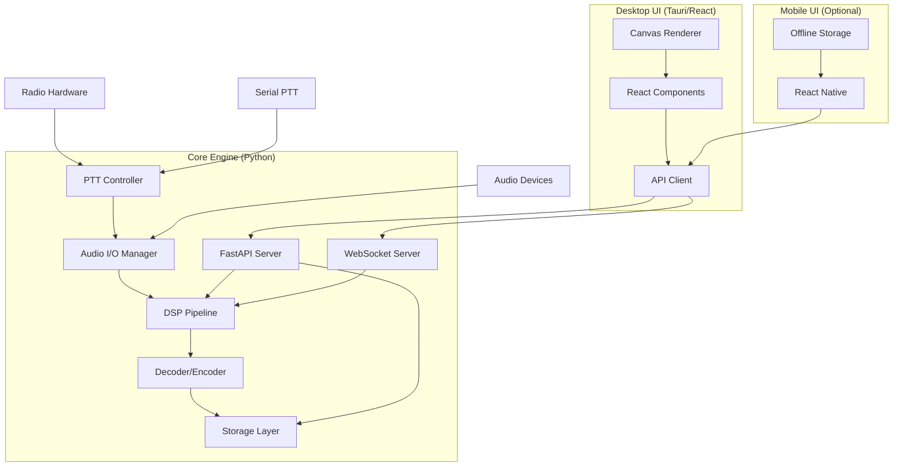
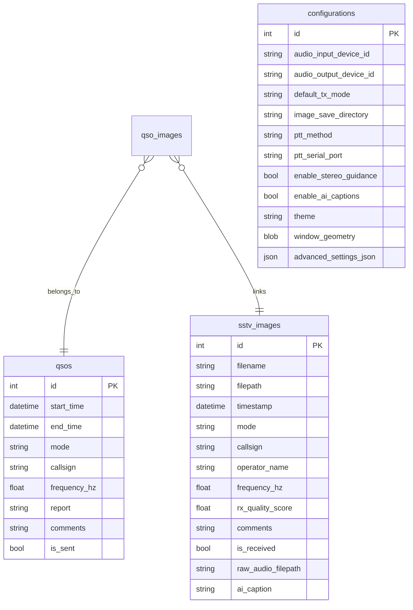
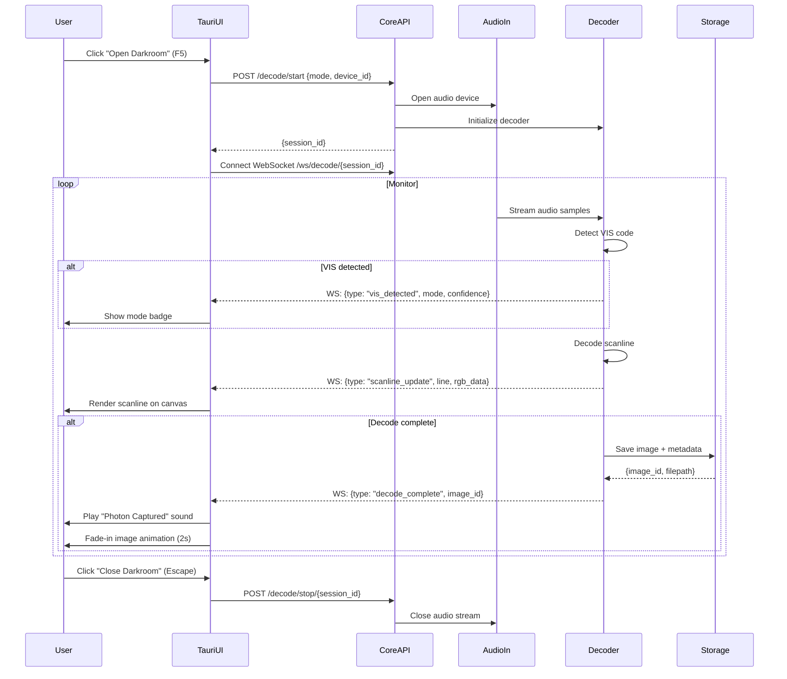
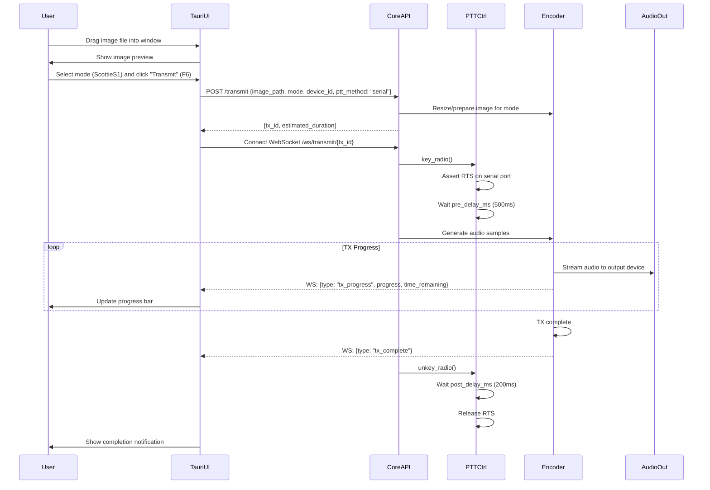
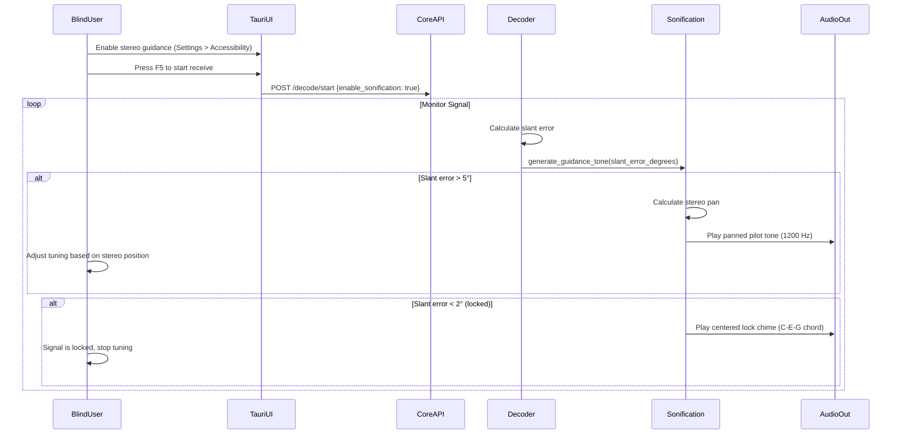
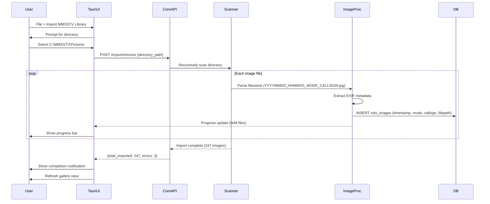

# SSTeVe Backend Specification

This document defines the backend architecture, REST/WebSocket API, Python core engine, database schema, and implementation details for the SSTeVe SSTV platform.

**For frontend/UI specifications, see:** `frontend-contract.md`

---

> **Status note (2026-08-07). `PRODUCT.md` is authoritative where it conflicts with this document.**
>
> The **API contract, schema, and DSP detail in this file remain current** — they describe shipped, tested code. The **product framing does not**, and is retained only as history:
>
> - **User archetypes (Makers, Activators, Preppers, Old Guard) are retired.** They were inherited from the original spec with no research behind them and were replaced by operating situations on 2026-08-07. Every reference below is stale.
> - **There was never any UX research.** The phrase "extensive UX research" below was false when written; `PRODUCT.md` §Evidence records that no user testing, telemetry, or beta testing has ever been conducted. The "20 participants" test was never run.
> - **Smart Reply is cut** — built but not shipped, and no UI surface will be built for it.
> - **Native SDR support (local devices and SpyServer) is now v1 scope**, not the "future" work this document lists. It moves the RF boundary: on the SDR path SSTeVe owns tuning and demodulation.
> - **Decode records need provenance.** QSO / reception report / remote reception report are three distinct types, and ADIF export must hard-block remote receptions. The `QSO` schema below can represent only the first.

---
Summary:: Modern, modular SSTV platform with headless Python core and web-based desktop UI (Tauri), centered on reliable RX/TX, eyes-free operation (stereo sonification), and smart automation that removes friction. SSTeVe is your friendly nerdy assistant for SSTV - helpful, capable, and approachable through messaging, not gimmicks.
Next:: [SUPERSEDED — see status note above] Build Option C hybrid (Auto + Manual modes), conduct user testing with 20 participants, ship validated approach
Context:: [SUPERSEDED — see status note above] Revised architecture serving Makers, Activators, Preppers, and Old Guard ham operators with API-first design and progressive disclosure.

## SSTeVe SSTV Platform - Build-Ready Blueprint

### Project Abstract
Build a modular SSTV platform with a headless Python core engine exposing a REST API and WebSocket interface, paired with a lightweight React/Tauri desktop UI. Smart automation removes friction: Smart Mode Detection when VIS fails, Signal Quality Pre-Flight to prevent wasted decodes, and friendly messaging that makes SSTV approachable without dumbing it down. (Archetype framing retired 2026-08-07; Smart Reply cut — see status note above.)

**Timeline:** 12 weeks for desktop MVP + accessibility + brand integration. Optional mobile prototype adds 6 weeks.

---

## 1. Tech Stack & Architecture

### 1.1 Modular Architecture Overview

**Core Philosophy:** Separate DSP/business logic from UI layer to enable:
- Multiple interface options (desktop, mobile, CLI, community plugins)
- Easier testing and maintenance
- Community extensibility via API

**System Architecture:**



### 1.2 Core Engine Stack

**Language:** Python 3.10+ (100% Python for DSP/business logic)

**Key Dependencies:**
```python
# Core DSP & Audio
sounddevice>=0.4.6          # Audio I/O (primary)
numpy>=1.24                 # Signal processing
scipy>=1.10                 # Filters, FFT
Pillow>=10.0               # Image processing

# Database & Storage
sqlalchemy>=2.0             # ORM
alembic>=1.12              # Migrations

# API Layer
fastapi>=0.104             # REST API framework
uvicorn>=0.24              # ASGI server
websockets>=12.0           # Live updates
pydantic>=2.0              # Data validation

# PTT Control
pyserial>=3.5              # Serial port control

# Filesystem Integration
watchdog>=3.0              # File system monitoring

# Accessibility (optional, post-MVP)
transformers>=4.35         # AI image captioning (BLIP) for alt-text
pytesseract>=0.3.10       # OCR (not for automatic callsign extraction - too unreliable on noisy SSTV images)
```

**Packaging:**
- Core engine: Python package installable via pip
- Desktop app: Tauri bundler (Windows installer, macOS .app, Linux AppImage)
- Mobile app: React Native bundler (APK, IPA)

### 1.3 Desktop UI Stack

**Framework:** React 18 + Tauri 2.0

**Why Tauri over PyQt:**
- 600KB binary vs 80MB (Electron) or 40MB (PyQt bundled)
- No Python runtime needed for UI (smaller distribution)
- Web tech enables easier community contributions
- Can evolve to web-hosted version without rewrite
- Native system integration (notifications, tray icons)

**UI Dependencies:**
```json
{
  "framework": "React 18",
  "state": "Zustand (lightweight)",
  "UI": "shadcn/ui (Tailwind components)",
  "build": "Vite",
  "desktop": "Tauri 2.0"
}
```

**Actionable Advice:**
- Run core engine as subprocess from Tauri app
- Use HTTP/WebSocket for UI ↔ Core communication
- Store core engine path in Tauri app bundle
- Handle core startup/shutdown lifecycle from Tauri

### 1.4 Mobile UI Stack (Optional - Phase 3)

**Framework:** React Native 0.72+

**Platform Support:**
- iOS 14+ (Lightning adapter, USB-C iPad)
- Android 10+ (USB-C OTG, USB host mode)

**Offline-First Design:**
- Local SQLite database syncs with core API
- Pre-bundled mode templates
- Queue TX/RX logs for upload when online

---

## 2. Data Schema (Core Engine Database)

### 2.1 Core Tables (SQLite via SQLAlchemy)

```sql
-- Images (received/transmitted)
CREATE TABLE sstv_images (
  id INTEGER PRIMARY KEY AUTOINCREMENT,
  filename TEXT NOT NULL,
  filepath TEXT NOT NULL,
  timestamp DATETIME NOT NULL DEFAULT CURRENT_TIMESTAMP,
  mode TEXT NOT NULL,
  callsign TEXT,
  operator_name TEXT,
  frequency_hz REAL,
  rx_quality_score REAL,
  comments TEXT,
  is_received BOOLEAN NOT NULL DEFAULT 1,
  raw_audio_filepath TEXT,
  ai_caption TEXT,                    -- NEW: AI-generated alt-text
  UNIQUE(filepath)
);

-- QSO log
CREATE TABLE qsos (
  id INTEGER PRIMARY KEY AUTOINCREMENT,
  start_time DATETIME NOT NULL DEFAULT CURRENT_TIMESTAMP,
  end_time DATETIME,
  mode TEXT NOT NULL,
  callsign TEXT NOT NULL,
  frequency_hz REAL,
  report TEXT,
  comments TEXT,
  is_sent BOOLEAN NOT NULL DEFAULT 0
);

-- QSO-Image join table
CREATE TABLE qso_images (
  qso_id INTEGER NOT NULL REFERENCES qsos(id) ON DELETE CASCADE,
  image_id INTEGER NOT NULL REFERENCES sstv_images(id) ON DELETE CASCADE,
  PRIMARY KEY (qso_id, image_id)
);

-- Configuration (singleton)
CREATE TABLE configurations (
  id INTEGER PRIMARY KEY CHECK (id = 1),

  -- Audio
  audio_input_device_id TEXT,
  audio_output_device_id TEXT,
  default_tx_mode TEXT NOT NULL DEFAULT 'ScottieS1',

  -- Storage
  image_save_directory TEXT NOT NULL,
  mmsstv_import_directory TEXT,
  enable_auto_save BOOLEAN NOT NULL DEFAULT 1,

  -- PTT Control (NEW)
  ptt_method TEXT NOT NULL DEFAULT 'vox',  -- 'none', 'serial', 'vox'
  ptt_serial_port TEXT,
  ptt_serial_baud INTEGER DEFAULT 9600,
  ptt_serial_signal TEXT DEFAULT 'RTS',   -- 'RTS' or 'DTR'
  ptt_pre_delay_ms INTEGER DEFAULT 500,
  ptt_post_delay_ms INTEGER DEFAULT 200,
  vox_preamble_ms INTEGER DEFAULT 500,

  -- Accessibility (NEW)
  enable_stereo_guidance BOOLEAN DEFAULT 0,
  pilot_tone_hz INTEGER DEFAULT 1200,
  enable_ai_captions BOOLEAN DEFAULT 0,  -- optional, off by default
  enable_verbose_cli BOOLEAN DEFAULT 0,

  -- Brand (minimal)
  theme TEXT NOT NULL DEFAULT 'darkroom',

  -- UI State
  window_geometry BLOB,
  window_state BLOB,
  last_input_device TEXT,
  last_output_device TEXT,

  -- Advanced settings stored as JSON for flexibility
  -- Schema (all fields optional, nullable):
  -- {
  --   "decoder": {
  --     "vis_detection_threshold": 0.85,        -- float 0.0-1.0
  --     "sync_detection_threshold": 0.75,       -- float 0.0-1.0
  --     "afc_enabled": true,                    -- bool
  --     "afc_range_hz": 100,                    -- int (50, 100, 200)
  --     "auto_mode_detection_enabled": true,    -- bool
  --     "slant_auto_correct": false             -- bool
  --   },
  --   "encoder": {
  --     "pre_emphasis_enabled": false,          -- bool
  --     "color_space": "RGB",                   -- "RGB" or "YUV"
  --     "jpeg_quality": 85                      -- int 0-100
  --   },
  --   "ui": {
  --     "canvas_zoom": 1.0,                     -- float 0.5-2.0
  --     "waterfall_fft_size": 1024,             -- int (512, 1024, 2048)
  --     "waterfall_visible": true,              -- bool
  --     "telemetry_panel_visible": true,        -- bool
  --     "operating_mode": "standard"            -- "standard", "night_vision", "sunlight"
  --   },
  --   "audio": {
  --     "buffer_size_samples": 1024,            -- int (512, 1024, 2048)
  --     "sample_rate_override": null,           -- int or null (48000, 44100)
  --     "input_gain_override": null             -- float or null (0.0-2.0)
  --   },
  --   "experimental": {
  --     "ai_captions_enabled": false,           -- bool
  --     "smart_reply_auto_suggest": true,       -- bool
  --     "telemetry_export_enabled": false       -- bool
  --   }
  -- }
  advanced_settings_json TEXT
);

-- Indexes for performance
CREATE INDEX idx_images_timestamp ON sstv_images(timestamp DESC);
CREATE INDEX idx_images_mode ON sstv_images(mode);
CREATE INDEX idx_images_callsign ON sstv_images(callsign);
CREATE INDEX idx_qsos_start ON qsos(start_time DESC);
```

### 2.2 Entity Relationship Diagram



---

## 3. Core Engine API Specification

### 3.1 REST API Endpoints (FastAPI)

**Base URL:** `http://localhost:8000/api/v1`

#### Concurrent Operation Limits

**Maximum Concurrent Sessions:**
- **Decode sessions:** 1 (single radio receiver, single audio input)
- **Transmit sessions:** 1 (prevent PTT conflicts, single audio output)
- **Decode + Transmit simultaneously:** NOT ALLOWED (half-duplex operation)

**Enforcement:**

Starting a new decode session while one is active:
```http
POST /decode/start

Response: HTTP 409 Conflict
{
  "error": "CONCURRENT_OPERATION",
  "error_code": 6004,
  "message": "A decode session is already active. Stop the current session before starting a new one.",
  "active_session_id": "abc-123-def-456",
  "recoverable": true,
  "suggested_action": "Stop current decode/transmit before starting new operation"
}
```

Attempting to transmit while decoding:
```http
POST /transmit

Response: HTTP 409 Conflict
{
  "error": "CONCURRENT_OPERATION",
  "error_code": 6004,
  "message": "Cannot transmit while decode session is active (half-duplex constraint).",
  "active_session_id": "xyz-789-ghi-012",
  "session_type": "decode",
  "recoverable": true,
  "suggested_action": "Stop decode session before transmitting"
}
```

**Future Enhancements (v2.0):**
- Multi-receiver support: Multiple USB SDR dongles + traditional radio
- Transmit queue: Multiple images queued for sequential transmission
- Full-duplex mode: Separate input/output devices (requires hardware support)

---

#### Decode Operations

```yaml
POST /decode/start
  Request:
    mode: "ScottieS1" | "MartinM1" | "Robot36"
    device_id: string
    enable_auto_save: boolean
  Response:
    session_id: uuid
    status: "listening"

GET /decode/status/{session_id}
  Response:                          # field names as implemented; see openapi.json
    session_id: uuid
    state: "listening" | "vis_detected" | "decoding" | "completed"
           | "failed" | "stopped"
    mode: string | null
    mode_confidence: float | null
    progress_percent: float (0-100)
    scanlines_received: int
    total_scanlines: int | null      # null before a mode is known
    vis_detected: boolean
    signal_quality: float (0-1) | null   # decoder estimate, NOT calibrated SNR
    snr_db: float | null
    frequency_offset_hz: float | null    # measured offset; null until AFC locks
    afc_locked: boolean
    afc_correction_applied_hz: float | null
    image_id: uuid | null
    error: string | null
    started_at: datetime
    completed_at: datetime | null

POST /decode/stop/{session_id}
  Response:
    status: "stopped"
    image_id: int | null
    filepath: string | null
```

> **Reading AFC lock (PRODUCT.md #5 requires it be verifiable).** Three states,
> which is why this is two fields rather than one boolean:
>
> | State | `afc_locked` | `frequency_offset_hz` | `afc_correction_applied_hz` |
> |---|---|---|---|
> | Searching | `false` | `null` | `null` |
> | Locked, corrected | `true` | measured | same as measured (clamped) |
> | Locked, not applied | `true` | measured | `0.0` |
>
> The third row is `auto_afc` off — Doppler and satellite work, where the
> operator wants the offset *reported* and the video mapping *untouched*.
> Render it distinctly: "40 Hz off, not correcting" is different information
> from "still searching."

#### Transmit Operations

```yaml
POST /transmit
  Request:
    image_path: string
    mode: string
    device_id: string
    ptt_method: "none" | "serial" | "vox"
  Response:
    tx_id: uuid
    estimated_duration_sec: int

GET /transmit/status/{tx_id}
  Response:
    status: "transmitting" | "complete" | "error"
    progress: int (0-100)
    time_remaining_sec: int

POST /transmit/cancel/{tx_id}
  Response:
    status: "cancelled"
```

#### Image Gallery

```yaml
GET /images
  Query:
    limit: int (default 50)
    offset: int (default 0)
    mode: string | null
    is_received: boolean | null
    callsign_filter: string | null
  Response:
    images: array of ImageMetadata
    total: int

GET /images/{id}
  Response:
    id: int
    filename: string
    filepath: string
    timestamp: ISO8601
    mode: string
    callsign: string | null
    rx_quality_score: float | null
    ai_caption: string | null
    metadata: object
```

#### Device Management

```yaml
GET /devices/audio
  Response: array of AudioDevice

  AudioDevice:
    device_id: string
    name: string
    channels: int
    sample_rate: int            # preferred rate (48000 when supported)
    sample_rates: array of int  # every probed rate, ascending
    is_input: bool
    is_output: bool
    is_default: bool

GET /devices/serial
  Response:
    ports: array of SerialPort

  SerialPort:
    port: string (/dev/ttyUSB0, COM3, etc.)
    description: string
    manufacturer: string | null
```

> **`GET /devices/audio` returns a flat array, not `{inputs, outputs}`.** This
> section specified the split shape until 2026-08-09; the implementation never
> had it, and the spec was corrected rather than the code. `is_input` /
> `is_output` carry strictly more information than the partition would: a
> duplex device is honestly both, where the split shape must either duplicate
> it across two arrays or pick one arbitrarily. Clients that want the split
> can filter on the flags.

#### Configuration

```yaml
GET /config
  Response: Configuration object (all 40 fields)

GET /config/schema
  Response: JSON Schema for Configuration -- types, ranges, defaults,
            descriptions. Generated from the Pydantic model, so a client
            never hardcodes the field list.

POST /config
  Request: Partial Configuration object
  Response: Updated Configuration

PATCH /config
  Request: Partial updates
  Response: Updated Configuration
```

> **Adding a setting.** `routes/config.py` holds one `_FIELD_TO_MANAGER_KEY`
> table that drives both reads and writes; add the field to the API
> `Configuration` model and one row to that table. It used to be two
> hand-written mappings in opposite directions, which is how nine
> accessibility settings — including the `stereo_guidance_enabled` PR #44
> shipped — ended up stored but unreachable. `test_config_completeness.py`
> enumerates the `AdvancedSettings` tree and fails on any leaf without a
> mapping, so the drift cannot silently recur.

### 3.2 WebSocket Live Updates

**App channel:** `ws://localhost:8000/api/v1/ws`

The channel that exists while nothing is decoding or transmitting. Both
session endpoints below are session-scoped, so before 2026-08-09 an idle
client had no channel at all — which structurally blocked idle metering,
device hot-plug, and library pushes to a gallery with no session open (#57).

Events: `device_changed`, `library_updated`, `audio_levels` (while
monitoring), `monitor_state`, `error`.

Commands (text frames): `ping`, `monitor_start[:device_id]`, `monitor_stop`.

Two behaviors worth knowing:

- **Unbuffered, unlike the session channels.** These events describe the
  world *now* — devices present, current levels, library contents. Replaying
  a stale device list to a reconnecting client would be worse than silence;
  it should re-fetch from the REST endpoints instead.
- **Monitoring is refused during a decode** (`INPUT_BUSY`). Opening a second
  input stream would collide with the decode's own capture — half-duplex
  applies to the microphone, not only to decode-vs-transmit.

The device poll runs only while at least one client holds the channel open,
so an idle headless server does no PortAudio work.

**Session channel:** `ws://localhost:8000/api/v1/ws/decode/{session_id}`

Events are keyed on `event_type` and defined by the Pydantic models in
`sstv_core/api/models.py` (VISDetectedEvent, ScanlineUpdateEvent,
AudioLevelsEvent, DecodeCompleteEvent, TransmitProgressEvent,
TransmitCompleteEvent, ErrorEvent) — those models are the contract, and
the emitter builds every payload from them. (Until 2026-08-07 three
incompatible shapes coexisted: this spec said `type`, models.py said
`event_type`, and the emitter used `event` with different fields. A
per-scanline `rgb_data` field appeared here but was never implemented;
live preview remains an open item.)

**Event Types:**

```javascript
// VIS code detected (vis_code is null when the correlation detector
// identified the mode without separately decoding the VIS byte)
{
  "event_type": "vis_detected",
  "mode": "ScottieS1",
  "confidence": 0.98,
  "vis_code": null,
  "timestamp": "2026-08-07T14:30:23Z"
}

// Scanline decoded (signal_quality is the decoder's 0-1 estimate;
// snr_db/frequency_offset_hz are null until the engine truly measures them)
{
  "event_type": "scanline_update",
  "scanline_number": 128,
  "total_scanlines": 256,
  "progress_percent": 50.0,
  "signal_quality": 0.87,
  "snr_db": null,
  "frequency_offset_hz": null,
  "timestamp": "2026-08-07T14:30:45Z"
}

// Input level meter (mono source: left == right)
{
  "event_type": "audio_levels",
  "left_db": -18.2,
  "right_db": -18.2,
  "peak_db": -9.1,
  "is_clipping": false,
  "timestamp": "2026-08-07T14:30:45Z"
}

// Decode complete (image_id is the public UUID, null when the database
// is disabled)
{
  "event_type": "decode_complete",
  "image_id": "0b6d9c1e-...",
  "filepath": "/path/to/image.png",
  "mode": "ScottieS1",
  "snr_db": null,
  "duration_seconds": 112.4,
  "timestamp": "2026-08-07T14:32:01Z"
}

// Error occurred
{
  "event_type": "error",
  "error_code": "DECODE_ERROR",
  "message": "Audio input device disconnected",
  "recoverable": false,
  "suggested_action": null,
  "timestamp": "2026-08-07T14:32:01Z"
}
```

**Transmit WebSocket:** `ws://localhost:8000/api/v1/ws/transmit/{tx_id}`

```javascript
// TX progress
{
  "event_type": "tx_progress",
  "progress_percent": 67.0,
  "current_scanline": 172,
  "time_remaining_seconds": 36.0,
  "timestamp": "2026-08-07T14:34:10Z"
}

// TX complete
{
  "event_type": "transmit_complete",
  "tx_id": "7f1c2b3a-...",
  "mode": "ScottieS1",
  "duration_seconds": 110.2,
  "timestamp": "2026-08-07T14:35:22Z"
}
```

#### 3.2.1 WebSocket Connection Management & Reconnection

**Session Persistence:**
- Decode/transmit sessions continue server-side even if client disconnects
- Sessions remain active for **5 minutes** after last WebSocket activity
- Sessions timeout configurable via `SESSION_TIMEOUT_SEC` environment variable

**Client Disconnection Behavior:**

```python
# Server-side session management
class SessionManager:
    def __init__(self):
        self.active_sessions = {}  # session_id -> DecodeSession
        self.session_timeouts = {}  # session_id -> datetime

    async def handle_websocket_disconnect(self, session_id: str):
        """
        Called when WebSocket client disconnects.

        Behavior:
        - Keep decode/transmit running
        - Set timeout timestamp (now + 5 minutes)
        - Log disconnect event
        - Continue emitting events (buffered for reconnect)
        """
        session = self.active_sessions.get(session_id)
        if session:
            session.websocket_connected = False
            self.session_timeouts[session_id] = datetime.now() + timedelta(minutes=5)
            logger.info(f"Client disconnected from session {session_id}, keeping alive for 5min")

    async def cleanup_expired_sessions(self):
        """
        Background task: Remove sessions inactive for >5 minutes.
        Runs every 60 seconds.
        """
        while True:
            await asyncio.sleep(60)
            now = datetime.now()
            expired = [
                sid for sid, timeout in self.session_timeouts.items()
                if now > timeout
            ]
            for session_id in expired:
                logger.info(f"Session {session_id} expired, cleaning up")
                await self.active_sessions[session_id].abort()
                del self.active_sessions[session_id]
                del self.session_timeouts[session_id]
```

**Client Reconnection Implementation:**

```typescript
// Frontend WebSocket reconnection logic
class SSTVWebSocketClient {
  private ws: WebSocket | null = null;
  private reconnectAttempts = 0;
  private maxReconnectAttempts = 5;
  private reconnectInterval = 2000; // ms
  private sessionId: string;

  connect(sessionId: string) {
    this.sessionId = sessionId;
    this.ws = new WebSocket(
      `ws://localhost:8000/api/v1/ws/decode/${sessionId}`
    );

    this.ws.onopen = () => {
      console.log(`WebSocket connected to session ${sessionId}`);
      this.reconnectAttempts = 0; // Reset counter on successful connect
    };

    this.ws.onclose = (event) => {
      console.warn(`WebSocket closed: ${event.code} ${event.reason}`);
      this.attemptReconnect();
    };

    this.ws.onerror = (error) => {
      console.error(`WebSocket error:`, error);
      // onclose will be triggered automatically, don't reconnect here
    };

    this.ws.onmessage = (event) => {
      const message = JSON.parse(event.data);
      this.handleMessage(message);
    };
  }

  private attemptReconnect() {
    if (this.reconnectAttempts >= this.maxReconnectAttempts) {
      console.error(`Max reconnect attempts (${this.maxReconnectAttempts}) reached`);
      this.emit("connection_failed", {
        message: "Unable to reconnect to decode session",
        session_id: this.sessionId,
      });
      return;
    }

    this.reconnectAttempts++;
    console.log(
      `Reconnecting in ${this.reconnectInterval}ms (attempt ${this.reconnectAttempts}/${this.maxReconnectAttempts})`
    );

    setTimeout(() => {
      this.connect(this.sessionId); // Reuse same session_id
    }, this.reconnectInterval);
  }

  disconnect() {
    this.reconnectAttempts = this.maxReconnectAttempts; // Prevent auto-reconnect
    if (this.ws) {
      this.ws.close();
      this.ws = null;
    }
  }
}
```

**Catch-Up Events on Reconnect:**

When client reconnects to an active session, server sends buffered events:

```json
{
  "type": "session_resume",
  "session_id": "abc-123-def-456",
  "missed_events": [
    {
      "type": "scanline_update",
      "line": 64,
      "total": 256,
      "progress": 25,
      "rgb_data": "...",
      "timestamp": "2025-12-27T14:30:45Z"
    },
    {
      "type": "scanline_update",
      "line": 65,
      "total": 256,
      "progress": 25.4,
      "rgb_data": "...",
      "timestamp": "2025-12-27T14:30:46Z"
    }
  ],
  "current_state": {
    "status": "decoding",
    "progress": 26,
    "current_scanline": 67,
    "mode": "ScottieS1"
  }
}
```

**Server-Side Event Buffering:**

```python
class DecodeSession:
    def __init__(self, session_id: str):
        self.session_id = session_id
        self.websocket: WebSocket | None = None
        self.websocket_connected = False
        self.event_buffer = []  # Buffer events during disconnect
        self.max_buffer_events = 100  # Limit memory usage

    async def emit_event(self, event: dict):
        """
        Emit WebSocket event to client.

        Behavior:
        - If connected: Send immediately
        - If disconnected: Buffer event (up to max_buffer_events)
        - If buffer full: Drop oldest events (FIFO)
        """
        if self.websocket_connected and self.websocket:
            await self.websocket.send_json(event)
        else:
            # Buffer event for reconnect
            if len(self.event_buffer) >= self.max_buffer_events:
                self.event_buffer.pop(0)  # Drop oldest
            self.event_buffer.append(event)

    async def handle_websocket_reconnect(self, websocket: WebSocket):
        """
        Called when client reconnects to existing session.

        Sends catch-up events and current state.
        """
        self.websocket = websocket
        self.websocket_connected = True

        # Send session resume event with buffered events
        await websocket.send_json({
            "type": "session_resume",
            "session_id": self.session_id,
            "missed_events": self.event_buffer,
            "current_state": self.get_current_state()
        })

        # Clear buffer after sending
        self.event_buffer.clear()
```

**Timeout Behavior:**

If session expires (>5 minutes inactive):
1. Server aborts decode/transmit
2. Server deletes session data
3. Client reconnect attempt receives HTTP 404
4. Client shows error: "Session expired. Please start a new decode."

**UI Reconnection Indicators:**

```typescript
// Show reconnection status to user
ws.on("attempting_reconnect", (attempt, max) => {
  showToast({
    type: "warning",
    message: `Connection lost. Reconnecting... (${attempt}/${max})`,
    duration: null, // Don't auto-dismiss
  });
});

ws.on("reconnected", () => {
  showToast({
    type: "success",
    message: "Reconnected! Catching up...",
    duration: 3000,
  });
});

ws.on("connection_failed", () => {
  showModal({
    title: "Connection Lost",
    message: "Unable to reconnect to decode session. The session may have expired.",
    buttons: [
      { label: "Start New Decode", action: () => navigateToCapture() },
      { label: "Close", action: () => dismissModal() },
    ],
  });
});
```

**Testing Reconnection:**

```python
# Integration test for reconnection
async def test_websocket_reconnect():
    # Start decode session
    response = await client.post("/decode/start", json={
        "mode": "ScottieS1",
        "device_id": "test_device"
    })
    session_id = response.json()["session_id"]

    # Connect WebSocket
    async with client.websocket_connect(f"/ws/decode/{session_id}") as ws1:
        # Receive first event
        event1 = await ws1.receive_json()
        assert event1["type"] == "vis_detected"

    # Disconnect (simulate network failure)
    # Session continues server-side

    # Reconnect with same session_id
    async with client.websocket_connect(f"/ws/decode/{session_id}") as ws2:
        # Should receive session_resume event
        resume_event = await ws2.receive_json()
        assert resume_event["type"] == "session_resume"
        assert len(resume_event["missed_events"]) > 0
        assert resume_event["current_state"]["status"] == "decoding"
```

---

## 4. Image Library & Filesystem Integration

### 4.1 Filesystem-Native Architecture

**Core Principle:** The image library is a regular directory on the user's filesystem, not an abstracted database-only store. This enables seamless integration with external image editing tools.

**Directory Structure:**
```
/Users/jeremy/SSTV/Images/           # User-configurable location
├── received/
│   ├── 20251203_142345_ScottieS1_W1AW.jpg
│   ├── 20251203_143012_MartinM1_K2XYZ.jpg
│   └── ...
├── transmitted/
│   ├── my_template_01.png
│   ├── pota_activation_k1234.jpg
│   └── ...
└── .ssteve/                         # Hidden metadata directory
    └── library.db                   # SQLite database (metadata only)
```

**Key Design Decisions:**
- Images stored as regular files (not embedded in database)
- Database stores metadata only (callsign, mode, timestamp, rx_quality)
- User can browse/backup directory with any file manager
- External apps can save directly to library (no import step)

### 4.2 File System Watcher

**Purpose:** Automatically detect changes to the image library directory and sync with database.

**Implementation (Python Core):**
```python
from watchdog.observers import Observer
from watchdog.events import FileSystemEventHandler

class ImageLibraryWatcher(FileSystemEventHandler):
    def on_created(self, event):
        """New file added to library directory"""
        if self.is_image_file(event.src_path):
            self.import_image(event.src_path)
            self.emit_websocket_event("library_updated")

    def on_modified(self, event):
        """File edited externally (e.g., in Preview/GIMP)"""
        if self.is_image_file(event.src_path):
            self.update_metadata(event.src_path)
            self.emit_websocket_event("image_modified")

    def on_deleted(self, event):
        """File removed from filesystem"""
        self.remove_from_database(event.src_path)
        self.emit_websocket_event("image_deleted")
```

**Behavior:**
- Watches user-configured library directory recursively
- Debounces rapid changes (editors often write multiple times)
- Handles rename/move operations
- Emits WebSocket events to UI for live gallery updates

### 4.3 OS Integration Features

**"Edit in Default App" (Context Menu):**
```typescript
// Tauri frontend
import { Command } from '@tauri-apps/plugin-shell';

async function editInDefaultApp(imagePath: string) {
  // Opens image in OS default editor (Preview, Photos, GIMP)
  await Command.create('open', [imagePath]).execute();

  // File watcher handles detecting save and updating gallery
}
```

**"Show in Finder/Explorer" (Context Menu):**
```typescript
async function revealInFileManager(imagePath: string) {
  const dir = path.dirname(imagePath);
  await Command.create('open', [dir]).execute();
}
```

**"Edit and Reply" Workflow (Smart Reply Integration):**
```typescript
async function editAndReply(receivedImage: Image) {
  // Export to temp file
  const tempPath = await exportToTemp(receivedImage);

  // Open in default editor
  await editInDefaultApp(tempPath);

  // Watch for changes
  const watcher = watchFile(tempPath, async (modified) => {
    // Auto-load into TransmitView when user saves
    await loadImageForTransmit(modified);
    showNotification("Image updated - ready to transmit");
  });
}
```

### 4.4 Drag-and-Drop Support

**UI Drop Zones:**
- Main window (anywhere) → Import to library
- Gallery view → Import to library
- Transmit view → Load image for TX (doesn't save to library)

**Supported Formats:**
- Single image file (JPG, PNG, BMP)
- Multiple image files (batch import)
- Directory (recursive import of all images)

**Implementation:**
```typescript
// React drop handler
function handleDrop(event: DragEvent) {
  event.preventDefault();
  const files = Array.from(event.dataTransfer.files);

  files.forEach(async (file) => {
    if (isImageFile(file)) {
      await importToLibrary(file);
    } else if (isDirectory(file)) {
      await importDirectoryRecursive(file);
    }
  });
}
```

### 4.5 Save-to-Library Workflow

**External Tool Integration:**
Users can save directly from any application into the SSTeVe image library:

```
User's Canva Workflow:
1. Create graphic in Canva
2. Export → Download → Save to disk
3. Navigate to: /Users/jeremy/SSTV/Images/transmitted/
4. Save as: my-template.png
5. Switch back to SSTeVe
   → Image appears immediately in gallery (file watcher)
   → No import button needed
```

**Configuration (Settings Panel):**
```yaml
Image Library Location:
  [/Users/jeremy/SSTV/Images/]  [Change Directory...]

  [Open in Finder/Explorer]

  ☑ Watch for new files (auto-import)
  ☑ Auto-detect image modifications
  ☑ Sync metadata to EXIF tags
```

### 4.6 Graphics and Overlay Workflows

**Design Philosophy:**
SSTeVe does not include a general-purpose graphics editor. Modern operating systems and web-based tools handle image creation better than any SSTV application can. SSTeVe focuses on seamless integration with these tools rather than replicating their functionality.

**Comparison with MMSSTV Quick Graphics:**

| **Use Case** | **MMSSTV Approach** | **SSTeVe Approach** |
|--------------|---------------------|---------------------|
| **Create initial graphics** | Quick Graphics editor (text, shapes, color bars) | Use OS tools (Preview, Photos, GIMP) or web tools (Canva, Photopea). Save directly to image library. |
| **Add callsign to image** | Manual text overlay in Quick Graphics | Smart Reply system (auto-populated from telemetry). See Section 6.5. |
| **Real-time acknowledgment** | Type callsign manually, position text | Right-click → "Smart Reply" → One-click transmit with proof-of-reception composite. |
| **Reusable templates** | Save Quick Graphics .qst files | Create templates in external tool, save to library. Or use Smart Reply templates. |

**Why This Approach:**

1. **Modern tools are better:** Image editing capabilities in Preview, Photos, GIMP, and web-based editors surpass what MMSSTV Quick Graphics offered.

2. **Seamless integration:** File system watcher and "Edit in Default App" provide round-trip editing without leaving SSTeVe mentally.

3. **Innovation where it matters:** Smart Reply with auto-populated telemetry (frequency, SNR, timestamp) is genuinely better than MMSSTV's manual text entry for acknowledgment workflows.

4. **Intentional focus:** SSTeVe excels at reliable SSTV communication, not at being a Swiss Army knife.

**For MMSSTV Users:**

If your workflow depends on in-app graphics editing beyond Smart Reply for real-time acknowledgments, SSTeVe may not be the right fit. This is an intentional design decision, not an oversight. The project prioritizes modern workflow integration over feature parity with legacy applications.

**Workflows Supported:**

1. **Prepare graphics externally:**
   - Create image in Canva/GIMP/Preview
   - Save directly to SSTeVe image library directory
   - Image appears automatically in gallery
   - Select and transmit

2. **Edit received image for reply:**
   - Right-click received image → "Edit in Default App"
   - Add your callsign/notes in Preview/Photos/GIMP
   - Save file
   - SSTeVe detects change, updates preview
   - Transmit

3. **Quick acknowledgment (Smart Reply):**
   - Right-click received image → "Smart Reply"
   - Preview shows auto-populated proof-of-reception composite
   - Click "Transmit" (5 seconds from decode complete to reply)

---

## 6. Smart Automation Principles

### 6.1 Design Philosophy

SSTeVe reduces friction through **intelligent assistance**, not brittle automation. SSTV signals are inherently noisy and variable - smart features must degrade gracefully when signal quality is poor.

**Core Insight:** Taking the work out of SSTV is what makes it fun. SSTeVe is your friendly nerdy assistant - helpful suggestions, not bossy automation. Focus on removing tedious tasks (typing callsigns, configuring devices, restarting failed decodes) rather than adding complexity through gamification.

### 6.2 Signal Reality Constraints

**Assumptions we CAN make:**
- ✅ Audio-level analysis (input levels, clipping, frequency detection)
- ✅ Signal timing analysis (sync pulse intervals, scanline duration)
- ✅ Hardware detection (USB device IDs, serial port characteristics)
- ✅ User-provided metadata (callsign entered once, reused everywhere)

**Assumptions we CANNOT make:**
- ❌ Image content is readable (OCR unreliable on noisy decodes)
- ❌ VIS codes always present (20% failure rate)
- ❌ Auto-detection always succeeds (must provide manual overrides)
- ❌ Signal quality is consistent (QSB, QRM, fading common)

### 6.3 Graceful Degradation Strategy

Every smart feature must have a fallback:

| Feature | Works On Good Signals | Degrades To (Noisy Signals) |
|---------|----------------------|---------------------------|
| Smart Mode Detection | Auto-suggests from sync timing | Manual mode selection |
| Smart Reply | Pre-fills callsign from metadata | User edits callsign in preview |
| Smart QSO Logging | One-click with all fields populated | User enters callsign, rest auto-fills |
| Signal Quality Pre-Flight | Accurate SNR estimate | Basic clipping/level detection only |
| Smart Slant Correction | Auto-corrects with high confidence | Offers manual adjustment with preview |

**Core Principle:** Smart features should **reduce work when possible**, not **fail when signal quality is poor**.

### 6.4 Innovation Areas (Reality-Grounded)

**1. Smart Reply (Flagship Feature)**
- User enters callsign on decode complete → Saved to metadata
- Right-click → "Smart Reply" → Auto-populated proof-of-reception composite
- Includes: Both callsigns, frequency, timestamp, SNR, mode
- One-click transmit (5 seconds from decode complete to reply)

#### Smart Reply Technical Implementation

**Template Storage:**
- Bundled templates: `sstv_core/templates/smart_reply/` (3 default templates: QSL Card, Monitor Frame, Minimal Badge)
- User templates: `~/.ssteve/templates/` (user-created, automatically discovered on startup)
- Template hot-reload: Watch directory for new templates added at runtime

**Template Engine: Pillow-Based Compositing**
- No external dependencies beyond Pillow (already required)
- Template format: PNG base image (320x256 for ScottieS1) + JSON metadata file
- Supports text overlays, variable positioning, font customization

**Template Metadata Format (JSON):**
```json
{
  "name": "QSL Card",
  "base_image": "qsl_card_base.png",
  "default_mode": "ScottieS1",
  "fields": [
    {
      "id": "callsign_received",
      "label": "Their Callsign",
      "x": 50,
      "y": 100,
      "font_size": 32,
      "font_family": "Arial",
      "color": "#FFFFFF",
      "alignment": "left"
    },
    {
      "id": "callsign_operator",
      "label": "Your Callsign",
      "x": 50,
      "y": 150,
      "font_size": 24,
      "color": "#FFFFFF"
    },
    {
      "id": "frequency_mhz",
      "x": 50,
      "y": 200,
      "font_size": 18,
      "color": "#FFD24A",
      "format": "{value:.3f} MHz"
    },
    {
      "id": "timestamp_utc",
      "x": 50,
      "y": 230,
      "font_size": 16,
      "color": "#FFFFFF",
      "format": "{value:%Y-%m-%d %H:%M UTC}"
    },
    {
      "id": "snr_db",
      "x": 50,
      "y": 260,
      "font_size": 16,
      "color": "#FFFFFF",
      "format": "SNR: {value}dB"
    }
  ]
}
```

**API Endpoints:**

```yaml
GET /smart_reply/templates
  Response:
    templates: array of TemplateMetadata

POST /smart_reply/generate
  Request:
    image_id: int (received image to reply to)
    template_id: string (default: "qsl_card")
    field_overrides: object (optional manual edits)
      {
        "callsign_received": "W1AW",
        "frequency_mhz": 14.230
      }
  Response:
    preview_image_path: string (temp file for preview)
    template_data: object (all field values used)
    estimated_tx_duration: int (seconds)

POST /smart_reply/transmit/{preview_id}
  Request:
    mode: string (ScottieS1, MartinM1, Robot36)
    device_id: string
    ptt_method: string
  Response:
    tx_id: uuid (standard transmit flow)
```

**Fallback Behavior for Missing Metadata:**
```python
def populate_smart_reply_fields(image_id: int, overrides: dict = None):
    """
    Auto-populate template fields from image metadata.

    Fallback hierarchy:
    1. User override (manual entry in preview dialog)
    2. Image metadata (callsign, frequency, SNR from decode)
    3. Configuration defaults (operator callsign from settings)
    4. Placeholder text ("N/A", "Unknown")
    """
    image = db.query(SSTVImage).get(image_id)
    config = db.query(Configuration).first()

    fields = {
        "callsign_received": overrides.get("callsign_received")
                            or image.callsign
                            or "UNKNOWN",
        "callsign_operator": overrides.get("callsign_operator")
                            or config.station_callsign
                            or "YOUR_CALL",
        "frequency_mhz": overrides.get("frequency_mhz")
                        or image.frequency_hz / 1e6
                        or config.default_frequency / 1e6,
        "timestamp_utc": image.timestamp,
        "snr_db": image.rx_quality_score or "N/A",
        "mode": image.mode
    }

    # If critical field missing, prompt user before generating
    if fields["callsign_received"] == "UNKNOWN":
        raise ValueError("Callsign required for Smart Reply. Please enter manually.")

    return fields
```

**Template Rendering (Python Core):**
```python
from PIL import Image, ImageDraw, ImageFont

def render_smart_reply_template(template_id: str, field_values: dict) -> str:
    """
    Render Smart Reply template with populated fields.

    Returns: Path to generated preview image
    """
    template = load_template(template_id)
    base = Image.open(template["base_image"])
    draw = ImageDraw.Draw(base)

    for field in template["fields"]:
        value = field_values.get(field["id"])
        if value is None:
            continue

        # Apply format string if specified
        if "format" in field:
            text = field["format"].format(value=value)
        else:
            text = str(value)

        # Load font
        font = ImageFont.truetype(
            field.get("font_family", "Arial.ttf"),
            field["font_size"]
        )

        # Parse color
        color = ImageColor.getrgb(field["color"])

        # Draw text
        draw.text(
            (field["x"], field["y"]),
            text,
            font=font,
            fill=color,
            anchor=field.get("alignment", "left")
        )

    # Save to temp file
    preview_path = f"/tmp/smart_reply_{uuid4()}.png"
    base.save(preview_path)
    return preview_path
```

**2. Smart Mode Detection**
- When VIS fails, analyze sync pulse timing at signal level
- Suggest most likely mode with confidence score
- One-click accept or manual override
- Prevents 2+ minute restart penalty

#### Smart Mode Detection Algorithm

**When to Trigger:**
- VIS code detection fails (timeout after 30 seconds of listening)
- VIS code detected but confidence <70% (potential false positive)
- User manually requests mode detection (button: "Auto-Detect Mode")

**Detection Algorithm:**
```python
def detect_mode_from_sync_timing(audio_stream, duration_sec=10.0):
    """
    Detect SSTV mode from sync pulse timing when VIS fails.

    Algorithm:
    1. Detect 1200 Hz sync pulses (Goertzel filter)
    2. Measure inter-pulse intervals (scanline duration)
    3. Compare against known mode timings
    4. Calculate confidence based on timing consistency

    Returns:
        {
            "mode": "ScottieS1",
            "confidence": 0.87,
            "measured_intervals": [138.2, 138.3, 138.1],  # ms
            "expected_interval": 138.24,  # ms for Scottie S1
            "num_samples": 25  # number of scanlines analyzed
        }
    """
    # Mode timing specifications (scanline duration in ms)
    MODE_TIMINGS = {
        "ScottieS1": 138.24,
        "ScottieS2": 71.04,
        "ScottieDX": 269.04,
        "MartinM1": 146.43,
        "MartinM2": 73.22,
        "Robot36": 150.0,
        "Robot72": 300.0,
        "PD90": 126.72,
        "PD120": 121.6,
        "PD180": 121.6,
        "PD240": 121.92
    }

    # Step 1: Detect sync pulses (1200 Hz, typically 5-9ms duration)
    sync_pulses = detect_sync_pulses_goertzel(
        audio_stream,
        target_freq=1200,
        duration_sec=duration_sec
    )

    if len(sync_pulses) < 10:
        return None  # Not enough data for reliable detection

    # Step 2: Calculate inter-pulse intervals
    intervals = []
    for i in range(len(sync_pulses) - 1):
        interval_ms = (sync_pulses[i+1] - sync_pulses[i]) * 1000
        intervals.append(interval_ms)

    # Remove outliers (QRM, noise spikes)
    intervals = remove_outliers(intervals, z_threshold=2.0)

    if len(intervals) < 5:
        return None  # Too many outliers, unreliable

    # Step 3: Calculate median interval (robust against noise)
    median_interval = np.median(intervals)

    # Step 4: Score each mode based on deviation
    mode_scores = {}
    for mode_name, expected_interval in MODE_TIMINGS.items():
        deviation = abs(median_interval - expected_interval)
        percent_error = (deviation / expected_interval) * 100

        # Confidence score: 1.0 at perfect match, 0.0 at >10% error
        if percent_error < 10:
            confidence = 1.0 - (percent_error / 10)
        else:
            confidence = 0.0

        mode_scores[mode_name] = confidence

    # Step 5: Return best match
    best_mode = max(mode_scores, key=mode_scores.get)
    best_confidence = mode_scores[best_mode]

    return {
        "mode": best_mode,
        "confidence": best_confidence,
        "measured_intervals": intervals[:10],  # First 10 for debugging
        "expected_interval": MODE_TIMINGS[best_mode],
        "num_samples": len(intervals)
    }
```

**Confidence Thresholds:**
- ≥ 85%: High confidence - Auto-suggest with "Accept" button
- 70-84%: Medium confidence - Show suggestion with warning "Not sure, but this looks like..."
- < 70%: Low confidence - Require manual mode selection

**API Integration:**
```yaml
POST /decode/detect_mode
  Request:
    session_id: uuid (optional, for active decode session)
    audio_file: file (optional, for offline analysis)
    duration_sec: float (default 10.0)
  Response:
    detection: object or null
      {
        "mode": "ScottieS1",
        "confidence": 0.87,
        "measured_intervals": [138.2, 138.3],
        "expected_interval": 138.24
      }
    fallback_modes: array (top 3 alternatives)
      [
        {"mode": "MartinM1", "confidence": 0.73},
        {"mode": "PD90", "confidence": 0.45}
      ]
```

**User Workflow:**
1. VIS detection fails → WebSocket event `{"type": "vis_timeout"}`
2. Core engine automatically attempts mode detection
3. If confidence ≥ 70%: Emit `{"type": "mode_suggested", "mode": "ScottieS1", "confidence": 0.87}`
4. UI shows notification: "Couldn't read the VIS code, but this looks like ScottieS1 to me (87% sure). Want to try it?"
5. User clicks "Try It" → Restart decode with suggested mode
6. User clicks "Choose Manually" → Show mode selection dialog

**Fallback Strategy:**
- If mode detection confidence < 70%: Prompt user immediately (don't waste time on bad guess)
- If user rejects suggestion: Show mode picker with top 3 alternatives highlighted
- Preserve already-decoded scanlines if possible (don't restart from scratch)

**3. Smart Device Configuration**
- Auto-detect common SSTV hardware (Digirig, SignaLink, RigBlaster)
- Pre-populate PTT settings based on device type
- One-click "Apply Recommended Settings"
- Reduces 10-15 minute setup frustration

**4. Signal Quality Pre-Flight Check**
- Real-time audio analysis before decode starts
- Warns about clipping, weak signal, off-frequency
- Prevents wasted 90-second decodes on bad signals
- Actionable feedback with quick-access fixes

**5. Smart QSO Logging**
- Decode completes → "Log QSO?" notification
- All fields pre-populated from telemetry
- One-click save (no typing except callsign)
- ADIF export automatic

**6. Smart Slant Correction**
- Post-decode one-click correction offer
- Preview before/after
- Learns radio clock offset for next time
- Manual override always available

### 6.5 Brand Voice Guidelines (SSTeVe - Friendly & Nerdy)

**Brand Personality:**
SSTeVe is your helpful radio buddy who's really into SSTV. Excited to show you cool stuff, not gatekeep-y. Technical competence without pretension. Makes SSTV approachable without dumbing it down.

**Voice Characteristics:**
- **Helpful, not bossy:** "Want me to try ScottieS1?" not "Switching to ScottieS1"
- **Encouraging, not condescending:** "Signal's looking good!" not "Great job!"
- **Specific, not vague:** "Signal's too hot - let's dial it back" not "Please adjust settings"
- **Conversational, not robotic:** "Couldn't read the VIS code" not "VIS detection failed"

**Messaging Examples:**

| Context | Technical (Avoid) | SSTeVe Voice (Use) |
|---------|-------------------|-------------------|
| Decode complete | "Decode operation successful" | "Got it! Nice signal from W1AW" |
| VIS failed | "VIS code detection failed. Manual mode selection required." | "Couldn't read the VIS code, but this looks like ScottieS1 to me. Want to try it?" |
| Smart Reply | "Generate proof-of-reception composite transmission" | "Reply to W1AW?" |
| Signal clipping | "Input level exceeds threshold. Reduce gain." | "Whoa, signal's too hot! Let's dial it back a bit" |
| Device detected | "Hardware device detected: Digirig Mobile USB Serial. Apply recommended configuration profile?" | "Oh hey, I see you've got a Digirig! I know how to set that up - want me to do it?" |
| Signal weak | "Signal to noise ratio below optimal threshold" | "Signal's pretty weak - want to try decoding anyway?" |
| First run | "Application initialized. Configure audio device to begin operation." | "Hey! I'm SSTeVe. Want to decode something?" |
| Mode suggestion | "Signal analysis indicates ScottieS1 mode (confidence: 85%)" | "This looks like ScottieS1 to me. Should we go with that?" |

**UI Copy Guidelines:**

**Buttons:**
- ✅ "Listen" not "Start Receive" or "Open Darkroom"
- ✅ "Reply" not "Generate Smart Reply"
- ✅ "Try It" not "Accept Suggestion"
- ✅ "Fix It" not "Apply Correction"

**Status Messages:**
- ✅ "Listening..." not "Receive Mode Active"
- ✅ "Decoding..." not "Processing Signal"
- ✅ "Done!" not "Operation Complete"

**Errors:**
- ✅ "Can't find that device - did you unplug it?" not "Device enumeration failed"
- ✅ "Hmm, that didn't work. Try again?" not "Operation failed. Retry?"

**Notifications:**
- ✅ "New decode from W1AW" not "Image received"
- ✅ "Ready to transmit" not "TX queue prepared"

**What to Avoid:**
- ❌ Over-enthusiasm: "Awesome!", "Amazing!", "Perfect!"
- ❌ Baby talk: "Oopsie!", "Uh oh!", "Yay!"
- ❌ Corporate speak: "Please be advised", "Kindly", "At this time"
- ❌ Jargon without context: "VIS", "SNR", "AFC" (explain on first use)
- ❌ Unnecessary personality: Don't add "!" to everything
- ❌ Mascot references: No "Steve says..." or character dialogue

**Consistency Rules:**
1. First-person singular when SSTeVe is doing something: "I couldn't detect the mode"
2. Second-person for user actions: "Want to try listening?"
3. Neutral/factual for telemetry: "SNR: 18dB" (no flavor text needed)
4. Use contractions: "can't", "didn't", "won't" (sounds human)

**Accessibility Note:**
Screen reader announcements should be factual and direct, not conversational. Friendly voice in visible UI, clear voice for assistive tech.

---

## 7. Functional Requirements (MoSCoW)

### 7.1 Must Have (MVP - Weeks 1-8)

**Core Engine (Utility First):**
- [ ] Headless Python service with FastAPI REST API
- [ ] RX/TX for Scottie S1, Martin M1, Robot 36
- [ ] Audio device enumeration and selection
- [ ] PTT control (serial + VOX) with pre/post delay
- [ ] SQLite database with image/QSO storage
- [ ] WebSocket live updates for RX/TX progress
- [ ] VIS detection with mismatch warnings
- [ ] Automatic image save with MMSSTV-compatible filenames
- [ ] MMSSTV import: scan directory, parse metadata, ingest
- [ ] Scriptable CLI for headless operation and smoke tests

**Desktop UI (Tauri/React):**
- [ ] Live decode view with canvas rendering
- [ ] Transmit view with image upload/preview
- [ ] Gallery view (list + filters)
- [ ] Settings panel (audio, PTT, accessibility)
- [ ] Keyboard shortcuts (F5=RX, F6=TX, Escape=cancel)
- [ ] Audio level meter (RMS + peak + clipping indicator)
- [ ] Signal Quality Pre-Flight Check (real-time audio analysis before decode)
  - [ ] Clipping detection with actionable warning
  - [ ] Frequency detection (signal present at expected tone)
  - [ ] Rough SNR estimate during listening phase
  - [ ] "Ready to decode" status indicator
- [ ] Drag-and-drop support (images + directories)
- [ ] Offline-first logging/store with burst sync/export
- [ ] SSTeVe branding/terminology (friendly and nerdy through messaging, not visuals)
- [ ] Desktop-native baseline: menu/tray entry, OS file pickers, window state persistence, clear offline/error states

**Filesystem Integration:**
- [ ] User-configurable image library directory
- [ ] Filesystem-native storage (images as regular files, not DB-embedded)
- [ ] File system watcher (auto-import on create/modify)
- [ ] "Edit in Default App" context menu
- [ ] "Show in Finder/Explorer" context menu
- [ ] Live gallery updates on filesystem changes

**Accessibility:**
- [ ] Stereo sonification for blind signal tuning
- [ ] Verbose CLI mode with JSON logging
- [ ] Screen reader labels (ARIA live regions)
- [ ] Keyboard-only navigation

### 7.2 Should Have (Weeks 9-12)

**Desktop UI Polish:**
- [ ] Waterfall/spectrum display with zoom
- [ ] Slant correction tools
- [ ] QSO log view with ADIF export
- [ ] Recent files menu
- [ ] Session recovery
- [ ] Platform-specific integration:
  - macOS: Native menu bar, dock badges, unified toolbar
  - Windows: Taskbar progress, jump lists, installer
  - Linux: .desktop file, D-Bus notifications

**Quality & Convenience:**
- [ ] AI image captioning (optional, offline-friendly toggles)
- [ ] Burst sync/export flows for field logs

### 7.3 Could Have (v2+)

**Mobile App (React Native):**
- [ ] Offline-first architecture (local SQLite + sync)
- [ ] GPS integration (auto-fill grid square)
- [ ] Battery-optimized mode
- [ ] Field workflows (Quick Log, Emergency TX)
- [ ] USB audio interface support (Digirig, SignaLink)

**Community & Engagement (Optional):**
- [ ] Achievement or proficiency markers (minimal, opt-in)
- [ ] Plugin architecture for custom modes
- [ ] Community image sharing
- [ ] ~~SDR control integration~~ — **promoted to v1 scope 2026-08-07.** Native SDR support, local devices and SpyServer both. See `PRODUCT.md` §Scope.
- [ ] Advanced DSP (noise reduction, AGC)

### 7.4 Won't Have (MVP)

- [ ] Cloud backends or account systems
- [ ] Video SSTV modes
- [ ] WASM DSP modules
- [ ] Blockchain integration (seriously, no)
- [ ] General-purpose graphics editor
- [ ] MMSSTV Quick Graphics feature parity
- [ ] In-app text/shape drawing tools (use OS image tools instead)
- [ ] Gamification (achievements, badges, leaderboards, stats dashboards)
  - **Rationale:** Taking work out of SSTV makes it fun, not adding game mechanics. Focus on friction removal through smart automation instead.

### 7.5 UX Alignment (Operating Situations + First Wins)

*Rewritten 2026-08-07: the persona framing was retired, but these acceptance scenarios were worth keeping. Restated against the operating situations in `PRODUCT.md` "Users".*

- **At the desk, monitoring:** reliable device selection and defaults good enough to receive and save an image without configuration burden.
- **Field ops:** offline-first capture/log queue with burst sync/export; fast TX/RX flows; minimal setup.
- **Degraded signal:** auto-detection sets defaults and reports confidence; gain/squelch/AFC overrides reachable without leaving the primary interface.
- **Receive-only (SDR/SpyServer):** no audio-routing chain to assemble; transmit surfaces absent rather than disabled.
- **Eyes-free:** sonification and `--json` CLI output usable without the screen.
- **Scripted/headless:** REST/CLI parity and a stable API for automation.

**First Win Tests (per situation):**
- At the desk: fresh install → choose device → receive and save an image without extra config; PTT keys reliably.
- Field ops: capture RX/TX offline; queue logs; burst sync/export when back online.
- Degraded signal: force a VIS failure; confirm the mode-detection fallback surfaces a confidence figure and a manual path.
- Receive-only: connect an SDR or SpyServer, click a band frequency, decode — with no virtual audio cable anywhere in the flow.
- Eyes-free: complete a decode using sonification and screen-reader output only.
- Scripted: run sample audio decode via CLI/API headless; confirm image saved + status events.
- Migration (feature, not situation): import an MMSSTV library; verify filenames and metadata survive.

---

## 5. Key User Flows

### 5.1 Receive and Decode (Core + Desktop UI)



### 5.2 Transmit Image with PTT Control



### 5.3 Stereo Sonification for Blind Operators



### 5.4 Import MMSSTV Library



---

## 6. Implementation Checklist

### **Phase 1: Core Engine Foundation (Weeks 1-2)**

- [ ] **1.1 Project Setup**
  - [ ] Create monorepo structure: `sstv_core/`, `sstv_desktop/`, `sstv_mobile/` (optional)
  - [ ] Set up Python venv and install dependencies (sounddevice, FastAPI, SQLAlchemy, pyserial, etc.)
  - [ ] Initialize SQLite database with Alembic migrations
  - [ ] Create SQLAlchemy models matching schema in §2.1

- [ ] **1.2 Audio Device Manager**
  - [ ] Implement `sstv_core/audio/device_manager.py` using sounddevice
  - [ ] Enumerate input/output devices
  - [ ] Handle device hotplug detection
  - [ ] Implement audio callback with RMS/peak level calculation

- [ ] **1.3 PTT Controller**
  - [ ] Implement `sstv_core/audio/ptt_controller.py`
  - [ ] Support serial PTT (RTS/DTR signals)
  - [ ] Support VOX mode (preamble silence injection)
  - [ ] Add pre/post TX delays
  - [ ] Test with Digirig (serial) and SignaLink (VOX)

- [ ] **1.4 Minimal RX Pipeline**
  - [ ] Implement VIS detector for Scottie S1
  - [ ] Implement Scottie S1 decoder (320x256, 5:4 aspect)
  - [ ] Real-time scanline rendering
  - [ ] Auto-save to configured directory
  - [ ] Calculate RX quality score (signal SNR)

- [ ] **1.5 Minimal TX Pipeline**
  - [ ] Implement Scottie S1 encoder
  - [ ] Image resize/crop to 320x256 (Pillow LANCZOS)
  - [ ] Generate VIS code + sync pulses
  - [ ] Stream audio to output device
  - [ ] Integrate PTT control (key before audio, unkey after)

### **Phase 2: API Layer (Week 3)**

- [ ] **2.1 FastAPI Application**
  - [ ] Set up FastAPI app with CORS middleware
  - [ ] Implement `/api/v1/decode/*` endpoints (start/stop/status)
  - [ ] Implement `/api/v1/transmit/*` endpoints
  - [ ] Implement `/api/v1/images/*` endpoints (list, get)
  - [ ] Implement `/api/v1/devices/*` endpoints (audio, serial)
  - [ ] Implement `/api/v1/config` endpoint (GET/POST/PATCH)
  - [ ] Add request validation with Pydantic models

- [ ] **2.2 WebSocket Server**
  - [ ] Implement `/api/v1/ws/decode/{session_id}` WebSocket endpoint
  - [ ] Emit `vis_detected`, `scanline_update`, `decode_complete` events
  - [ ] Implement `/api/v1/ws/transmit/{tx_id}` WebSocket endpoint
  - [ ] Emit `tx_progress`, `tx_complete` events
  - [ ] Handle client disconnections gracefully

- [ ] **2.3 API Testing**
  - [ ] Write pytest integration tests for all endpoints
  - [ ] Test WebSocket event streams
  - [ ] Test concurrent RX/TX operations
  - [ ] Document API with OpenAPI/Swagger

### **Phase 3: Accessibility & Additional Modes (Week 4)**

- [ ] **3.1 Stereo Sonification**
  - [ ] Implement `sstv_core/accessibility/audio_guidance.py`
  - [ ] Generate stereo-panned pilot tones based on slant error
  - [ ] Generate lock chime (C-E-G chord) when centered
  - [ ] Mix guidance tones with monitoring audio

- [ ] **3.2 Verbose CLI Mode**
  - [ ] Implement `sstv_core/api/cli.py` with JSON logging
  - [ ] Add `--cli` and `--verbose` flags
  - [ ] Emit structured events for screen readers
  - [ ] Test with NVDA/VoiceOver/Orca

- [ ] **3.3 Additional Modes**
  - [ ] Implement Martin M1 decoder/encoder (320x256)
  - [ ] Implement Robot 36 decoder/encoder (320x240, 4:3 aspect)
  - [ ] Update mode selection API to support all 3 modes

- [ ] **3.4 AI Image Captioning (Optional)**
  - [ ] Integrate BLIP model for semantic captions
  - [ ] Integrate Tesseract OCR for callsign extraction
  - [ ] Generate captions in background thread (don't block RX)
  - [ ] Cache captions in `sstv_images.ai_caption` field

### **Phase 4: Desktop UI - Core Views (Week 5)**

- [ ] **4.1 Tauri Project Setup**
  - [ ] Initialize Tauri 2.0 project
  - [ ] Configure Rust backend to launch core engine subprocess
  - [ ] Set up React 18 frontend with Vite
  - [ ] Install shadcn/ui components and Tailwind CSS
  - [ ] Set up Zustand state management

- [ ] **4.2 API Client**
  - [ ] Create TypeScript API client with fetch/WebSocket
  - [ ] Implement auto-reconnect for WebSocket
  - [ ] Handle core engine startup/shutdown
  - [ ] Add error boundary for API failures

- [ ] **4.3 Live Decode View**
  - [ ] Implement canvas-based scanline renderer
  - [ ] Subscribe to WebSocket scanline updates
  - [ ] Show real-time progress bar
  - [ ] Display VIS detection badge
  - [ ] Show audio level meter (RMS/peak/clipping)

- [ ] **4.4 Transmit View**
  - [ ] Implement image file upload (drag-and-drop + file picker)
  - [ ] Show image preview with mode-specific crop overlay
  - [ ] Mode selection dropdown (Scottie S1, Martin M1, Robot 36)
  - [ ] TX progress dialog with time remaining
  - [ ] Cancel button (send API request)

- [ ] **4.5 Gallery View**
  - [ ] Implement infinite scroll with lazy loading
  - [ ] Show image cards (thumbnail + metadata)
  - [ ] Add filtering (mode, callsign, date range)
  - [ ] Add sorting (newest, oldest, quality)
  - [ ] Click to open full-size view

- [ ] **4.6 Settings View**
  - [ ] Audio device selection (dropdowns for input/output)
  - [ ] PTT configuration (method, serial port, delays)
  - [ ] Accessibility options (sonification, AI captions, high contrast)
  - [ ] Image save directory picker
  - [ ] Theme selection (Darkroom, Light, High Contrast)

### **Phase 5: Desktop UI - Polish & Brand (Week 6)**

- [ ] **5.1 SSTeVe Brand Integration**
  - [ ] Create `brand_constants.ts` with SSTeVe colors
  - [ ] Apply instrument panel theme (deep blue-charcoal + lime/amber accents)
  - [ ] Implement SSTeVe voice guidelines ("Listen", "Reply", etc.)
  - [ ] Implement smooth canvas transitions (600-800ms easing)
  - [ ] Add "Decode Complete" confirmation tone

- [ ] **5.2 First-Run Experience**
  - [ ] Create onboarding modal for first launch
  - [ ] Add demo mode (play pre-recorded SSTV audio)
  - [ ] Show tutorial tooltips for first RX/TX

- [ ] **5.3 Keyboard Shortcuts**
  - [ ] F5: Start receive
  - [ ] F6: Start transmit
  - [ ] Escape: Cancel RX/TX
  - [ ] Ctrl+O: Open image for TX
  - [ ] Ctrl+S: Save current RX image
  - [ ] Ctrl+,: Open settings
  - [ ] Ctrl+L: Quick log QSO
  - [ ] F12: Emergency transmit

- [ ] **5.4 System Integration**
  - [ ] Implement native notifications (decode complete, TX complete)
  - [ ] macOS: Native menu bar, unified toolbar
  - [ ] Windows: Taskbar progress, system tray icon
  - [ ] Linux: .desktop file, D-Bus notifications

- [ ] **5.5 Packaging**
  - [ ] Windows: Inno Setup installer (.exe)
  - [ ] macOS: .app bundle with code signing
  - [ ] Linux: AppImage + .deb package

### **Phase 6: Smart Workflows & Automation (Weeks 7-8)**

- [ ] **6.1 Smart Reply System (Flagship Feature)**
  - [ ] Template engine for proof-of-reception composites (Python core)
  - [ ] 2-3 template designs (QSL Card, Monitor Frame, Minimal Badge)
  - [ ] Auto-population from reception telemetry (callsign, frequency, SNR, timestamp, mode)
  - [ ] Manual callsign entry on decode complete → saved to image metadata
  - [ ] Callsign reuse from metadata for Smart Reply
  - [ ] "Smart Reply" UI workflow (right-click → preview → transmit)
  - [ ] Template selector and field editor in preview modal
  - [ ] Keyboard shortcut: R (while image selected)
  - [ ] Editable fields in preview (callsign defaults to metadata, user can override)

- [ ] **6.2 Smart Mode Detection**
  - [ ] Signal-level sync pulse timing analysis (Python core)
  - [ ] Mode suggestion algorithm based on scanline duration patterns
  - [ ] Confidence scoring for mode suggestions
  - [ ] UI workflow: "VIS failed → Suggested: ScottieS1 (85%) [Accept] [Try Other]"
  - [ ] One-click mode switch without restarting decode
  - [ ] Fallback to manual mode selection if confidence < 50%

- [ ] **6.3 Smart Device Configuration**
  - [ ] USB device ID detection (VID/PID lookup)
  - [ ] Hardware profile database (Digirig, SignaLink, RigBlaster presets)
  - [ ] Auto-populate PTT settings based on detected hardware
  - [ ] "Apply Recommended Settings" one-click workflow
  - [ ] Settings preview before applying (show what will change)
  - [ ] Manual override always available

- [ ] **6.4 Smart QSO Logging**
  - [ ] Decode-complete notification with "Log QSO?" prompt
  - [ ] Pre-filled QSO form (callsign from metadata, time/freq/mode/SNR auto)
  - [ ] One-click save to database
  - [ ] ADIF export integration
  - [ ] Keyboard shortcut: Ctrl+L (from decode-complete notification)
  - [ ] Optional: Skip logging if no callsign in metadata

- [ ] **6.5 Smart Slant Correction**
  - [ ] Post-decode slant detection algorithm
  - [ ] One-click "Auto-Correct Slant" offer with before/after preview
  - [ ] Correction confidence scoring
  - [ ] Learn radio clock offset (save per frequency for future decodes)
  - [ ] Manual slider override always available
  - [ ] Apply correction without requiring decode restart

- [ ] **6.6 Frequency Discovery Helper**
  - [ ] Common SSTV frequency reference list (HF, VHF, satellite)
  - [ ] "Copy to Clipboard" for manual tuning
  - [ ] Usage notes (time of day, band conditions)
  - [ ] Optional: CAT control integration for auto-tuning (future)

- [ ] **6.7 Filesystem Integration**
  - [ ] File system watcher implementation (watchdog library)
  - [ ] "Edit in Default App" context menu (Tauri shell integration)
  - [ ] "Show in Finder/Explorer" context menu
  - [ ] Drag-and-drop support (single file, multiple files, directory)
  - [ ] Auto-import on file create/modify
  - [ ] Image library directory configuration in Settings
  - [ ] WebSocket events for live gallery updates

- ~~**6.8 Emergency Transmit Dialog (Prepper Workflow)**~~ — **cut 2026-08-07.** Never built. Its only justification was the Prepper archetype, which was retired; and SSTV is a poor emergency mode regardless (it needs a licensed counterpart, a known frequency, and a matching mode to work at all). Voice and digital text modes beat sending a picture in any real emergency.

### **Phase 7: Accessibility Enhancements (Weeks 9-10)**

- [ ] **7.1 Screen Reader Support**
  - [ ] Add ARIA labels to all interactive elements
  - [ ] Implement ARIA live regions for decode progress
  - [ ] Test with NVDA (Windows), VoiceOver (macOS), Orca (Linux)
  - [ ] Fix keyboard navigation issues

- [ ] **7.2 AI Image Captioning UI (Optional, Post-MVP)**
  - [ ] Show AI captions in gallery view (alt-text) for accessibility
  - [ ] Add "Generate Caption" button for existing images
  - [ ] Note: OCR for callsigns unreliable on noisy SSTV images - users enter callsigns manually instead

- [ ] **7.3 High-Contrast Mode**
  - [ ] Create high-contrast theme variant
  - [ ] Ensure 4.5:1 contrast ratio for text (WCAG AA)
  - [ ] Test with color blindness simulators

- [ ] **7.4 Keyboard-Only Enhancements**
  - [ ] Type-ahead search for device dropdowns
  - [ ] Gallery navigation with arrow keys
  - [ ] Delete/preview with Delete/Space keys

### **Phase 8: Platform-Specific Integration (Week 11)**

- [ ] **8.1 macOS Integration**
  - [ ] Native menu bar (File, Edit, View, Help)
  - [ ] Dock badge for unread images
  - [ ] Unified toolbar + title bar (Big Sur+)
  - [ ] File associations (.jpg, .png open in SSTeVe)
  - [ ] Notification Center integration

- [ ] **8.2 Windows Integration**
  - [ ] Taskbar progress during TX
  - [ ] Jump lists (Recent Images, Quick Log)
  - [ ] System tray icon with context menu
  - [ ] File associations (registry keys)
  - [ ] Windows 10/11 toast notifications

- [ ] **8.3 Linux Integration**
  - [ ] Install .desktop file to ~/.local/share/applications
  - [ ] Add to application menu (HamRadio category)
  - [ ] D-Bus notifications
  - [ ] Handle PulseAudio/PipeWire device changes

### **Phase 9: Testing & Release (Week 12)**

- [ ] **9.1 Hardware Testing**
  - [ ] Test PTT with Digirig (serial RTS/DTR)
  - [ ] Test PTT with SignaLink (VOX preamble)
  - [ ] Test with various audio interfaces (Scarlett, Behringer, etc.)
  - [ ] Test device hotplug handling

- [ ] **9.2 Accessibility Testing**
  - [ ] Contract with NFB for blind user testing
  - [ ] Validate stereo sonification effectiveness
  - [ ] Test screen reader compatibility (NVDA, VoiceOver, Orca)
  - [ ] Verify keyboard-only operation

- [ ] **9.3 Cross-Platform Testing**
  - [ ] Windows 10, Windows 11 (installer, serial ports)
  - [ ] macOS 12, 13, 14 (.app bundle, microphone permissions)
  - [ ] Ubuntu 22.04, Fedora 39, Arch Linux (AppImage, .deb)

- [ ] **9.4 Performance Testing**
  - [ ] Profile CPU usage during RX/TX
  - [ ] Test memory leaks (leave running for 24h)
  - [ ] Optimize database queries (add indexes if needed)
  - [ ] Test with 10,000+ images in gallery

- [ ] **9.5 Documentation**
  - [ ] Write README with screenshots
  - [ ] Create API documentation (OpenAPI/Swagger)
  - [ ] Write user guide (Markdown + hosted on GitHub Pages)
  - [ ] Record demo video (RX, TX, PTT, accessibility features)

- [ ] **9.6 Beta Release**
  - [ ] Create GitHub release (v1.0.0-beta.1)
  - [ ] Post to r/amateurradio, r/hamradio
  - [ ] Post to QRZ forums
  - [ ] Collect feedback and bug reports

### **Phase 10: Mobile Prototype (Optional - Weeks 13-18)**

- [ ] **10.1 React Native Setup**
  - [ ] Initialize React Native project (TypeScript)
  - [ ] Set up offline-first architecture (local SQLite + sync)
  - [ ] Implement API client with retry/queue logic

- [ ] **10.2 Core Views**
  - [ ] Simplified RX/TX UI (large buttons, minimal chrome)
  - [ ] Gallery with swipe gestures
  - [ ] Settings (audio, PTT, offline sync)

- [ ] **10.3 Field Optimizations**
  - [ ] GPS integration (auto-fill grid square)
  - [ ] Battery saver mode (reduce polling, lower sample rate)
  - [ ] Glove mode (larger touch targets)

- [ ] **10.4 Testing**
  - [ ] Test with Digirig on iOS (Lightning adapter)
  - [ ] Test with Digirig on Android (USB-C OTG)
  - [ ] Field test at POTA activation
  - [ ] Battery drain profiling

---

## 7. SSTeVe Brand Specifications

### 7.1 Visual Language

> **Removed 2026-08-05.** This section previously specified a color palette,
> typography, and motion vocabulary for a UI that has never been built, and it
> contradicted the palette in the retired `frontend-spec.md` §7.1. Both have been stripped so the
> visual world can be chosen deliberately. See `PRODUCT.md` § Brand Commitments — the
> visual world is recorded there as an open decision.
>
> This is a **backend** specification; the UI's visual language does not belong in it
> in any case.

The one durable constraint: numeric telemetry (frequency, SNR, RMS, scanline counts)
must be rendered in a tabular/monospaced form so digits align and don't jitter as
values update. That is a legibility requirement for reading live instrument data, not
a typographic preference.

### 7.2 Terminology (Standardized)

| Concept | Terminology |
|---------|-------------|
| RX View | Capture View |
| TX View | Transmit View |
| History | Log / Gallery |
| Tuning Aid | Waterfall / Spectrum |
| Signal Lock | Sync / Locked |

### 7.3 The Decode Animation

- **Progressive:** Scan lines render in real-time
- **Completion:** "Image Saved" success indicator
- **Sound:** Subtle mechanical "complete" click or chime

### 7.4 First Run Experience

**Trigger:** First app launch (database empty)

**Modal Dialog:**
```
SSTeVe is listening.

Tune your radio to 14.230 MHz.
Press F5 to Capture.

[Try Demo Mode]
```

**Demo Mode:** Play pre-recorded SSTV audio file to demonstrate decoding without radio.

---

## 8. Accessibility Specifications

### 8.1 Stereo Sonification Algorithm

**Purpose:** Enable blind operators to tune signals by ear using stereo audio guidance.

**Implementation:**
```python
def generate_guidance_tone(slant_error_degrees: float) -> np.ndarray:
    """
    Args:
        slant_error_degrees: -45 to +45 (left tilt to right tilt)

    Returns:
        Stereo audio (2 channels) with panned pilot tone
    """
    # Calculate stereo pan (-1 = full left, +1 = full right)
    pan = np.clip(slant_error_degrees / 45, -1, 1)

    # Equal-power panning
    left_gain = np.sqrt((1 - pan) / 2)
    right_gain = np.sqrt((1 + pan) / 2)

    # Generate pilot tone (1200 Hz by default)
    pilot_tone = generate_sine_wave(1200, duration=0.1)

    # Apply stereo pan
    stereo = np.column_stack((pilot_tone * left_gain, pilot_tone * right_gain))

    # Centered = success chime (C-E-G chord)
    if abs(slant_error_degrees) < 2:
        return generate_lock_chime()

    return stereo
```

**User Experience:**
- Signal too far left → Tone in left ear only
- Signal centered → Rising three-note chord in both ears
- Signal too far right → Tone in right ear only

### 8.2 Verbose CLI Mode

**Purpose:** Provide structured logging for screen reader parsing and automation.

**Usage:**
```bash
sstv-core --cli --verbose --mode ScottieS1 --rx
```

**Output Format:**
```json
{"timestamp":"2025-12-02T14:30:45Z","type":"VIS_DETECTED","message":"Mode: ScottieS1","data":{"mode":"ScottieS1","confidence":0.98}}
{"timestamp":"2025-12-02T14:30:50Z","type":"SYNC_LOCK","message":"Scanline 64/256","data":{"scanline":64,"progress":25}}
{"timestamp":"2025-12-02T14:31:55Z","type":"DECODE_COMPLETE","message":"Saved: image_001.jpg","data":{"image_id":123,"filepath":"/path/to/image.jpg"}}
```

### 8.3 AI Image Captioning

**Purpose:** Generate semantic alt-text for screen readers.

**Status:** Optional (post-MVP) due to model size and bundle impact.

**Models:**
- BLIP (Salesforce/blip-image-captioning-base) for image captions
- Tesseract OCR for callsign extraction

**Example Output:**
```
"A radio tower against a blue sky. Detected text: W1AW ARRL HQ"
```

**Storage:** Cache captions in `sstv_images.ai_caption` field to avoid re-processing.

### 8.4 WCAG 2.1 Level AA Compliance

**Contrast Ratios:**
- Normal text: 4.5:1 minimum
- Large text: 3:1 minimum
- UI components: 3:1 minimum
- Sunlight operating mode raises the floor to 7:1 (AAA) — see `frontend-contract.md` §20.5

**Keyboard Navigation:**
- All functions accessible via keyboard
- Focus indicators always visible, at user-configurable intensity
- Tab order follows logical flow

**Screen Reader Support:**
- ARIA labels on all interactive elements
- ARIA live regions for real-time updates
- Semantic HTML structure

---

## 9. PTT Control Specifications

### 9.1 Supported Methods & Timing

**1. Serial PTT (Digirig, RigBlaster) - Hardware Control**

Timing sequence:
1. Assert RTS/DTR signal on serial port
2. Wait `ptt_pre_delay_ms` (default 500ms) - **Hardware-level delay** for radio relay settling
3. Start SSTV audio transmission
4. Audio transmission completes
5. Wait `ptt_post_delay_ms` (default 200ms) - Ensure last audio bits transmitted before un-keying
6. Release RTS/DTR signal

Implementation:
```python
def transmit_with_serial_ptt(audio_data, serial_port, pre_delay_ms, post_delay_ms):
    """Serial PTT transmit flow."""
    # Step 1: Key the radio (hardware control)
    serial_port.setRTS(True)  # or setDTR(True)

    # Step 2: Wait for relay/radio to settle
    time.sleep(pre_delay_ms / 1000.0)  # Hardware-level delay

    # Step 3: Play audio
    sounddevice.play(audio_data, samplerate=48000)
    sounddevice.wait()  # Block until audio completes

    # Step 4: Post-delay before un-keying
    time.sleep(post_delay_ms / 1000.0)

    # Step 5: Un-key the radio
    serial_port.setRTS(False)
```

**Critical:** Pre-delay and post-delay are **time delays** (blocking sleep), NOT audio data.

---

**2. VOX PTT (SignaLink, TigerTronics) - Audio-Level Control**

Timing sequence:
1. Generate `vox_preamble_ms` (default 500ms) of **audio silence or low tone** (1000 Hz at -20dB)
2. **Inject preamble into audio stream** BEFORE SSTV signal
3. Start SSTV audio transmission immediately after preamble
4. Audio transmission completes
5. Radio automatically un-keys after detecting audio silence (no post-delay needed)

Implementation:
```python
def transmit_with_vox_ptt(sstv_audio_data, vox_preamble_ms):
    """VOX PTT transmit flow."""
    # Step 1: Generate VOX preamble audio
    preamble_samples = int((vox_preamble_ms / 1000.0) * 48000)
    # Option A: Silence
    preamble = np.zeros(preamble_samples, dtype=np.float32)
    # Option B: Low-level tone (more reliable VOX trigger)
    # preamble = generate_tone(1000, preamble_samples, amplitude=0.1)

    # Step 2: Concatenate preamble + SSTV audio
    combined_audio = np.concatenate([preamble, sstv_audio_data])

    # Step 3: Play combined audio stream (preamble triggers VOX)
    sounddevice.play(combined_audio, samplerate=48000)
    sounddevice.wait()

    # Step 4: No explicit un-key needed (VOX detects silence and un-keys)
```

**Critical:** VOX preamble is **audio data** (injected into WAV stream), NOT a time delay.

**VOX vs Serial Comparison:**

| Aspect | Serial PTT | VOX PTT |
|--------|-----------|---------|
| **Pre-delay type** | Time delay (`time.sleep()`) | Audio data (silence/tone in WAV) |
| **When radio keys** | On RTS/DTR assertion | On audio presence (VOX threshold) |
| **Post-delay needed** | Yes (ensure last audio transmitted) | No (VOX auto-un-keys on silence) |
| **Reliability** | High (hardware control) | Medium (depends on VOX sensitivity) |
| **Setup complexity** | Medium (requires serial cable) | Low (audio-only interface) |

---

**3. None (Monitor Only)**
- Transmit audio but don't key radio
- For testing, local playback, or radios with always-on VOX

### 9.2 Configuration

**Database Fields:**
```sql
ptt_method TEXT NOT NULL DEFAULT 'vox'
ptt_serial_port TEXT                    -- /dev/ttyUSB0, COM3, etc.
ptt_serial_baud INTEGER DEFAULT 9600
ptt_serial_signal TEXT DEFAULT 'RTS'    -- 'RTS' or 'DTR'
ptt_pre_delay_ms INTEGER DEFAULT 500
ptt_post_delay_ms INTEGER DEFAULT 200
vox_preamble_ms INTEGER DEFAULT 500
```

**UI Settings Panel:**
- Dropdown: PTT Method (None, Serial, VOX)
- Serial Port: Dropdown (auto-populated from `/api/v1/devices/serial`)
- Signal: Radio buttons (RTS, DTR)
- Pre-Delay: Slider (0-1000ms)
- Post-Delay: Slider (0-500ms)
- VOX Preamble: Slider (0-1000ms)

### 9.3 Testing Checklist

- [ ] Serial PTT: Radio TX LED illuminates before audio starts
- [ ] Serial PTT: Audio plays cleanly without clipping
- [ ] Serial PTT: Radio un-keys cleanly after audio
- [ ] VOX PTT: Radio keys within 500ms of audio start
- [ ] Device hotplug: Graceful error if serial port disconnected

---

## 10. Error Handling Strategy

### 10.0 Error Code Enumeration

All errors returned by the API and WebSocket events use standardized error codes for consistent handling across UI and backend.

**Python Enumeration:**
```python
from enum import IntEnum

class SSTVErrorCode(IntEnum):
    """
    Standardized error codes for SSTeVe platform.

    Categories:
    - 1xxx: Audio Device Errors
    - 2xxx: PTT Control Errors
    - 3xxx: Decoder/Signal Processing Errors
    - 4xxx: Database Errors
    - 5xxx: Image Processing Errors
    - 6xxx: API/Session Errors
    - 7xxx: Configuration Errors
    """

    # Audio Device Errors (1xxx)
    DEVICE_FAILURE = 1001
    DEVICE_NOT_FOUND = 1002
    DEVICE_PERMISSION_DENIED = 1003
    DEVICE_IN_USE = 1004
    BUFFER_UNDERRUN = 1005
    BUFFER_OVERRUN = 1006
    SAMPLE_RATE_MISMATCH = 1007

    # PTT Control Errors (2xxx)
    PTT_SERIAL_NOT_FOUND = 2001
    PTT_SERIAL_PERMISSION_DENIED = 2002
    PTT_SERIAL_TIMEOUT = 2003
    PTT_TEST_FAILED = 2004
    PTT_PORT_IN_USE = 2005
    PTT_UNSUPPORTED_METHOD = 2006

    # Decoder/Signal Errors (3xxx)
    VIS_DETECTION_FAILED = 3001
    VIS_TIMEOUT = 3002
    SYNC_LOST = 3003
    DECODE_ABORTED = 3004
    SIGNAL_TOO_WEAK = 3005
    SIGNAL_CLIPPING = 3006
    MODE_DETECTION_FAILED = 3007
    INVALID_MODE_SPECIFIED = 3008

    # Database Errors (4xxx)
    DB_INIT_FAILED = 4001
    DB_LOCKED = 4002
    DB_CORRUPTED = 4003
    DB_DISK_FULL = 4004
    DB_QUERY_FAILED = 4005
    DB_MIGRATION_FAILED = 4006

    # Image Processing Errors (5xxx)
    IMAGE_CORRUPTED = 5001
    IMAGE_FORMAT_UNSUPPORTED = 5002
    IMAGE_TOO_LARGE = 5003
    IMAGE_NOT_FOUND = 5004
    THUMBNAIL_GENERATION_FAILED = 5005
    IMAGE_SAVE_FAILED = 5006

    # API/Session Errors (6xxx)
    INVALID_SESSION_ID = 6001
    SESSION_EXPIRED = 6002
    SESSION_NOT_FOUND = 6003
    CONCURRENT_OPERATION = 6004
    INVALID_REQUEST_PARAMS = 6005
    UNAUTHORIZED = 6006

    # Configuration Errors (7xxx)
    CONFIG_LOAD_FAILED = 7001
    CONFIG_SAVE_FAILED = 7002
    INVALID_CONFIG_VALUE = 7003
    MISSING_REQUIRED_CONFIG = 7004


def error_code_name(code: int) -> str:
    """Convert error code to human-readable name."""
    try:
        return SSTVErrorCode(code).name
    except ValueError:
        return "UNKNOWN_ERROR"


def is_recoverable(code: int) -> bool:
    """Determine if error is recoverable with user action."""
    recoverable_codes = {
        # Audio errors - user can reconnect device, change selection
        SSTVErrorCode.DEVICE_NOT_FOUND,
        SSTVErrorCode.DEVICE_IN_USE,
        SSTVErrorCode.BUFFER_UNDERRUN,

        # PTT errors - user can fix permissions, reconnect cable
        SSTVErrorCode.PTT_SERIAL_NOT_FOUND,
        SSTVErrorCode.PTT_SERIAL_PERMISSION_DENIED,
        SSTVErrorCode.PTT_TEST_FAILED,

        # Signal errors - user can adjust radio, re-tune
        SSTVErrorCode.VIS_TIMEOUT,
        SSTVErrorCode.SIGNAL_TOO_WEAK,
        SSTVErrorCode.SIGNAL_CLIPPING,
        SSTVErrorCode.MODE_DETECTION_FAILED,

        # Session errors - user can retry
        SSTVErrorCode.SESSION_EXPIRED,
        SSTVErrorCode.INVALID_REQUEST_PARAMS,
    }
    return SSTVErrorCode(code) in recoverable_codes


def get_suggested_action(code: int) -> str:
    """Return user-facing suggested action for error."""
    suggestions = {
        SSTVErrorCode.DEVICE_NOT_FOUND: "Please check device connections and try again",
        SSTVErrorCode.DEVICE_PERMISSION_DENIED: "Grant audio permissions in System Settings",
        SSTVErrorCode.PTT_SERIAL_NOT_FOUND: "Check PTT cable connection",
        SSTVErrorCode.PTT_SERIAL_PERMISSION_DENIED: "Grant serial port access in System Settings (Linux: add user to dialout group)",
        SSTVErrorCode.VIS_TIMEOUT: "Try manual mode selection or check signal strength",
        SSTVErrorCode.SIGNAL_TOO_WEAK: "Increase radio volume or adjust antenna",
        SSTVErrorCode.SIGNAL_CLIPPING: "Reduce input gain in Settings",
        SSTVErrorCode.DB_DISK_FULL: "Free up disk space and restart",
        SSTVErrorCode.SESSION_EXPIRED: "Click 'Listen' to start a new session",
        SSTVErrorCode.CONCURRENT_OPERATION: "Stop current decode/transmit before starting new operation",
    }
    return suggestions.get(SSTVErrorCode(code), "Check application logs for details")
```

**WebSocket Error Event Format:**
```json
{
  "type": "error",
  "error_code": 1002,
  "error_name": "DEVICE_NOT_FOUND",
  "message": "Audio input device 'usb_audio_1' not found",
  "details": {
    "device_id": "usb_audio_1",
    "available_devices": ["built_in_microphone", "usb_audio_2"]
  },
  "timestamp": "2025-12-27T14:30:45Z",
  "recoverable": true,
  "suggested_action": "Please check device connections and try again"
}
```

**HTTP Error Response Format:**
```json
{
  "error": "DEVICE_NOT_FOUND",
  "error_code": 1002,
  "message": "Audio input device 'usb_audio_1' not found",
  "details": {
    "device_id": "usb_audio_1"
  },
  "recoverable": true,
  "suggested_action": "Please check device connections and try again"
}
```

### 10.1 Audio Device Failures

**Trigger:** Device disconnected during RX/TX, driver error

**Core Engine Response:**
1. Stop audio stream immediately
2. Emit WebSocket error event:
   ```json
   {
     "type": "error",
     "error_code": "DEVICE_FAILURE",
     "message": "Audio input device disconnected",
     "device_id": "usb_audio_1"
   }
   ```
3. Set session status to "error"

**Desktop UI Response:**
1. Show modal error dialog:
   - Title: "Audio Device Error"
   - Message: "Failed to open audio device: [device name]"
   - Buttons: [Retry] [Open Settings] [Quit]
2. Reset UI to idle state
3. Re-enumerate devices and update dropdowns

### 10.2 PTT Control Failures

**Trigger:** Serial port not found, permission denied

**Core Engine Response:**
1. Return HTTP 500 error from `/transmit` endpoint
2. Include error details in response body
3. Do not transmit audio (fail-safe)

**Desktop UI Response:**
1. Show non-modal error banner:
   - "PTT Error: Cannot open /dev/ttyUSB0. Check permissions."
2. Offer "Transmit without PTT" option
3. Log full error to console

### 10.3 Database Errors

**Trigger:** SQLite locked, disk full, corruption

**Core Engine Response (Startup):**
1. Fail fast on initialization
2. Return HTTP 503 from all endpoints
3. Log error with database path

**Desktop UI Response:**
1. Show modal error dialog:
   - Title: "Database Initialization Failed"
   - Message: "Unable to initialize database at [path]"
   - Buttons: [Reset Database] [Quit]
2. Reset Database: Backup old DB, create fresh schema, restart app

**Core Engine Response (Runtime):**
1. Log error with full traceback
2. Return HTTP 500 from affected endpoint
3. Continue serving other requests (don't crash)

### 10.4 Image Processing Errors

**Trigger:** Corrupted image file, unsupported format

**Core Engine Response:**
1. Skip problematic file during MMSSTV import
2. Increment error counter in response
3. Log error with file path

**Desktop UI Response:**
1. Show non-blocking toast notification:
   - "⚠️ Failed to import: corrupted_file.jpg"
2. Continue import process (don't abort)
3. Show summary at end: "247 imported, 3 errors"

---

## 11. Performance Requirements

### 11.1 Real-Time Constraints

**Audio Latency:**
- Target callback latency: <20ms (no audible glitches)
- Initial buffer size: 1024 samples @ 48kHz (~21ms)
- Adaptive buffering strategy:
  - If buffer underruns detected: Increase to 2048 samples (~43ms)
  - If latency acceptable and no glitches: Try 512 samples (~11ms)
  - Allow per-device override in advanced settings
- Use separate thread for DSP to avoid blocking UI
- Monitor buffer health: Emit WebSocket events on underrun/overrun
- Fallback: If persistent issues, lock to safe 2048 samples with user notification

**WebSocket Update Rate:**
- Scanline updates: 10-20 Hz (acceptable for visual feedback)
- Audio level meter: 20 Hz (smooth animation)
- Throttle updates on slow connections

### 11.2 Database Performance

**Gallery View:**
- Load 50 images in <100ms (indexed query)
- Thumbnail generation: Lazy load on scroll
- Cache thumbnails in memory (max 200 images)

**Indexes:**
```sql
CREATE INDEX idx_images_timestamp ON sstv_images(timestamp DESC);
CREATE INDEX idx_images_mode ON sstv_images(mode);
CREATE INDEX idx_images_callsign ON sstv_images(callsign);
```

**Query Optimization:**
```python
# BAD: Load all columns
images = session.query(SSTVImage).all()

# GOOD: Load only needed columns
images = session.query(
    SSTVImage.id, SSTVImage.filepath, SSTVImage.timestamp
).limit(50).all()
```

### 11.3 Memory Usage

**Desktop App:**
- Idle: <100MB RAM
- Active RX: <200MB RAM
- Gallery (1000 images): <500MB RAM

**Core Engine:**
- Idle: <50MB RAM
- Active RX/TX: <150MB RAM

**Optimizations:**
- Release image buffers immediately after save
- Use numpy views instead of copies
- Lazy load AI captioning models (only when enabled)

**DSP/Decoder Details (guidance):**
- Tone detection: Goertzel/PLL for VIS and sync; AFC + slant correction plan documented
- Timing recovery: explicit thresholds and re-sync behavior
- PTT: pre/post timing defaults (e.g., 500ms/200ms) and hotplug/error handling

---

## 12. Security Considerations

### 12.1 API Security

**Local-Only Binding:**
```python
uvicorn.run(app, host="127.0.0.1", port=8000)  # Localhost only
```

**No Authentication (MVP):**
- API runs locally, no network exposure
- Future: Add API key auth for remote access

**Input Validation:**
- All endpoints use Pydantic models
- Validate file paths (prevent directory traversal)
- Validate serial port names (whitelist known patterns)

### 12.2 File System Access

**Restrict Write Paths:**
```python
# Only allow writes to configured save directory
if not os.path.abspath(filepath).startswith(config.image_save_directory):
    raise ValueError("Invalid filepath")
```

**MMSSTV Import:**
- Scan only user-selected directory (no recursive scanning of system dirs)
- Skip symlinks to prevent directory traversal

### 12.3 Serial Port Access

**Linux Permissions:**
```bash
# Add user to dialout group for serial port access
sudo usermod -a -G dialout $USER
```

**Windows:**
- No special permissions needed for COM ports

**macOS:**
- Requires user approval for USB device access (handled by system)

---

## 13. Testing Strategy

### 13.1 Unit Tests (Pytest)

**Core Engine:**
- [ ] Audio device enumeration
- [ ] VIS code detection (known test signals)
- [ ] Mode encoding/decoding (known images)
- [ ] PTT timing (mock serial port)
- [ ] Database CRUD operations
- [ ] API endpoint responses (mocked decoder)

**Target Coverage:** 80% for core modules

### 13.2 Integration Tests

**API Flow Tests:**
- [ ] Full RX flow (start → VIS → scanlines → complete)
- [ ] Full TX flow (upload → encode → transmit → complete)
- [ ] WebSocket reconnection
- [ ] Concurrent RX/TX sessions
- [ ] Device hotplug during operation

### 13.3 End-to-End Tests (Playwright)

**Desktop UI:**
- [ ] Start app → Open Darkroom → Receive → Save
- [ ] Load image → Select mode → Transmit
- [ ] Import MMSSTV directory
- [ ] Change settings → Verify persistence
- [ ] Keyboard shortcuts work

### 13.4 Accessibility Testing

**Screen Readers:**
- [ ] NVDA (Windows): All controls readable, decode progress announced
- [ ] VoiceOver (macOS): Native menu bar accessible, image captions read
- [ ] Orca (Linux): GTK accessibility tree populated

**Keyboard Navigation:**
- [ ] Tab order follows logical flow
- [ ] All functions accessible without mouse
- [ ] Focus indicators visible

**Contrast:**
- [ ] Run axe DevTools audit (0 violations)
- [ ] Test with color blindness simulator

### 13.5 Hardware Testing

**PTT Control:**
- [ ] Digirig: Serial RTS keys radio, audio follows
- [ ] SignaLink: VOX preamble triggers radio
- [ ] Test with various radios (Yaesu, Icom, Kenwood)

**Audio Interfaces:**
- [ ] Built-in sound card (Windows/macOS/Linux)
- [ ] USB interfaces (Scarlett, Behringer, Digirig)
- [ ] Sample rate mismatches handled gracefully

---

## 14. Documentation Deliverables

### 14.1 User Documentation

**README.md:**
- Project overview (what is SSTV?)
- Screenshot gallery
- Installation instructions (Windows/macOS/Linux)
- Quick start guide (RX/TX in 5 minutes)
- Link to full user guide

**User Guide (GitHub Pages):**
- Detailed setup (audio devices, PTT configuration)
- Step-by-step tutorials (first decode, first transmit)
- Troubleshooting (common errors, solutions)
- Accessibility features (stereo sonification, CLI mode)
- MMSSTV migration guide

### 14.2 Developer Documentation

**API Reference:**
- OpenAPI/Swagger spec (auto-generated from FastAPI)
- WebSocket event reference
- Database schema documentation

**Architecture Guide:**
- System overview diagram
- Core engine design (audio pipeline, decoder architecture)
- UI architecture (Tauri/React components)
- Plugin development guide (future)

**Contributing Guide:**
- Development setup (Python venv, npm install)
- Code style guide (PEP 8, Prettier)
- Testing requirements (pytest, Playwright)
- Pull request process

### 14.3 Demo Video

**Script (5 minutes):**
1. Introduction (30s): "SSTeVe is a modern SSTV platform for ham radio operators"
2. Receive Demo (90s): Tune radio → Listen → Watch image develop → Decode complete
3. Transmit Demo (60s): Load image → Select mode → Configure PTT → Transmit
4. Accessibility Demo (60s): Enable stereo guidance → Tune by ear → Lock chime
5. Gallery & Features (60s): Show collection, achievements, QSO log
6. Call to Action (30s): "Download now, join the community"

**Platforms:**
- YouTube (embed in README)
- Twitter/X (GIF demo)
- Reddit r/amateurradio

---

## 15. Release Strategy

### 15.1 Beta Release (v1.0.0-beta.1)

**Timeline:** Week 12

**Deliverables:**
- Windows installer (.exe)
- macOS .app bundle (code-signed)
- Linux AppImage + .deb

**Distribution:**
- GitHub Releases (primary)
- QRZ.com download page
- ARRL software directory listing

**Beta Testing** *(aspirational — none of this is arranged. No beta exists, no
volunteers have been recruited, and there is no NFB partnership; the line below
previously implied one. `PRODUCT.md` §Evidence records what is actually absent.)*:
- 20-30 volunteers from r/amateurradio
- Operators testing the eyes-free path with real assistive technology
- 10 POTA/SOTA activators
- Feedback via GitHub Issues + Discord

### 15.2 v1.0 Stable Release

**Timeline:** Week 16 (after 4 weeks of beta feedback)

**Success Criteria:**
- 0 critical bugs (audio failures, PTT issues)
- <5 high-priority bugs (UI glitches, minor errors)
- Positive feedback from 80% of beta testers
- Accessibility validated by blind users

**Marketing:**
- Press release to ham radio magazines (QST, CQ)
- Demo video (YouTube, Twitter)
- Reddit announcement (r/amateurradio, r/hamradio)
- QRZ forums post

### 15.3 Post-Release Roadmap

**v1.1 (3 months):**
- Waterfall display
- Slant correction tools
- ADIF export
- More modes (PD90, PD120)

**v1.2 (6 months):**
- Plugin architecture
- Community image sharing
- ~~SDR control integration~~ — promoted to v1 scope 2026-08-07 (see `PRODUCT.md` §Scope)

**v2.0 (12 months):**
- Mobile app (iOS, Android)
- Web-hosted version
- Real-time collaboration features

---

## 16. Success Metrics

### 16.1 Technical Metrics

**API Coverage:**
- [ ] All SSTV operations accessible via REST API
- [ ] Real-time updates via WebSocket

**Accessibility:**
- [ ] WCAG 2.1 Level AA compliance
- [ ] Validated by blind users (NFB partnership)
- [ ] Stereo sonification enables blind signal tuning

**Platform Support:**
- [ ] Windows 10/11 (installer, taskbar integration)
- [ ] macOS 12+ (native menu bar, dock badges)
- [ ] Linux (Ubuntu, Fedora, Arch)

**PTT Compatibility:**
- [ ] Digirig (serial RTS/DTR)
- [ ] SignaLink (VOX preamble)
- [ ] RigBlaster, TigerTronics (serial)

### 16.2 User Metrics (Post-Beta)

**Removed 2026-08-07.** This section listed per-archetype targets (GitHub stars, community plugins, "mobile app downloaded by 100+ activators", "emergency mode used in disaster drills") for archetypes that were retired, against a distribution channel that does not exist. There is no beta, no user base, no telemetry, and no mobile app — `PRODUCT.md` §Evidence records what is actually absent, and inventing targets against it is how the earlier fabrications entered this repo.

The one honest success measure is in `PRODUCT.md` §Product Purpose: *an operator completing a decode they would otherwise have lost.*

### 16.3 Strategic Metrics

**Differentiation** (corrected 2026-08-07 — the previous checkmarks asserted shipped capability that does not exist):

- Feature parity with MMSSTV: **not yet** — no UI is built.
- API for extensibility: **yes** — REST/WebSocket contract shipped and tested. Treated as infrastructure, not as a market claim.
- Mobile support: **no, and out of scope.** `PRODUCT.md` requirement 11 states there are no layouts below 1280px.
- Eyes-free operation: **partial** — sonification and `--json` CLI shipped; never tested with real assistive technology.
- A point of view: **the actual differentiator.** See `PRODUCT.md` §Positioning and `DESIGN.md`.

**Community:**
- 100+ Discord/Reddit members
- 20+ active contributors
- 500+ downloads in first 3 months

**Growth:**
- 20% MoM user growth in first 6 months
- Featured in ham radio podcast
- ARRL endorsement/mention

---

## 17. Risk Mitigation

### 17.1 Technical Risks

| Risk | Likelihood | Impact | Mitigation |
|------|------------|--------|------------|
| FastAPI performance insufficient for real-time | Low | High | Profile early; optimize or fall back to native C extension |
| Tauri WebView incompatible with canvas rendering | Low | Medium | Test proof-of-concept in Week 1; fall back to Electron if needed |
| Serial port permissions on mobile (Android) | Medium | High | Document USB host mode requirements; provide rooted workaround |
| Battery drain on mobile | High | Medium | Aggressive power management, background throttling, battery tests |
| AI captioning models too large | Medium | Low | Lazy load, optional feature, use lightweight BLIP variant |

### 17.2 Strategic Risks

| Risk | Likelihood | Impact | Mitigation |
|------|------------|--------|------------|
| Community prefers desktop over mobile | Medium | Low | Desktop is MVP, mobile is optional (no sunk cost) |
| ~~API not sufficient for "Maker" archetype~~ — retired 2026-08-07; the API is infrastructure, not an audience commitment | — | — | — |
| Accessibility features underutilized | Medium | Low | Value is in inclusion, not usage volume; good PR for ham community |
| MMSSTV users don't migrate | Medium | Medium | Provide MMSSTV import tool, compatibility mode, migration guide |
| Regulatory issues (encryption, export) | Low | Medium | SSTV is unencrypted, no export controls; consult legal if API extended |

---

## 18. Next Steps

### 18.1 Immediate Actions (Week 0)

1. **Approve this specification** → Confirm architecture, timeline, scope
2. **Set up development environment:**
   - Create GitHub repository (MIT license)
   - Initialize monorepo structure
   - Set up CI/CD (GitHub Actions: pytest, Playwright, builds)
3. **Recruit team:**
   - 1-2 Python developers (core engine)
   - 1 frontend developer (React/Tauri)
   - 1 accessibility tester (blind operator)
4. **Create detailed task breakdown:**
   - Week 1 tickets (audio manager, PTT controller, DB models)
   - Set up project board (GitHub Projects or Linear)

### 18.2 Week 1 Kickoff

**Goals:**
- Core engine skeleton running
- Audio device enumeration working
- PTT controller tested with Digirig
- Database initialized with migrations

**Deliverable:** Demo video showing audio devices listed, PTT keying radio, database created.

---

## Appendix A: MMSSTV Import Metadata Extraction

### A.1 Filename Pattern

**Expected Format:**
```
YYYYMMDD_HHMMSS_MODE_CALLSIGN.jpg
Example: 20231215_143022_ScottieS1_W1AW.jpg
```

**Regex:**
```python
import re
pattern = r'(\d{8})_(\d{6})_([A-Za-z0-9]+)_([A-Z0-9]+)\.jpg'
match = re.match(pattern, filename)
if match:
    date, time, mode, callsign = match.groups()
```

**Fallback:** If no callsign in filename, leave `NULL` in database.

### A.2 EXIF Field Mapping

```python
from PIL import Image
from PIL.ExifTags import TAGS

img = Image.open(filepath)
exif = img._getexif()

if exif:
    for tag_id, value in exif.items():
        tag = TAGS.get(tag_id, tag_id)

        if tag == 'DateTime' or tag == 'DateTimeOriginal':
            timestamp = datetime.strptime(value, '%Y:%m:%d %H:%M:%S')

        if tag == 'UserComment' or tag == 'ImageDescription':
            # Check for callsign/mode in comment
            callsign = extract_callsign(value)
```

**Fallback:** If both filename and EXIF parsing fail, use file modification timestamp.

---

## Appendix B: Mode Specifications

### B.1 Scottie S1

| Parameter | Value |
|-----------|-------|
| Resolution | 320×256 |
| Aspect Ratio | 5:4 |
| Duration | ~110 seconds |
| VIS Code | 0x3C (60 decimal) |
| Scanlines | 256 |

### B.2 Martin M1

| Parameter | Value |
|-----------|-------|
| Resolution | 320×256 |
| Aspect Ratio | 5:4 |
| Duration | ~114 seconds |
| VIS Code | 0x2C (44 decimal) |
| Scanlines | 256 |

### B.3 Robot 36

| Parameter | Value |
|-----------|-------|
| Resolution | 320×240 |
| Aspect Ratio | 4:3 |
| Duration | ~36 seconds |
| VIS Code | 0x08 (8 decimal) |
| Scanlines | 240 |

---

## Appendix C: Keyboard Shortcut Reference

| Action | Shortcut | Context |
|--------|----------|---------|
| Start Receive | F5 | Global |
| Start Transmit | F6 | Global (image loaded) |
| Cancel RX/TX | Escape | During operation |
| Open Image for TX | Ctrl+O (Cmd+O macOS) | Global |
| Save Current RX Image | Ctrl+S (Cmd+S macOS) | During RX |
| Preferences | Ctrl+, (Cmd+, macOS) | Global |
| Quit Application | Ctrl+Q (Cmd+Q macOS) | Global |
| Show Gallery | Ctrl+1 (Cmd+1 macOS) | Global |
| Show QSO Log | Ctrl+2 (Cmd+2 macOS) | Global |
| Quick Log QSO | Ctrl+L (Cmd+L macOS) | Global |
| Emergency Transmit | F12 | Global |
| Mode: Scottie S1 | Ctrl+Shift+1 | Global |
| Mode: Martin M1 | Ctrl+Shift+2 | Global |
| Mode: Robot 36 | Ctrl+Shift+3 | Global |
| Help Documentation | F1 | Global |

---

## Appendix D: Brand Asset Checklist

### D.1 Visual Assets

- [ ] App icon (1024×1024 PNG)
  - macOS: .icns file
  - Windows: .ico file (16, 32, 48, 256 px)
  - Linux: .png (256×256)
- [ ] Logo variants (SVG):
  - Full logo (text + icon)
  - Icon only
  - Horizontal lockup
- [ ] UI icons (Material Design style):
  - Open Darkroom (F5)
  - Transmit (F6)
  - Settings (gear)
  - Gallery (grid)
  - QSO Log (list)

### D.2 Audio Assets

- [ ] Photon Captured (decode complete)
  - Format: WAV, 44.1kHz, stereo
  - Duration: 1-2 seconds
  - Style: Warm analog chime
- [ ] Lock Chime (stereo sonification)
  - C-E-G chord (523, 659, 784 Hz)
  - Rising pitch, 300ms decay
- [ ] Error sound
  - Single low tone (220 Hz)
  - 200ms duration

### D.3 Typography

**Fonts to Bundle:**
- Atkinson Hyperlegible (Regular, Bold)
  - License: SIL Open Font License
  - Source: https://fonts.google.com/specimen/Atkinson+Hyperlegible
- JetBrains Mono (Regular, Bold)
  - License: SIL Open Font License
  - Source: https://www.jetbrains.com/lp/mono/

---

**END OF SPECIFICATION**

**Total Timeline:** 12 weeks (desktop MVP + accessibility + brand) + 6 weeks (optional mobile)

**Ready to Begin:** Phase 1, Week 1 - Core Engine Foundation

**Questions/Clarifications:** Open GitHub Discussions for architecture feedback before implementation start.

Summary:: Modern, modular SSTV platform with headless Python core and React/Tauri desktop UI, centered on reliable RX/TX, accessibility (stereo sonification), and SSTeVe's friendly & nerdy brand voice. Smart automation removes friction without brittle complexity.
